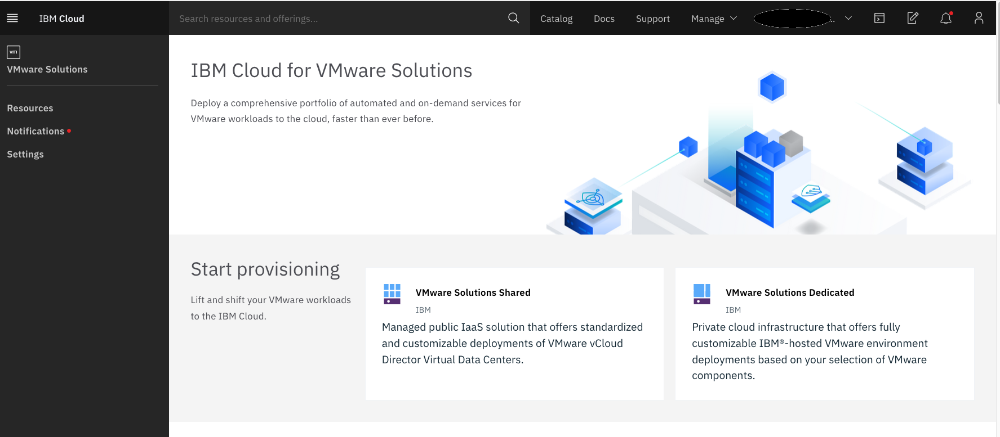

## Welcome to my VMWare notebook.

Some tips and tricks I picked up while working on [VMWare Solutions on IBM Cloud](https://cloud.ibm.com/infrastructure/vmware-solutions/console) offerings.

- disclosure as always:
  - I am not an author but just trying to share my findings.
  - Comments are welcomed and will do my best to acknowledge them
  - In that same spirit, I welcome being challenged because my goal is to provide accurate and useful content
  - I am a terrible speller
  - I can change and/or update my disclosure at anytime :)

Topics:
- [VMWare vCloud Director](https://mlwiles.github.io/vmwaresolutions/vcd/)
- [Veeam Availability Suite](https://mlwiles.github.io/vmwaresolutions/vas/)
- [Veeam Cloud Connect Replication](https://mlwiles.github.io/vmwaresolutions/vccr/)
