## VAS - Setup a simple backup job (Coming Soon) 

Updated: 2020-12-06

One of the enabled services for [VMWare Solutions on IBM Cloud](https://cloud.ibm.com/infrastructure/vmware-solutions/console) is the ability to use Veeam Availability Services (VAS) via a Self Service Portal (SSP) to backup and restore VMs within your virtual Data Center.  The VAS service is automatically enabled by default for all virtual data centers.  This is noted on the vDC order page and owners are only charged for what you use in the VAS.

### Access the Self-Service Portal

To access to the SSP there are two links provided and of course once you access it you should bookmark it for future access.

The first link is provided from the within the vCD portal.  Once authenticated into the vCD portal, select your username and there will appear in the dropdown menu some reference links, one of which is a link to the Veeam Backup SSP.

The second link is provided from the vCD summary page within the [VMWare Solutions on IBM Cloud](https://cloud.ibm.com/infrastructure/vmware-solutions/console) portal.  Once authenticated into the vCD summary page, scroll to the bottom portion of the summary page to see the link.

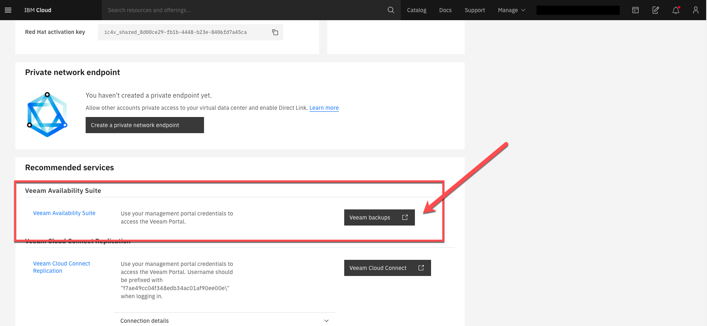

The Veeam SSP will require authentication.  The user access for the SSP requires the *Organization Admin* role from the vCD Organization.  This by default is your *admin* user but as admin you can create more users and assign them this role.  

In order As a note to login, in some cases you should prefix the login with the *ORG_ID\USERNAME* but if the *ORG_ID* is in the URL of the SSP, then the prefix of the *ORG_ID* will not be necessary.

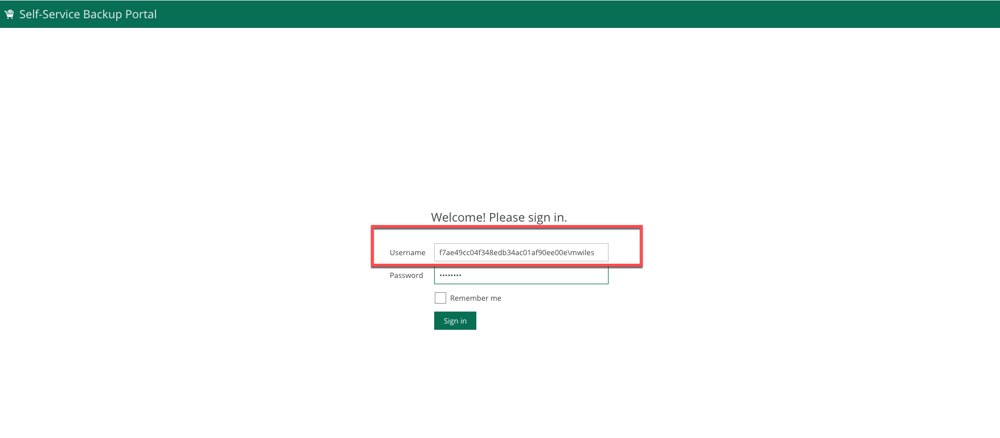

### Creating a job

Once logged in you default to the *Dashboard* view.  To create or manage jobs, select the *Jobs* tab.  In this demo we will *Create* a new job.

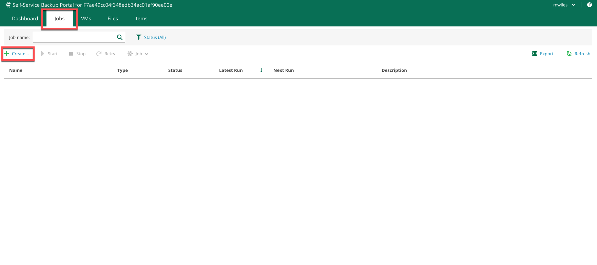

Provide a *Name* and *Description* for the Job.  

The [Retention policy](https://helpcenter.veeam.com/docs/backup/vsphere/retention_policy.html) is used to determine how many restore points you would like to keep.  Also keep in mind that the restore point is created every time you run the job, therefore the combination of the number of times the jobs runs will determine how many restore points you keep on disk.  In a simple example if you use the default of 7 restore points and you run the job daily you will have backups for everyday of the week from the current day backward.

*Some behind the scenes information* is that the template currently being created for each vCD Organization is using [forward incremental](https://helpcenter.veeam.com/docs/backup/vsphere/retention_forever_incremental.html) with [synthetic full](https://helpcenter.veeam.com/docs/backup/vsphere/synthetic_full_backup.html) backups created periodically.

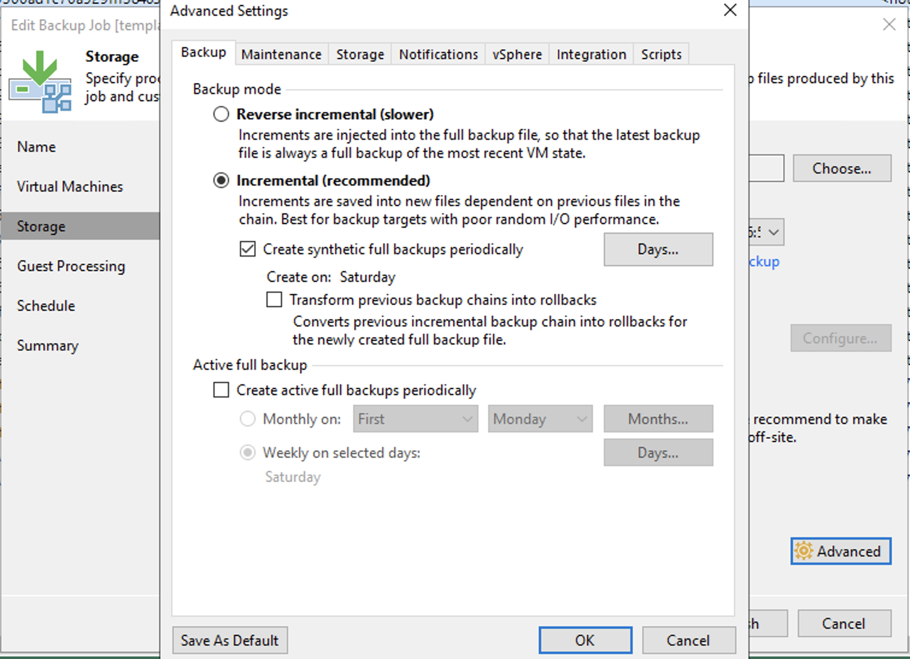

After selecting *Next* on the *Job Settings* tab, select *Add* to add the vDC items for the job.

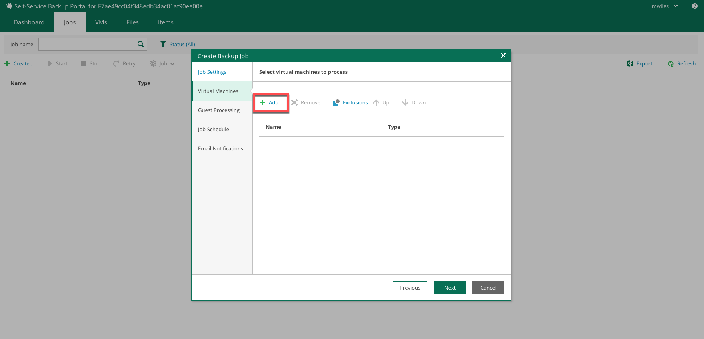

You can filter from:
- *Everything* within the *Organization*
- *Organization vDC*
- *vCloud App*
- *vCloud VM*

You can add:
- *the vCloud Organization*
- one or more *Organization vDCs*
- one or more *Virtual Applications*
- one or more *Virtual Machines*

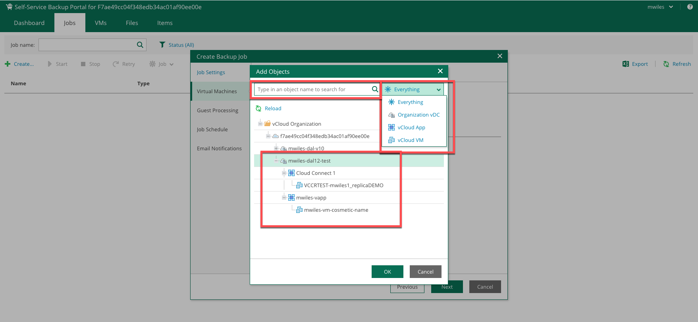

*NOTE* when you add items to the job, they also describe what each item is

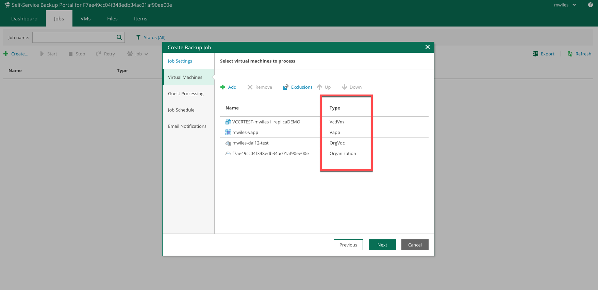

In this demo, we are going to focus on two types of items to add.

1. a vApp (which is the vApp and *ALL* of the Virtual Machines in it)
2. a VM (this will also include information about the vApp the VM is contained in) 

*REMEMBER* that vCD is vApp centric so every VM runs in a vApp whether its explicit or not.

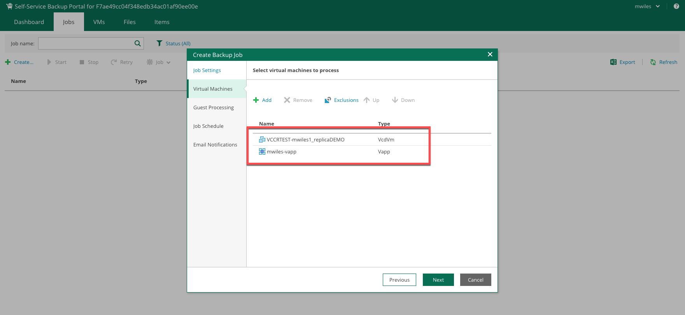

After selecting *Next* on the *Virtual Machines* tab, determine if *Guest Processing* is required.  There are several items to consider for Guest Processing.  While not ALL of the features are exposed using the SSP, the Guest Processing features are described on [Veeam Help Center](https://helpcenter.veeam.com/docs/backup/vsphere/backup_job_vss_vm.html)

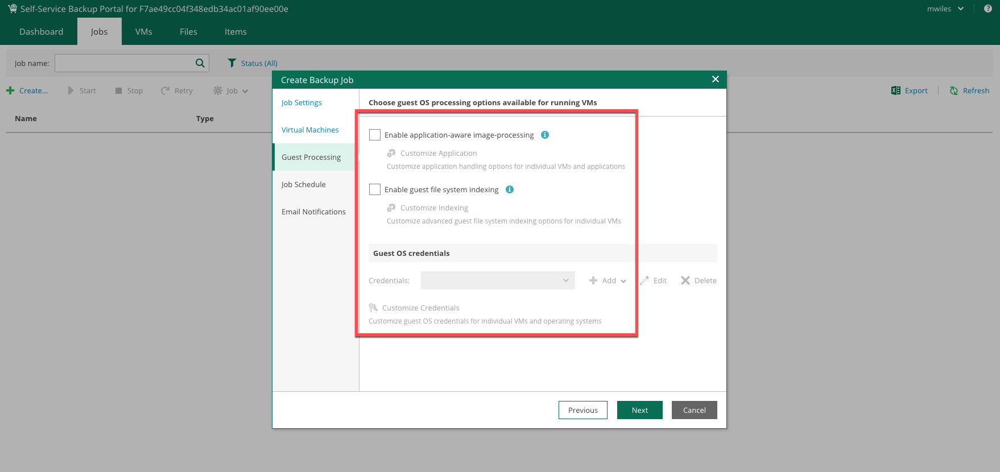

After selecting *Next* on the *Guest Processing* tab, the *Job Schedule* can be adjusted.  First is whether or not to enable the job to run on a scheduled bases and then adjust when and how often to run.  Recall the restore points play a role in your expected number of backups and the frequency in which they are created.

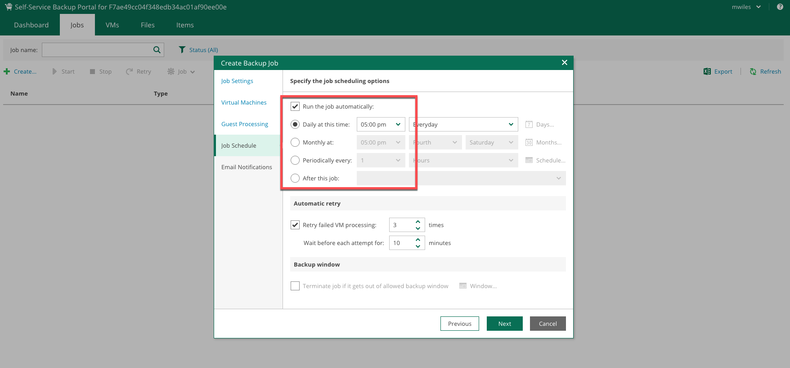

Finally, in the *Email Notifications* can be used to send feedback on the job with respect to the job status.  Select *Finish* to save the job.

### Running a job

From the *Jobs* tab there are additional actions that can be taken.  One action is to manually start the job.  Select the recently created job and click *Start*

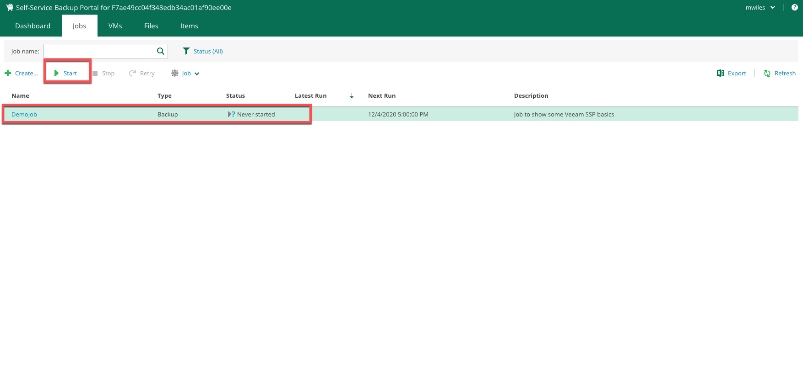

Navigation within the job will tell you different levels of detail from within the job.  Notice the items reported from the Job.

- *Cloud Connect 1* is a vApp that we did not specifically select, but recall that we selected a the VM *VCCRTEST-mwiles1_replicaDEMO* that was contained in the vApp, therefore parts of the vApp also have to be backed up in order to be able to successfully restore in the event of the vApp being deleted.
- *mwiles-vapp* is the vApp that we DID select and all VMs contained within the vApp will be backed up and in this case only 1 VM *mwiles-vm-cosmetic-name* will be backed up with the vApp.

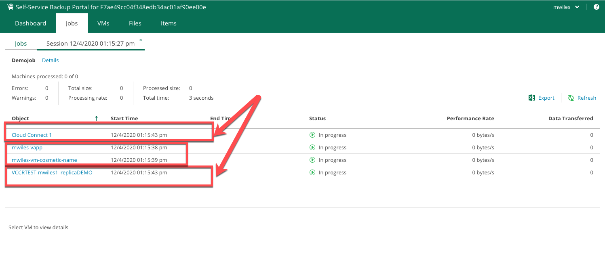

Selecting the *Details* of the job will provide some more details of the overall job.

*Refresh* can be used to see updated status of the job.

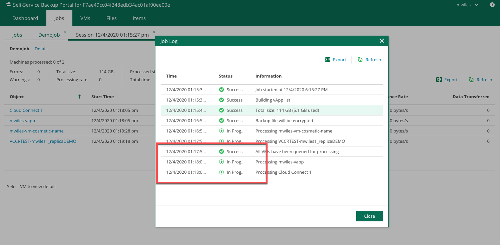

Notice that when a specific artifact is highlighted in the job, specific messages will be shown in the bottom of the page.  In this case, it’s interesting to note that a message was returned regarding *Change block tracking cannot be enabled: one or more snapshots present*.  In this case we did not explicitly create any snapshots for this VM so huh???  Well since this specific VM was created from [Veeam Cloud Connect Replication](https://mlwiles.github.io/vmwaresolutions/vccr/), we will have to take some extra steps to remove these snapshots and allow this VM to be in stead-state.  See [Migration to vCD](https://mlwiles.github.io/vmwaresolutions/vccr/vcd-migration/) to permanently failover this VM and promote it to production status.

The VM that we created in [Simple Deploy of a VM](https://mlwiles.github.io/vmwaresolutions/vcd/vm101/) is backing up without issue.

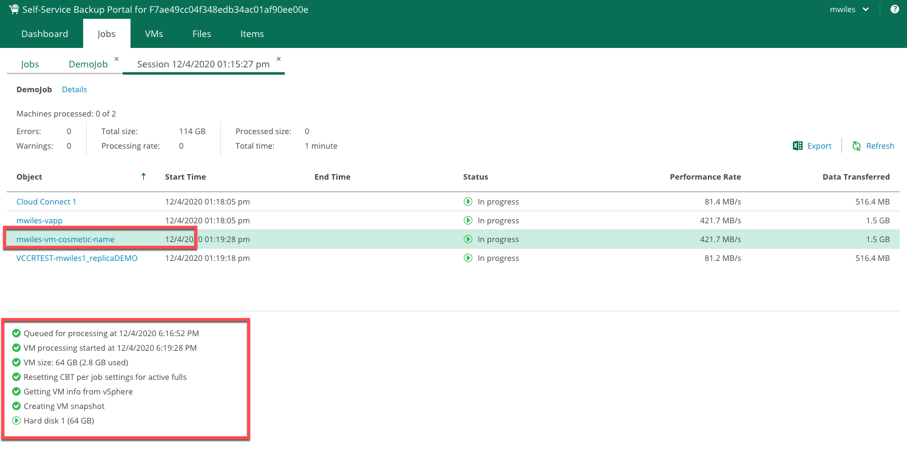

Select one of the artifacts showing *Success* to see the underlying messages for details.

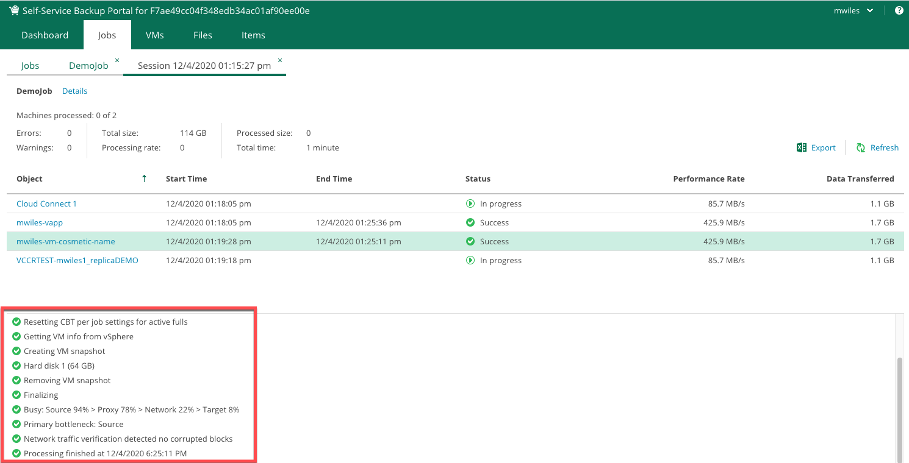

Select one of the artifacts showing *Warning* to see the underlying messages for details.

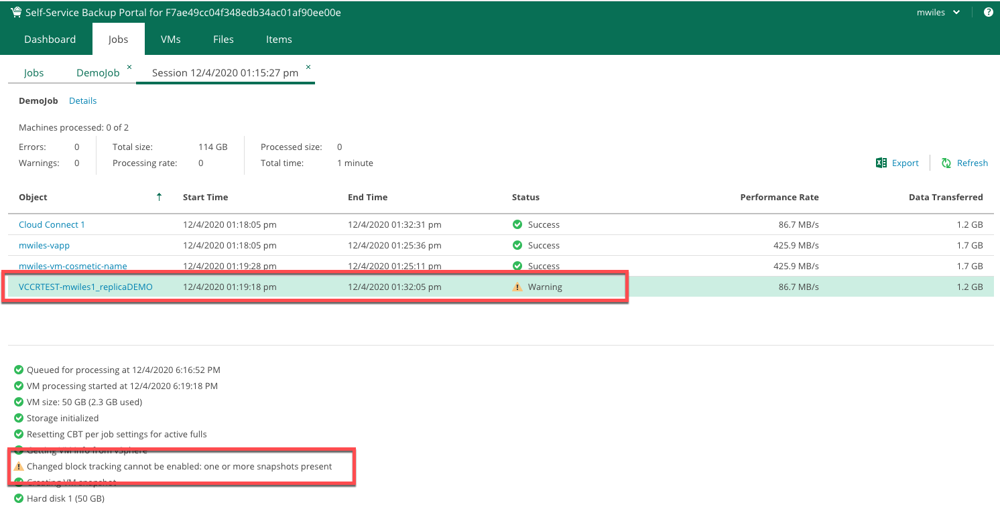

Fortunately there were no errors in this job to show, but if errors are encountered that cannot be resolved on your own we suggest a ticket be opened to get assistance from IBM Cloud.

Otherwise, you can enjoy the summary emails that can be sent on the scheduled cadence to report the status of the backup job.

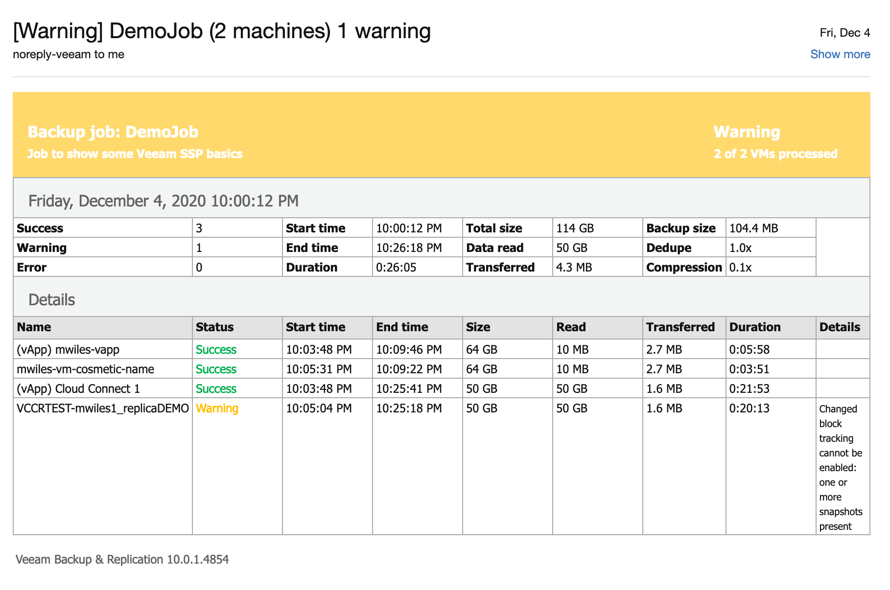

Many items were discussed here and some come with a cost, be sure to check out the pricing details on the VM components visit [
VMware Solutions Shared pricing](https://cloud.ibm.com/docs/vmwaresolutions?topic=vmwaresolutions-shared_pricing) section.

_Note the information described in this example are guidelines.  There are multiple ways to configure the various parts of the example.  Please adjust accordingly for your needs._

[Veeam Availability Suite](https://mlwiles.github.io/vmwaresolutions/vas/) 
[Main Page](https://mlwiles.github.io/vmwaresolutions)

