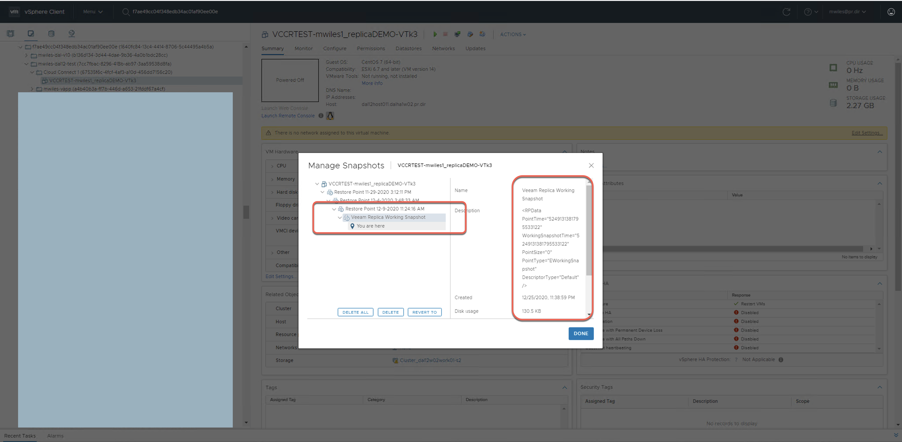
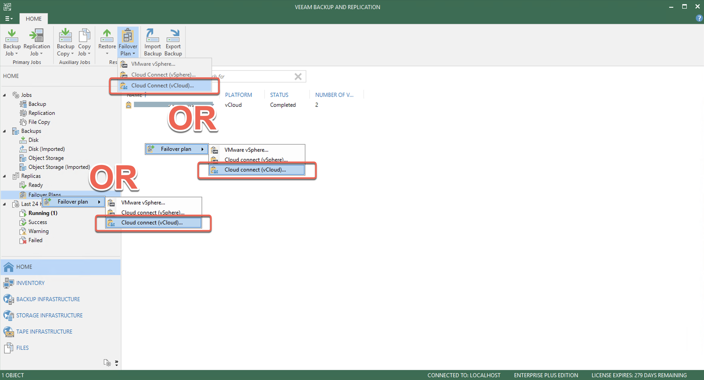
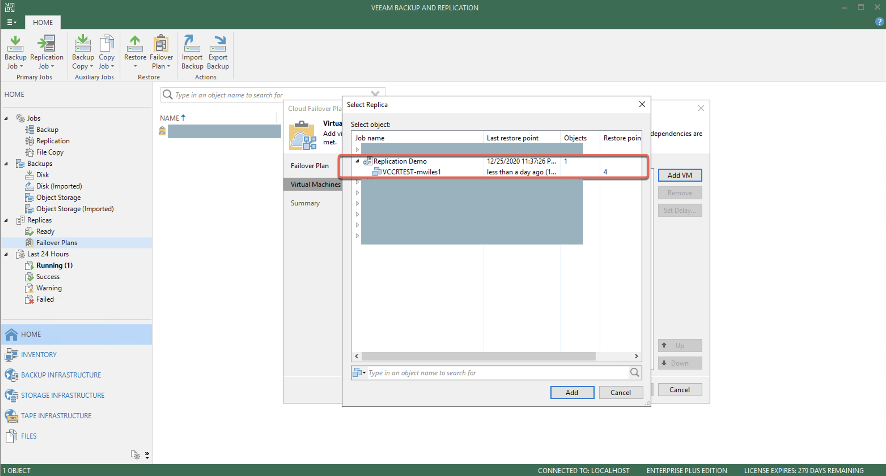
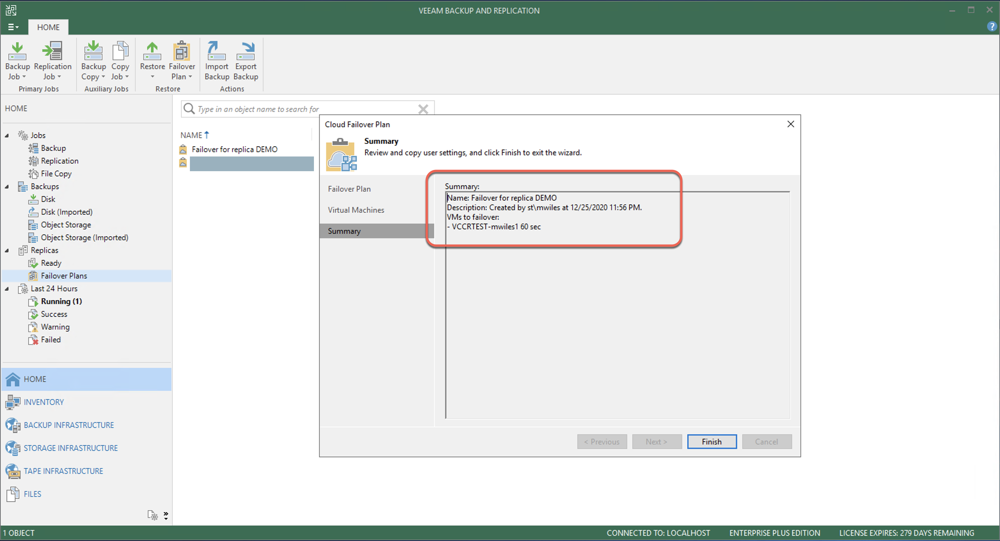
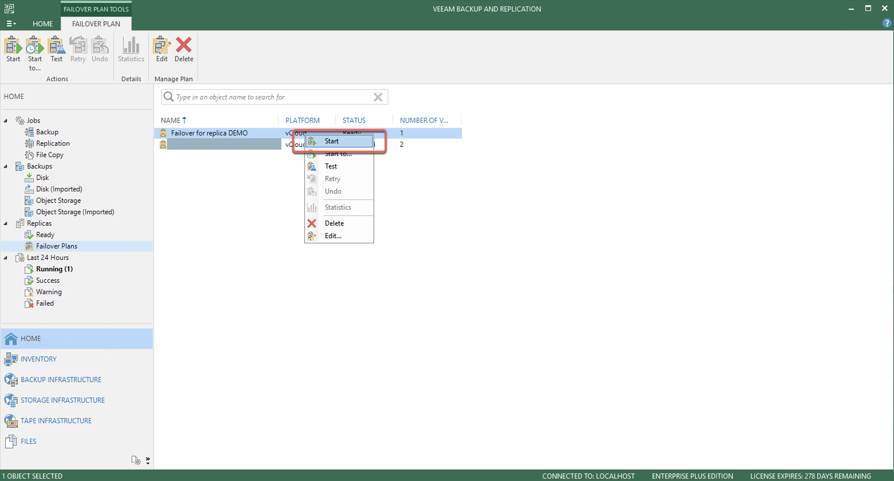
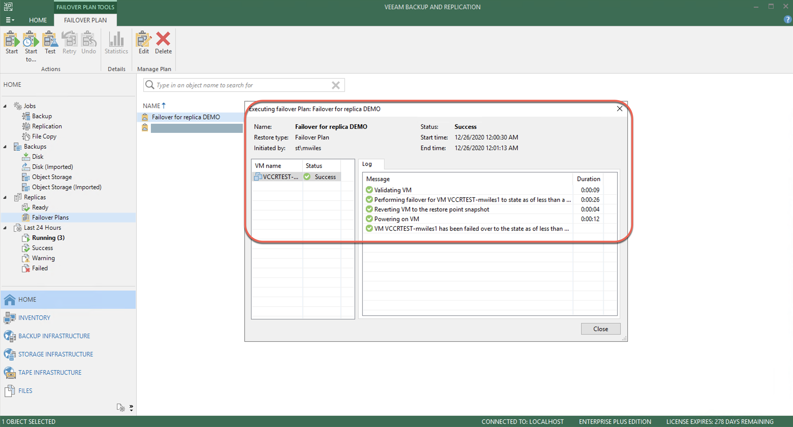
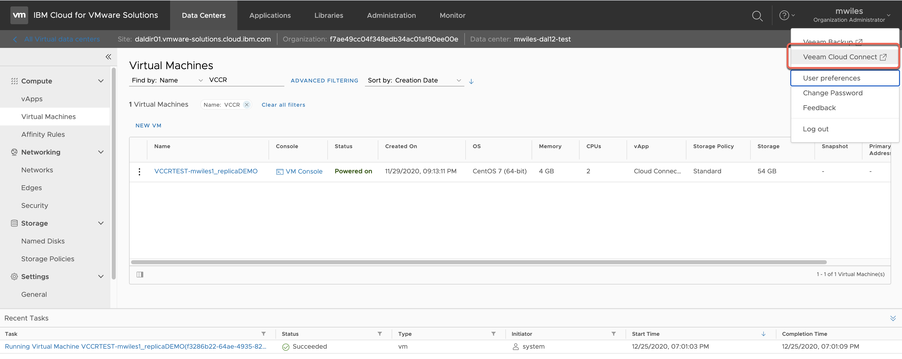
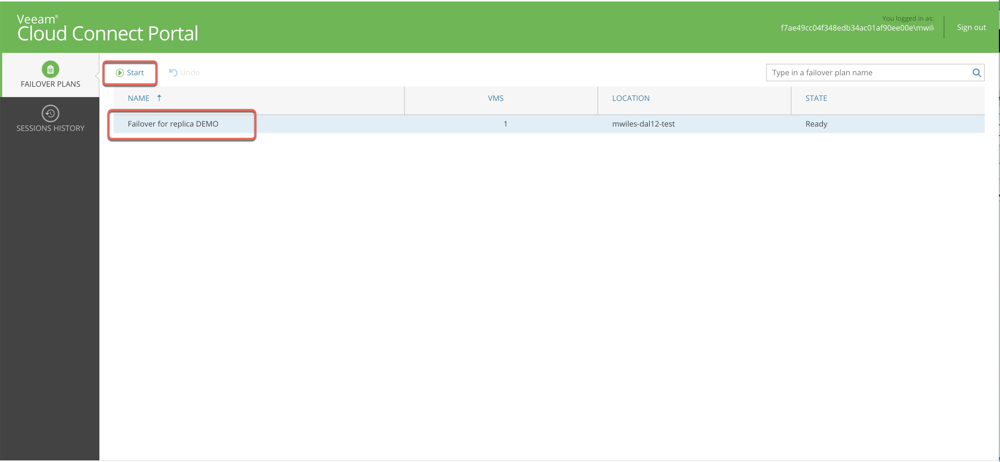
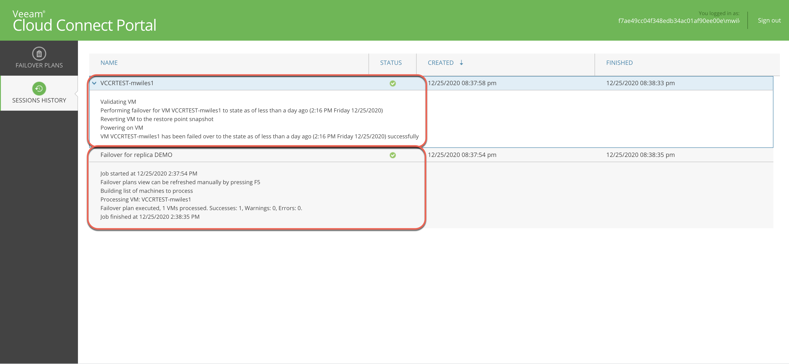

## VCCR - Disaster Recovery Prep

Updated: 2020-12-29

Now that the Replication job has either completed once successfully or has been running on a scheduled cadence via a [Simple Replication job to vCD](https://mlwiles.github.io/vmwaresolutions/vccr/vcd-job/), its now time to prepare for failover testing and/or execution.

First we re-evaluate that the CCR job is running successfully... 

and has created the VM in the vDC.

Behind the scenes, what is not necessarily known to the user is that there are snapshots created by Veeam that map one-to-one to the Restore Points on the replication job.  During replication (or sometimes when there is a network failure) the service provider can observe a snapshot with the name `Veeam Replica Working Snapshot`.  In a normal replication, this is fine, but when something causes the replication to be interrupted, its up to the service provider to notify or proactively cleanup the orphaned snapshot.

Once a successful replication has been completed, the snapshot will be renamed to the format `Restore Point MM-DD-YYYY HH:mm:ss XM` and this will corollate to the restore points referenced from the Customer VBR on-premises.

Now to either create a temporary test or execute a failover permanently, the customer will need to create a `Failover Plan` from the on-premises VBR.

Provide the Failover Plan a unique and meaningful name.

Select the VM(s) from the available list ...

In this case, we select the previously replicated VM `VCCRTEST-mwiles1`

Add the VM(s).

Summary 

To begin the Test or the Migration, select the plan and then `Start`

You will see the Plan has began and update for the on-prem VBR.  This will power on the VM.

One thing to note, in the even of a complete disaster of the on-premises VBR, the Failover plan can also be started from the VCCR Self-Service Portal.  One place the link can be found is from the vCD portal.

Log-in with the `ORGID\Username` and respective password.

Select the `Failover Plan` and `Start`

Status will be reflected in the portal UI.

Next would be to either stop the Failover Plan, or begin the Permanent Failover to fully [Migration to vCD](https://mlwiles.github.io/vmwaresolutions/vccr/vcd-migration/)

_Note the information described in this example are guidelines.  There are multiple ways to configure the various parts of the example.  Please adjust accordingly for your needs._

[Veeam Cloud Connect Replication](https://mlwiles.github.io/vmwaresolutions/vccr/) 
[Main Page](https://mlwiles.github.io/vmwaresolutions)

