## VCCR - Simple Replication job to vCD

Updated: 2020-11-30

## Create the job

To create a replication job the step to [Setup service provider](https://mlwiles.github.io/vmwaresolutions/vccr/vcd-sp/) must first be completed.

To create the actual replication job from your current data center or offering into IBM Cloud, open the console on your Veeam Backup and Replication (VBR) Server.  Select Home > Replication.  There are several ways to begin the job wizard.   
- Home > Replication Job > Virtual Machine...
- Home > Jobs > Replication > Replication > Virtual Machine...
- Home > Jobs > Replication > *Right click* > Replication > Virtual Machine...

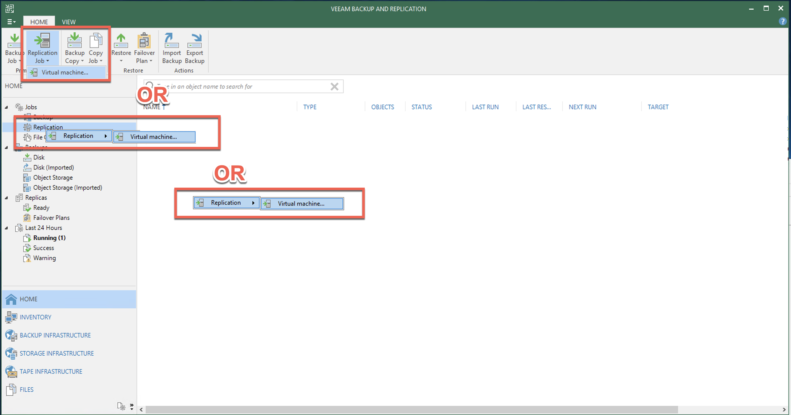

The options on the Home tab of the *New Replication Wizard* allow a few [advanced options](https://helpcenter.veeam.com/docs/backup/vsphere/replica_name_vm.html) can be described in the Veeam documentation.

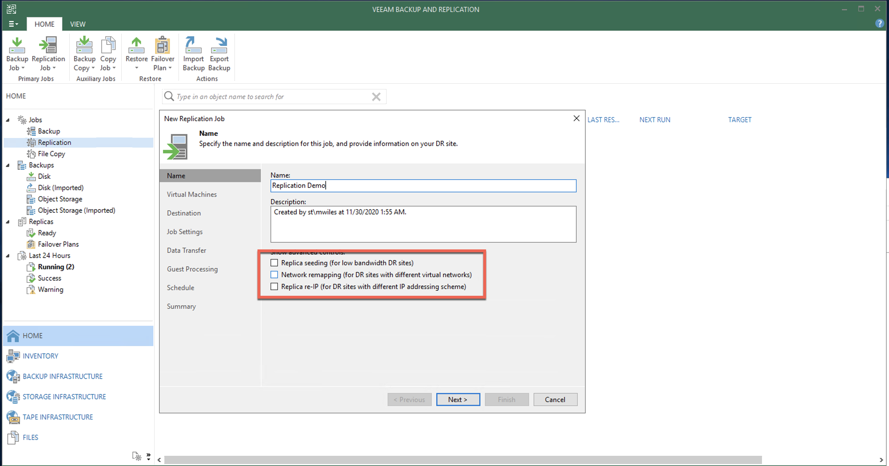

Add the Source VM's for the Replication.  Filter option can assist nicely to quickly find VM's.

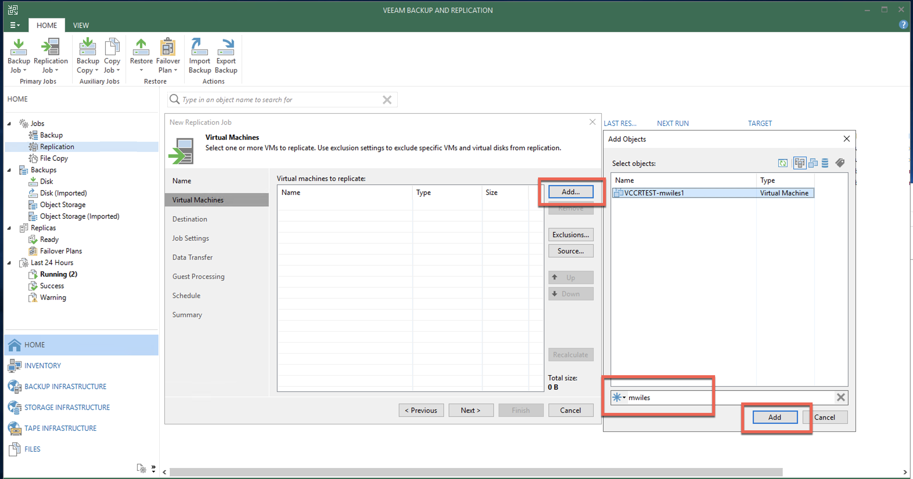

Next to select the destination.  BY default the jobs are designed to run against vCenter instead of vCD.  Select *Choose...* to change to the vCloud > Service Provider.

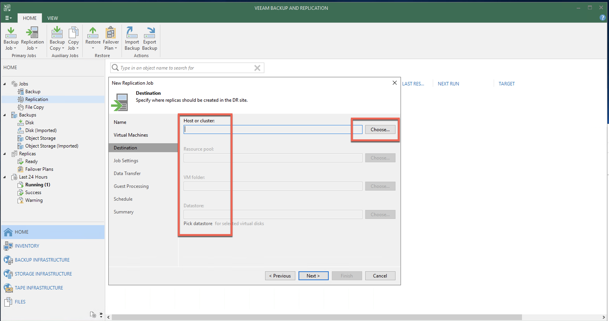

Expand the Service Provider to select the target vDC.

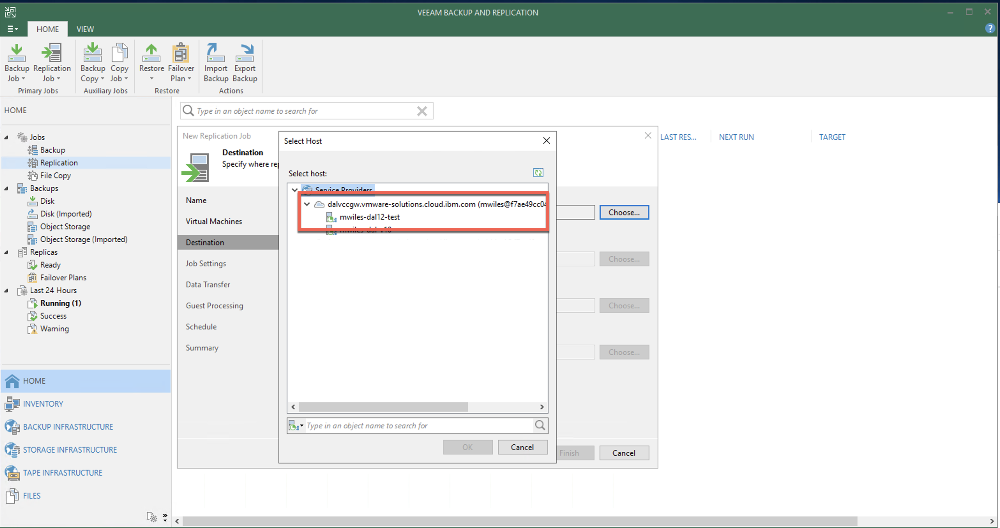

Use the *Choose...* options to change the vApp and/or Storage Policy.  Default for the vApp is typically *Cloud Connect* whether it already exists or not.  Also the Storage Policy is the default for the vDC.

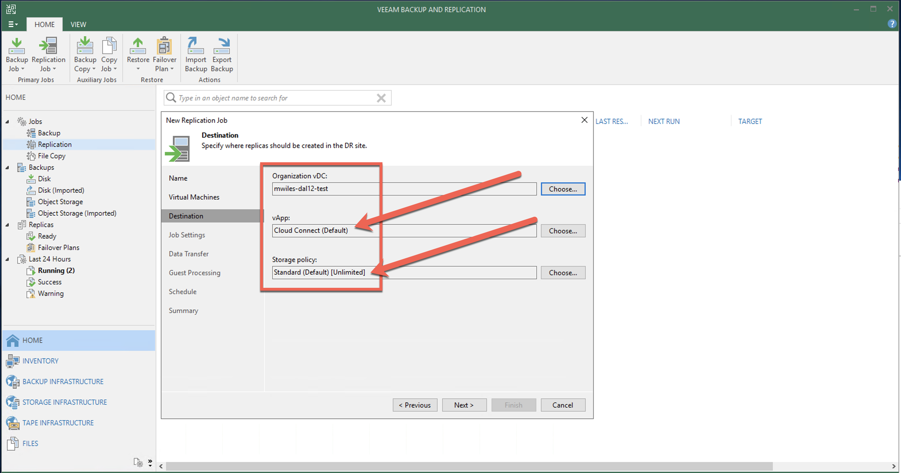

Next determine what *suffix* the replication VMs will get (this is not required and can be left blank).  Number of restore points will determine the number of snapshots left for the target VM in the replication jobs.  The [Advanced](https://helpcenter.veeam.com/docs/backup/vsphere/replica_advanced_vm.html) *options* can be described in the Veeam documentation.  One setting in this section is to enable the Email Notifications for this replication job.

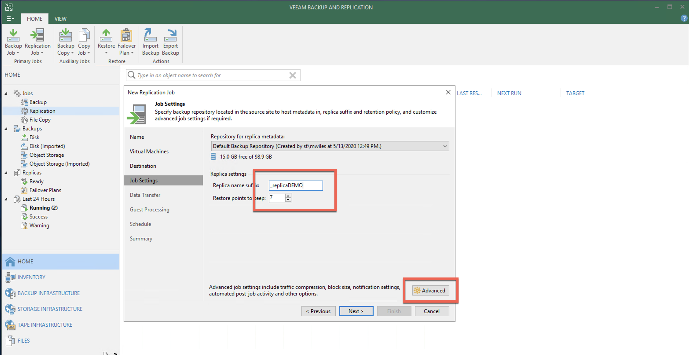

[Wan Accelerator](https://helpcenter.veeam.com/docs/backup/vsphere/replica_data_transfer_vm.html) *options* can be described in the Veeam documentation. 

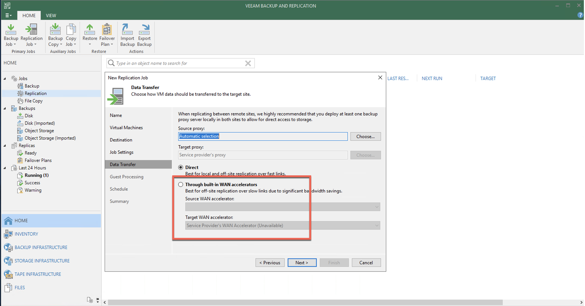

[Application-aware processing](https://helpcenter.veeam.com/docs/backup/vsphere/replica_vss_vm.html) *options* can be described in the Veeam documentation.

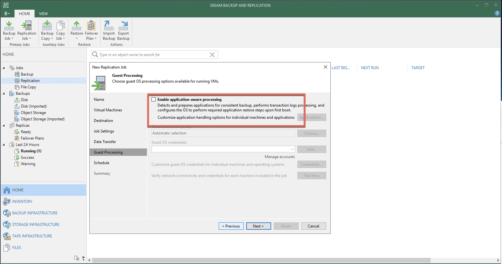

Schedule the job if desired.

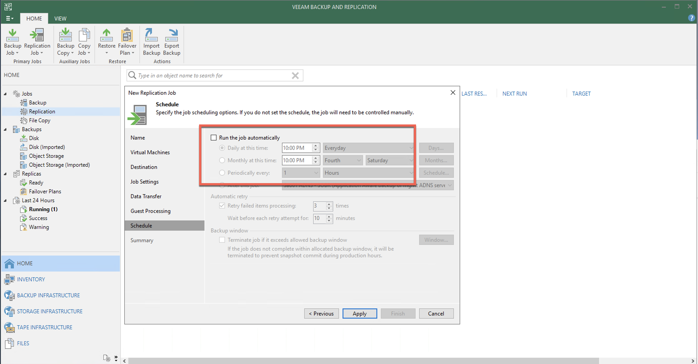

Run the job when finished if desired.  We choose this option.

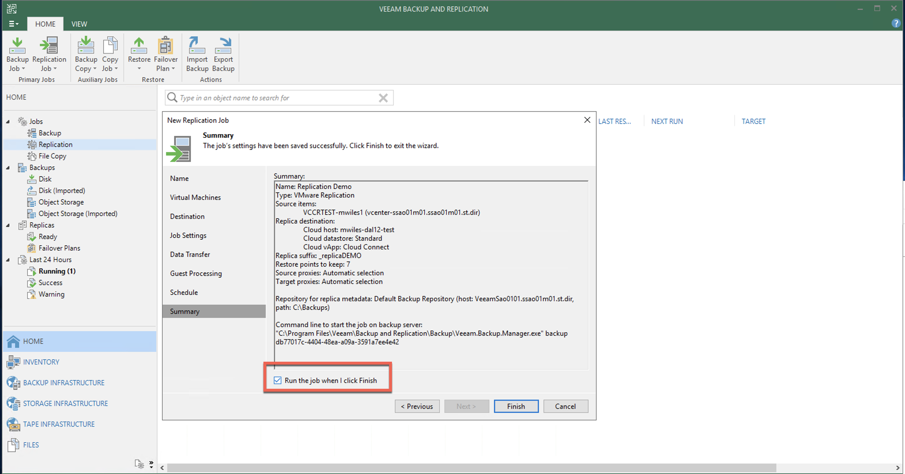

## The job in progress

While the job is running, there are several things going on of interest.  First on the local VBR, the processing of the source VM begins with a snapshot.

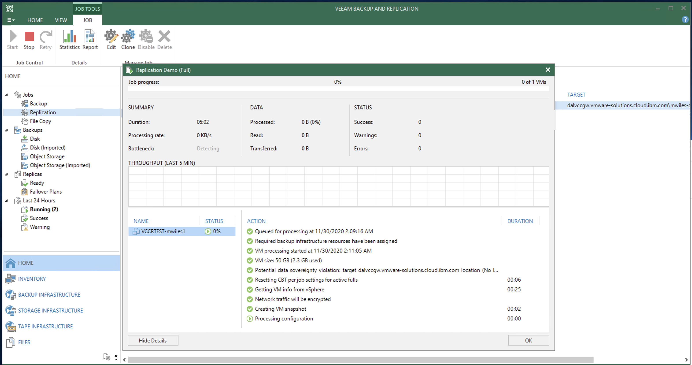

The snapshot is created by the local VBR called *VEEAM BACKUP TEMPORARY SNAPSHOT*.

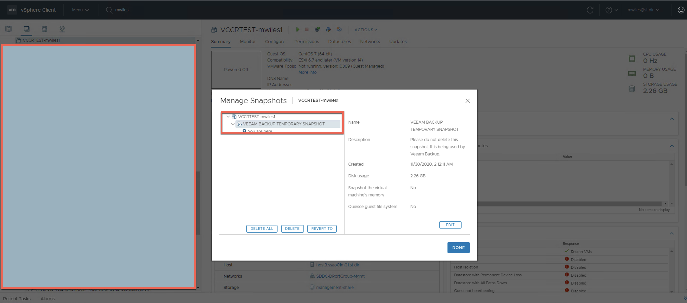

The transfer of data can be measured / monitored from the source VBR.

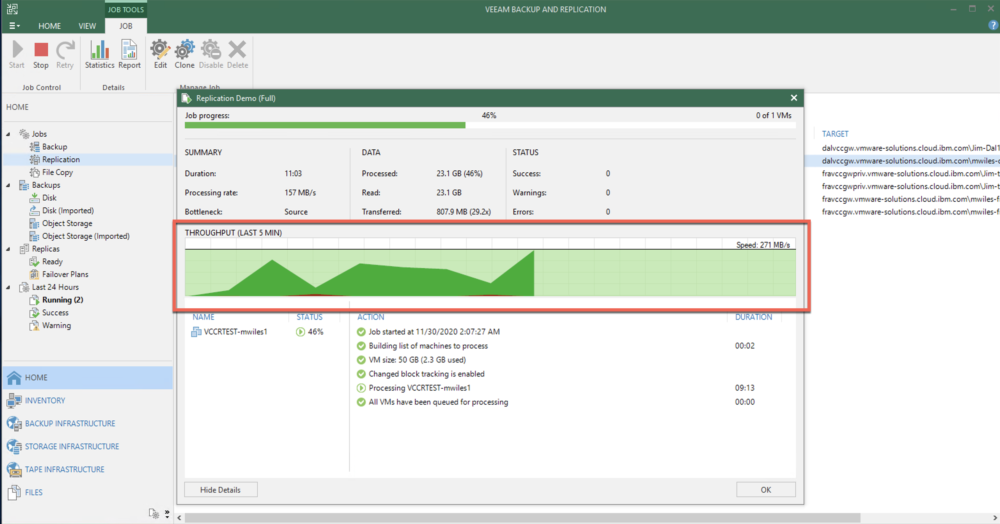

The *New* replica will be created in the vCD Org > vCD virtual Datacenter > Compute > vCD vApp > Virtual machines OR vCD Org > vCD virtual Datacenter > Compute > Virtual machines.

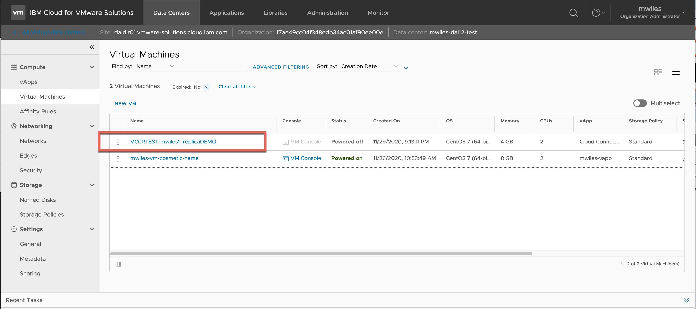

The snapshot is transferred via the local VBR to the Service Provider VMWare vCloud infrastructure.  vCD is backed by vSphere so as we navigate the backend view to the vCD Org (folder) > vCD virtual Datacenter (folder) > vCD vApp (folder) ... we ultimately find the new VM.  While the replication is in progress, the new snapshot will be created with the name *Veeam Replica Working Snapshot*.  Once the snapshot is successfully applied to the target VM the snapshot is renamed to *Restore Point MM-DD-YYYY HH:mm*.  These *Restore Points* can be controlled from the local VBR.

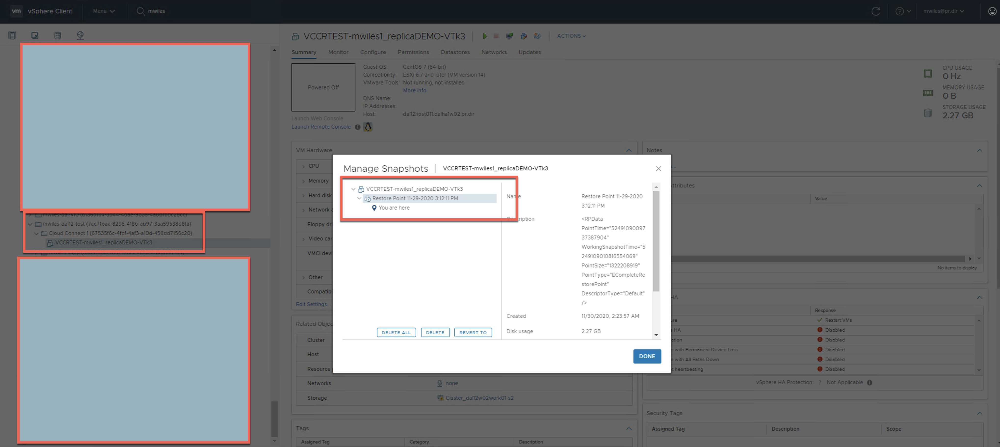

Now the Replication Job can be scheduled for the desired frequency.  

Next steps are to test / validate the replications via failover jobs for the [Disaster Recovery Prep](https://mlwiles.github.io/vmwaresolutions/vccr/vcd-dr/).  If the requirement is to permanently [Migration to vCD](https://mlwiles.github.io/vmwaresolutions/vccr/vcd-migration/) then a *Permanent Failover* is required.

Otherwise, you can enjoy the summary emails that can be sent on the scheduled cadence to report the status of the replication job.

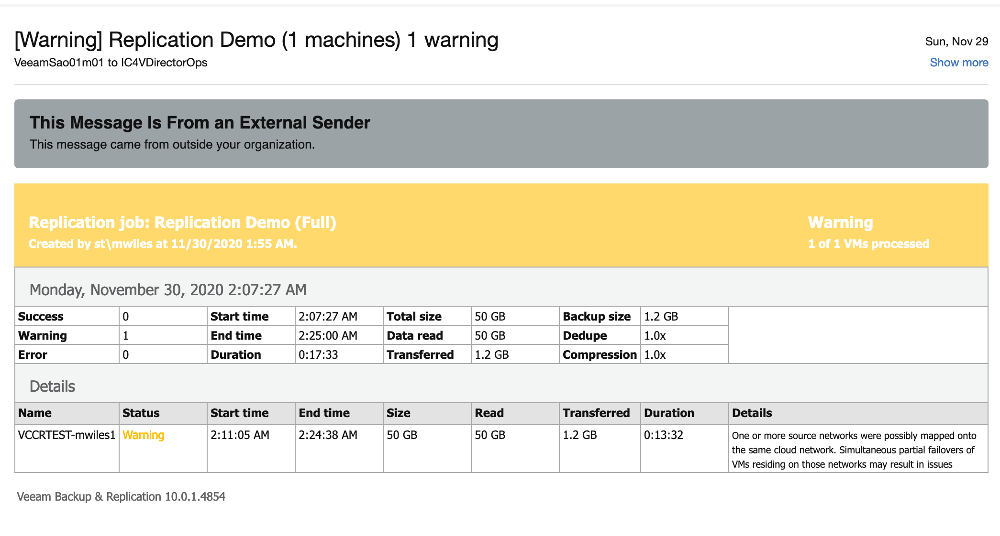

_Note the information described in this example are guidelines.  There are multiple ways to configure the various parts of the example.  Please adjust accordingly for your needs._

[Veeam Cloud Connect Replication](https://mlwiles.github.io/vmwaresolutions/vccr/) 
[Main Page](https://mlwiles.github.io/vmwaresolutions)
