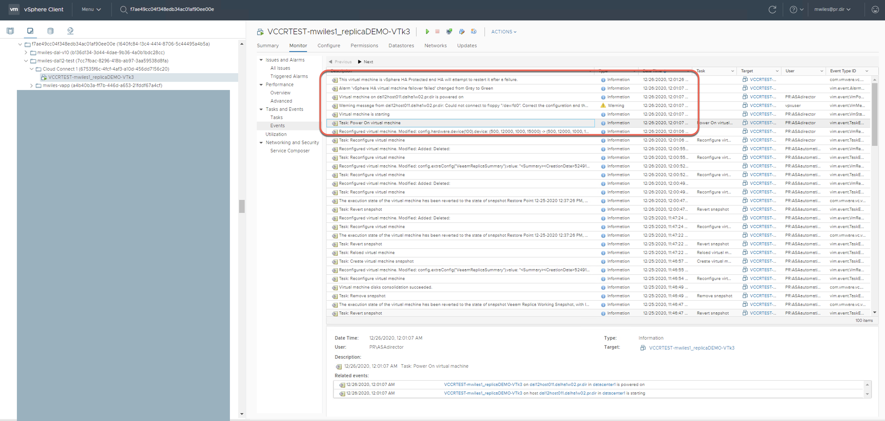
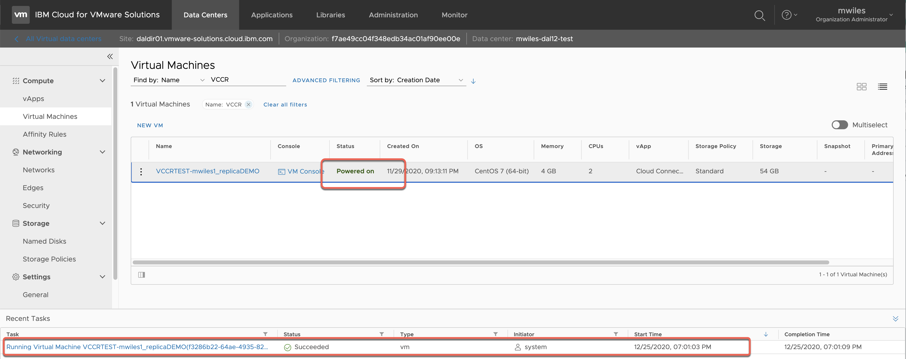
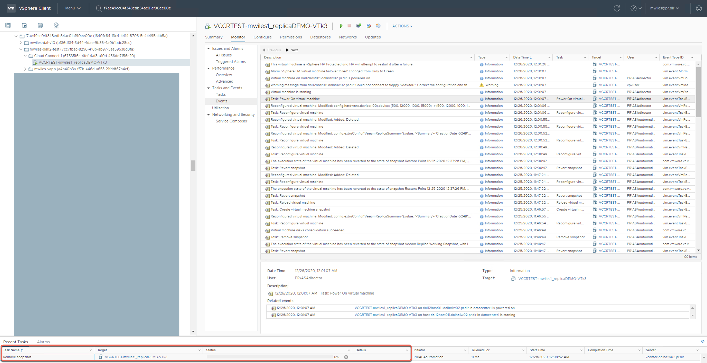
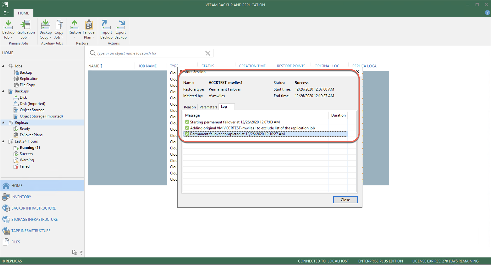
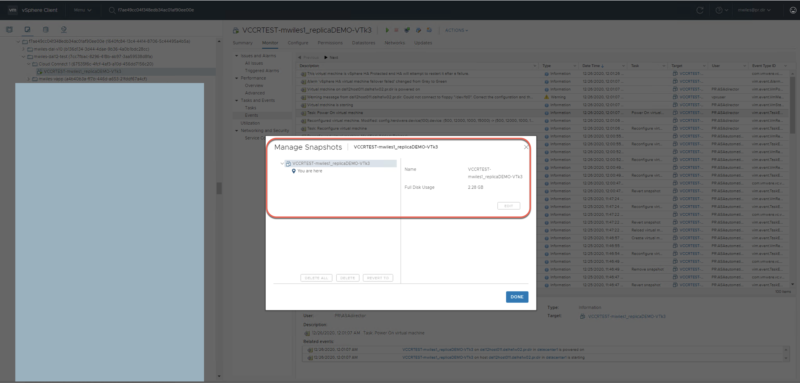
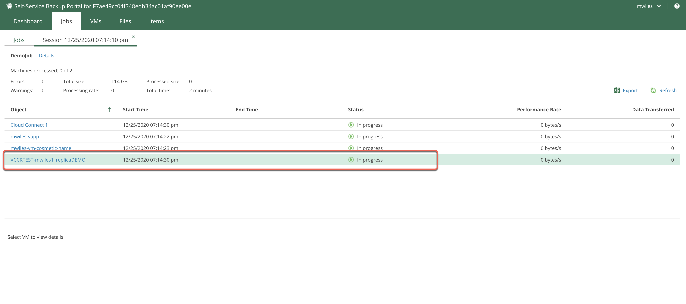
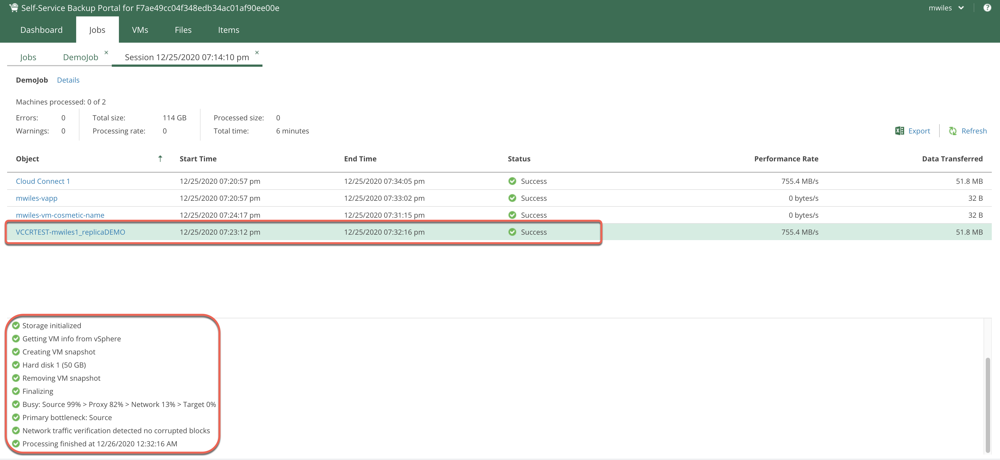

## VCCR - Migration to vCD (Permfail)

Updated: 2020-12-26

Once the [Disaster Recovery Prep](https://mlwiles.github.io/vmwaresolutions/vccr/vcd-dr/) is ready and the VM is powered on, the provider can see this from the vCenter.

Customer can see the VM is powered on from the vDC.

From the VBR (not from the SSP) the customer can now perform a `Permanent Failover` which will collapse the previously shown `Replication Points` or `VM Snapshots` back in to the root of the VM.

The provider can see that the restore points are `removed` and rolled into the base of the VM.

The Permanent Failure success can be viewed from the customer VBR.

The Provider can now see that the vm snapshots are removed.  This will allow the VM to be running from the most recent base of the VM as well as this will prevent the Veeam backups from reporting issue from `Change Block Tracking` warnings.

The previous warning can be seen from the backup job.

Rerun the previous backup job that contained warnings.

Now the warnings are removed once the VM is permanently failed over.

Now the VM is ready for production running explicitly from the vDC.

_Note the information described in this example are guidelines.  There are multiple ways to configure the various parts of the example.  Please adjust accordingly for your needs._

[Veeam Cloud Connect Replication](https://mlwiles.github.io/vmwaresolutions/vccr/) 
[Main Page](https://mlwiles.github.io/vmwaresolutions)

