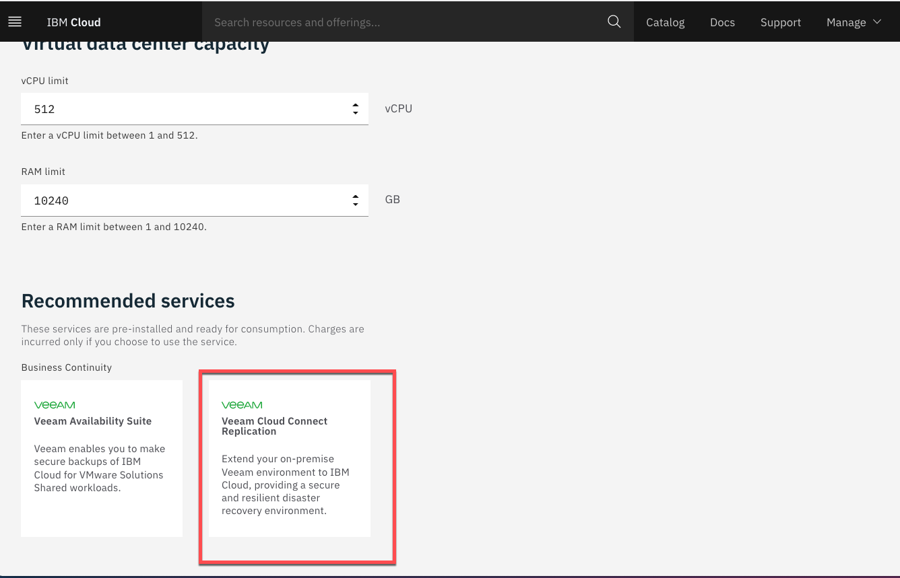
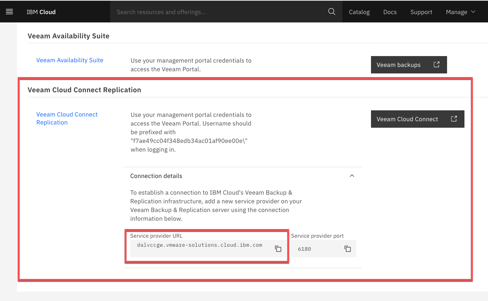
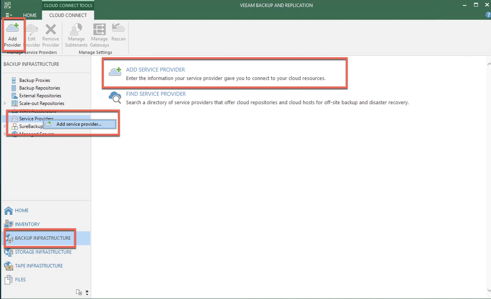
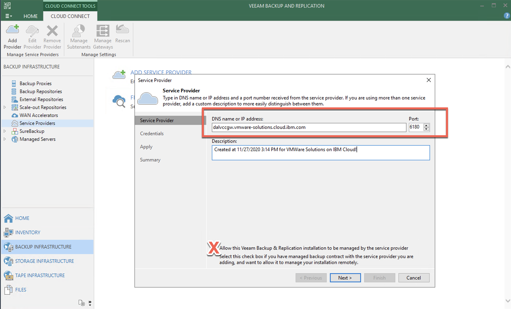
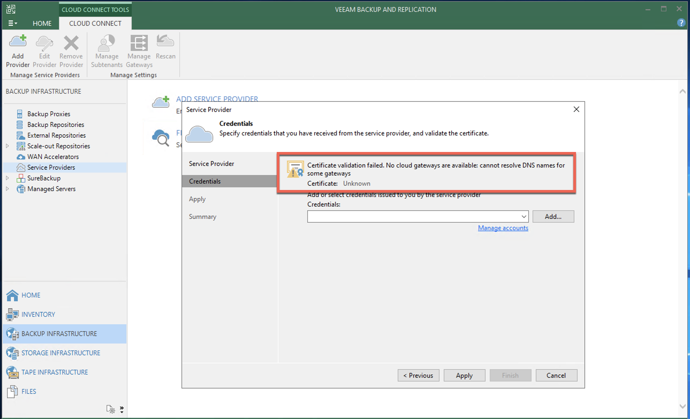
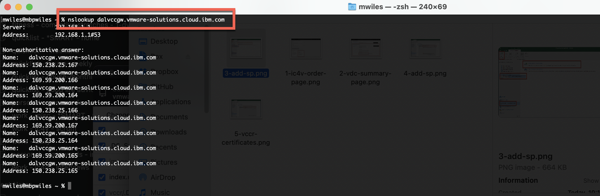
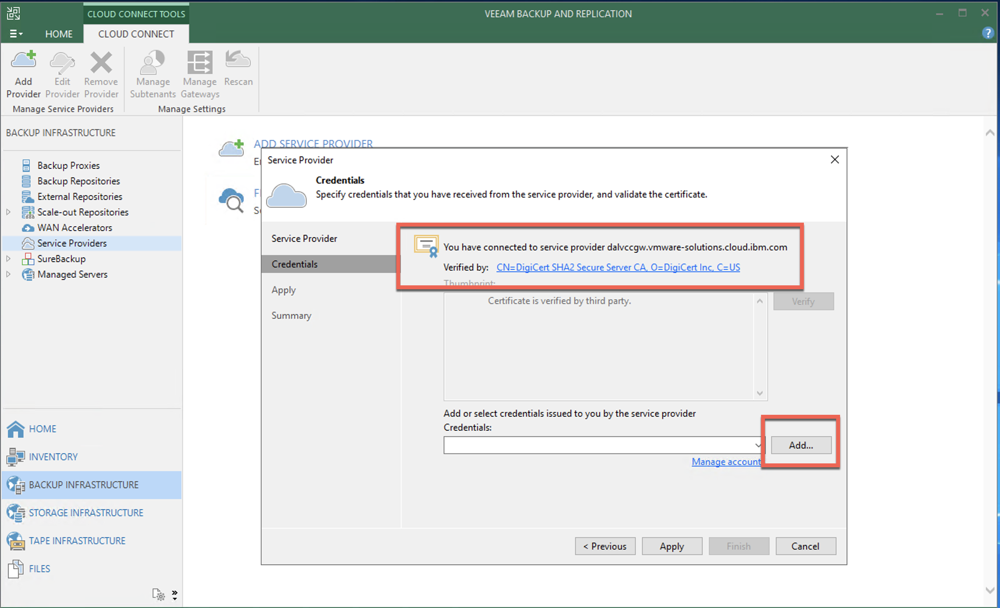
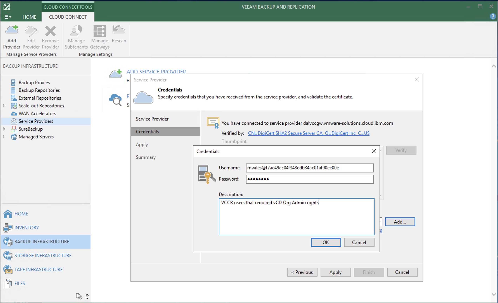
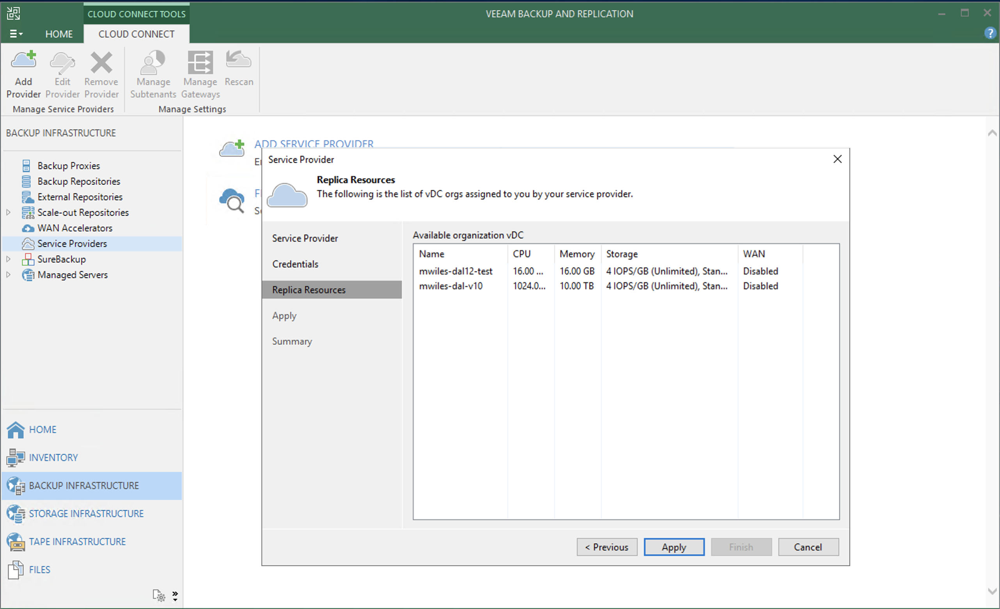
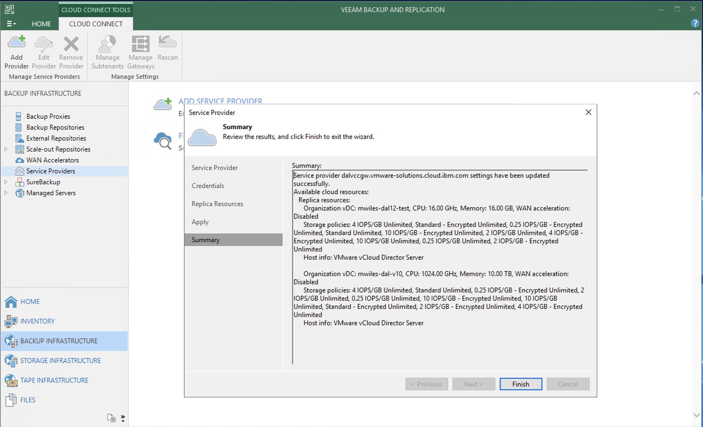

## Setup service provider 

Updated: 2020-11-27

One of the enabled services for [VMWare Solutions on IBM Cloud](https://cloud.ibm.com/infrastructure/vmware-solutions/console) is the ability to use Veeam Cloud Connect Replication (VCCR) for Disaster Recovery as a Service (DRaaS) or migration of VMs from your current data center or offering into IBM Cloud.  The VCCR service is automatically enabled by default for all virtual data centers.  This is noted on the vDC order page.

Once you have a vDC provisioned the VCCR information is located at the bottom of your vDC summary page.  The Service provider URL reflects the Multi-Zone Region for which the vDC is provisioned. 

To begin using VCCR it is required that you have deployed a Veeam Backup and Replication (VBR) Server that has administrative access to your current VM deployment.  The new component that will be configured is a *Service Provider* in the *Backup Infrastructure* section of the VBR.  To begin the process, go to  
BACKUP INFRASTRUCTURE > Service Provider 
From there you have multiple ways to add the new Service Provider

In the *Service Provider* Wizard, enter the DNS name provided from the vDC summary page.  Note that the Port is the default for VCCR.  VMWare Solutions on IBM Cloud does not at this point offer remote VBR management so this checkbox is ignored.

For some troubleshooting tips at this point already.  If you get to the *Credentials* section of the Wizard and the dialog displays *Certificate: Unknown* this can be due to a number of issues.

1. make sure your VBR has internet access - this is required by Veeam to validate the revocation status of the SSL certificate provided by the VCCR components. In the case of VMWare Solutions on IBM Cloud we currently use DigiCert as a certificate provider for this offering.  The Online Certificate Status Protocol (OCSP) for DigiCert is ocsp.digicert.com.   **NOTE** this OCSP service is using HTTP not HTTPS therefore using port 80.  For more details in this, contact Veeam support for specifics.
2. make sure your VBR has DNS to resolve not only the primary DNS entry, but the specific gateway DNS entries.  The VCCR service uses Round Robin DNS to distribute the replication workload among all gateways in available.  So if you perform a DNS lookup of the VCCR Service Provider URL, multiple IPs will be resolved.  However adding just these to your DNS or *hosts* file is not sufficient.  It is recommended that your VBR have access to public DNS as well.  

Once you have both requirements satisfied, the Credentials page will now display the contents of the SSL certificate from the Provider.  Next step is to add the credentials from your vDC.

The user that you select will need to have the role of *Organization Admin* in order to create VMs and vApps without error.   **NOTE** the format of the user is *username@orgID* or *orgID\username*

Once authenticated, the available organization vDCs will be displayed.

Finally the summary ...

Once the Wizard is completed, the service provider entry is ready for use. 

Next we will setup a [Simple Replication job to vCD](https://mlwiles.github.io/vmwaresolutions/vccr/vcd-job/index.md). 

_Note the information described in this example are guidelines.  There are multiple ways to configure the various parts of the example.  Please adjust accordingly for your needs._

[Veeam Cloud Connect Replication](https://mlwiles.github.io/vmwaresolutions/vccr/) 
[Main Page](https://mlwiles.github.io/vmwaresolutions)