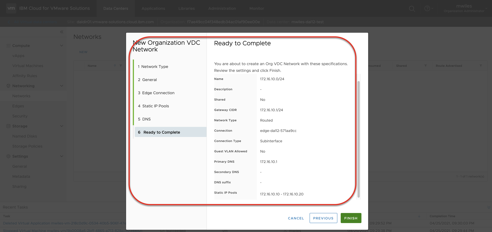
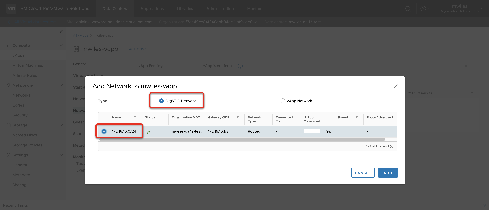
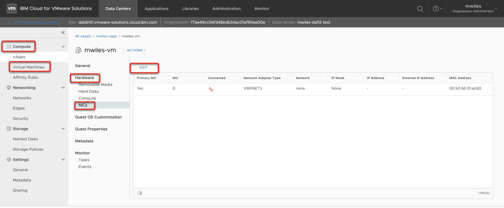
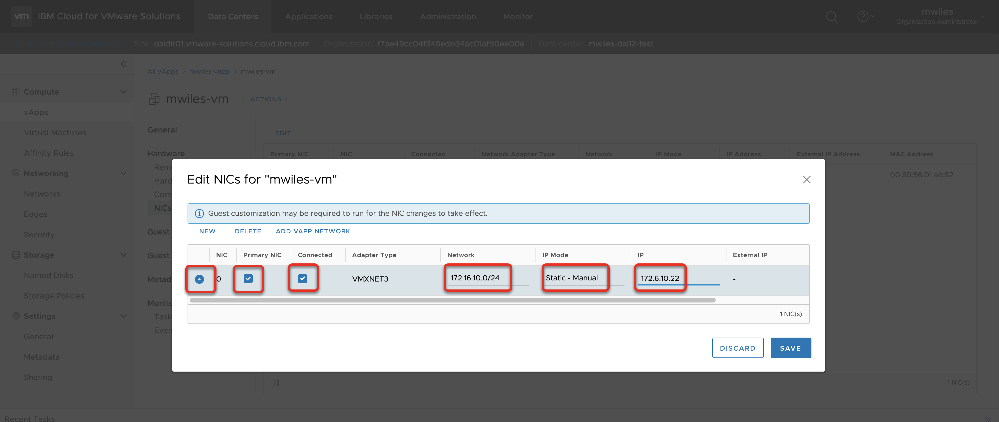
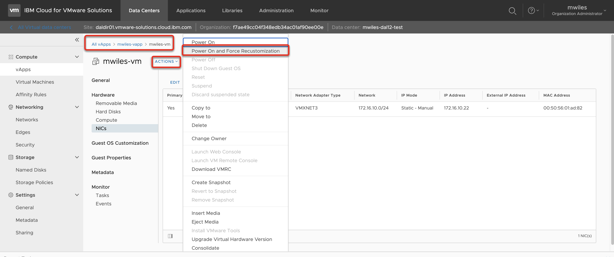
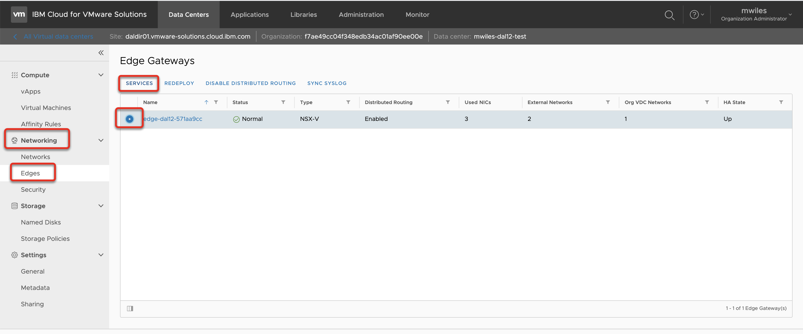
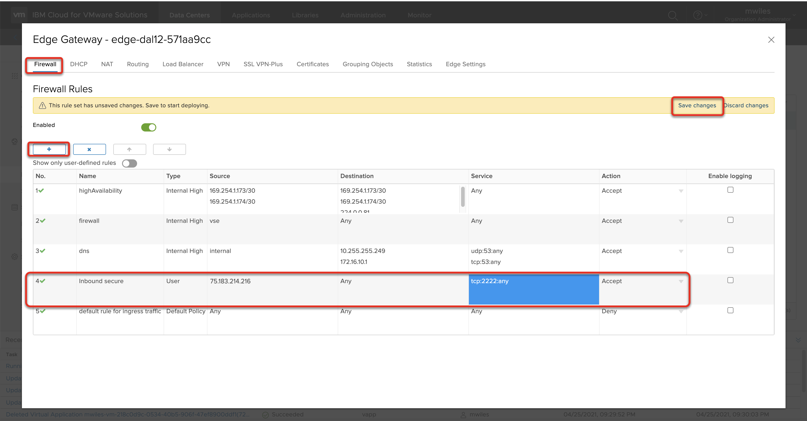
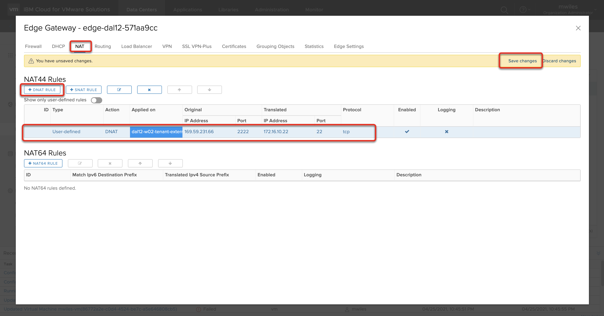
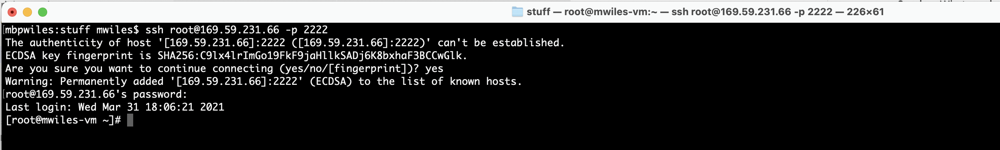

## vCD - Secure inbound access

Updated: 2021-04-25

### Table of Contents:
  - [Overview](#overview)
  - [Finished Picture](#finished)
  - [Data Collection](#data)
  - [Public IP](#publicip)
  - [vDC Network](#vdcnetwork)
  - [Virtual Machine IP](#vmip)
  - [Allow Access inbound](#allow)
  - [Test the rule](#test)

###  Overview

If you are finding that the Web Console in your vDC is not quite meeting your needs: 
Compute > Virtual Machine > MACHINE > Actions > Launch Web Console

then you can configure SECURE inbound access to your VM.  This is a great way to take advantage of copy / paste, larger resolution, or just working on your environment without the requirement of the admin portal.

For more details on allowing your VMs Internet or IBM Cloud services access see [Internet and IBM Cloud services access](https://mlwiles.github.io/vmwaresolutions/vcd/outbound/).

Back to: [Menu](#toc)

### Finished Picture

The end goal is to open your Edge Service Gateway (ESG) to securely enable you to connect either via Secure Shell (SSH), Remote Desktop (RDP), etc ... to your VM(s).

Below is a use case where we will configure inbound SSH from a whitelisted (HOME) ip address to our vm in our vDC.

Back to: [Menu](#toc)

### Data Collection 

For this example, we need the following information:
- Home or remote IP address (e.g. [What's my IP](https://whatismyipaddress.com/)): `75.183.214.216`
- Public IP address for my ESG (see below): `169.59.231.66`
- Virtual Machine IP: (see below): `172.16.10.22`

Back to: [Menu](#toc)

### Public IP address range can be found on your ESG

Networking > Edges > EDGENAME > External Networks > IP Allocations 
There will be 5 IP addresses assigned to your ESG at creation time.  Any of these will work for this purpose.  Select one of the IPs to use as inbound IP:  169.59.231.66

Back to: [Menu](#toc)

### vDC Network

You must create a network if one does not already exist that will be used to route the inbound traffic.

For this example, I created a network with the following criteria:
- Gateway CIDR: `172.16.10.1/24`
- Type: `Routed`
- Connection Type: `Subinterface`
- Static IP Pool: `172.16.10.10-172.16.10.20`

Review [vCD -   Networks made easy](https://mlwiles.github.io/vmwaresolutions/vcd/network101/) for additional information on how to create a network.

If using vApps, the network must be attached to the vApp.  

Compute > vApps > Networks > New

OrgVDC Network > 172.16.10.0/24 (in the case of this example)

Back to: [Menu](#toc)

### Virtual Machine IP

Make sure you have a VM attached to the Network and assign an IP

Compute > vApps > Virtual Machine > MACHINE > Hardware > NICs > Edit

Select the NIC
- Primary NIC
- Connected
- Network (`172.16.10.0/24` in the case of this example)
- IP Mode (`Static - Manual` for this example)
- IP (`172.16.10.22` in the case of this example)

Once set, Force Customization on the VM to have VMWare Tools setup the networking.

Back to: [Menu](#toc)

### Allow Access inbound

Create the ESG Firewall rule to allow the inbound traffic.  In this case we are going to allow traffic from the Remote IP on Port 2222

Networking > Edges > EDGENAME > Services 

From the Firewall tab, select the `+` to add a new rule.  Edit the contents of the rule:
- Name: `Inbound Secure`
- Source: Remote IP address (for this example `75.183.214.216`)
- Destination: Where to allow traffic (for this example `Any`)
- Service: What service to allow (for this example TCP with a destination port of `2222`)

Don't forget to `Save changes`

Create the ESG DNAT rule to change the destination of traffic from port 2222 on the external network to 22 on the internal network, select `+ DNAT` button to add a new DNAT rule:
- Applied on: `tenant external network`
- Original IP Address: Public IP address for my ESG: `169.59.231.66`
- Original Port: `2222`
- Translated IP Address: IP of the VM: `172.16.10.22`
- Translated Port: `22`

Don't forget to `Save changes`

Back to: [Menu](#toc)

### Test the rule

To test the rule, I will open a terminal on my local machine and try to ssh to the machine: 
`ssh root@169.59.231.66 -p 2222`

For more details on deploying VMs see [vCD - Simple Deploy of a VM](https://mlwiles.github.io/vmwaresolutions/vcd/vm101/).

Back to: [Menu](#toc)

_Note the information described in this example are guidelines.  There are multiple ways to configure the various parts of the example.  Please adjust accordingly for your needs._

[VMWare vCloud Director](https://mlwiles.github.io/vmwaresolutions/vcd/) 
[Main Page](https://mlwiles.github.io/vmwaresolutions)