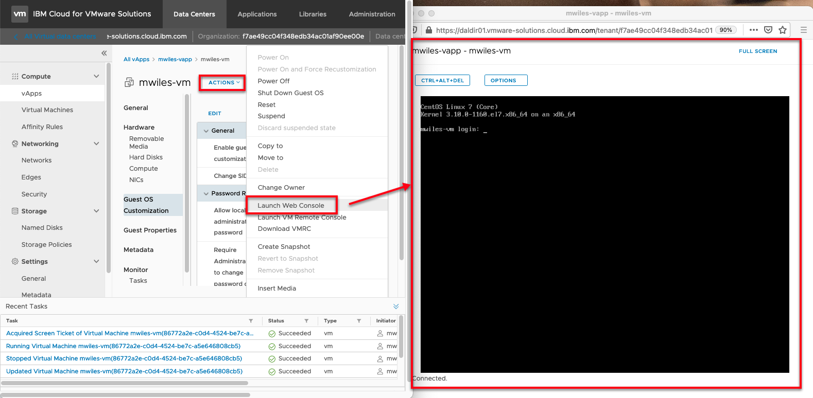
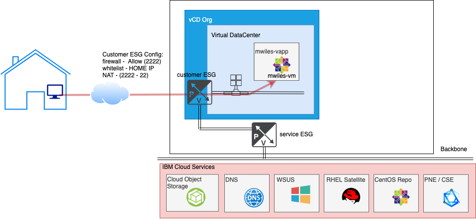
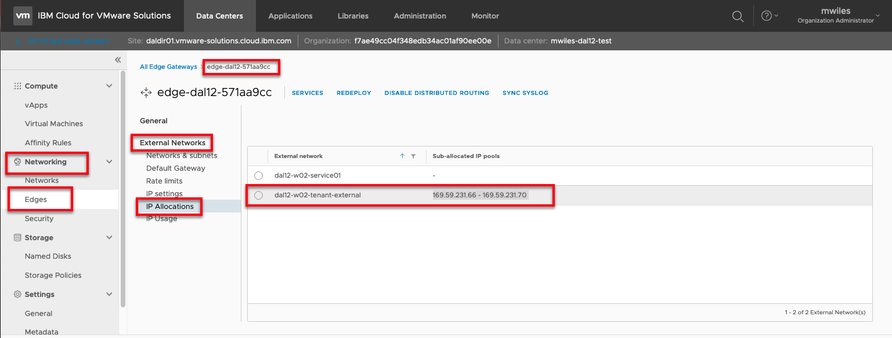

## vCD - Secure inbound access (Coming Soon)

Updated: 2021-03-31

If you are finding that the Web Console in your vDC is not quite meeting your needs: 
Compute > Virtual Machine > MACHINE > Actions > Launch Web Console

 then you can configure SECURE inbound access to your VM.  This is great to taking advantage of copy / paste, larger resolution, or just working on your environment without the requirement of the admin portal.

### Finished Picture

The end goal is to open up your Edge Service Gateway (ESG) to securely enable you to connect either via Secure Shell (SSH), Remote Desktop (RDP), etc ... to your VM(s).

Below is a use case where we will configure inbound SSH from a whitelisted (HOME) ip address to our vm in our vDC.

### Data Collection 

For this example we need the following information:
- Home or remote IP address (e.g. [What's my IP](https://whatismyipaddress.com/)): 75.183.214.216
- Public IP address for my ESG (see below): 169.59.231.66
- Virtual Machine IP: (see below)

### Public IP address range can be found on your ESG

Networking > Edges > EDGENAME > External Networks > IP Allocations 
There will be 5 IP addresses assigned to your ESG at creation time.  Any of these will work for this purpose.

### Virtual Machine IP

TO_BE_CONTINUED

_Note the information described in this example are guidelines.  There are multiple ways to configure the various parts of the example.  Please adjust accordingly for your needs._

[VMWare vCloud Director](https://mlwiles.github.io/vmwaresolutions/vcd/) 
[Main Page](https://mlwiles.github.io/vmwaresolutions)