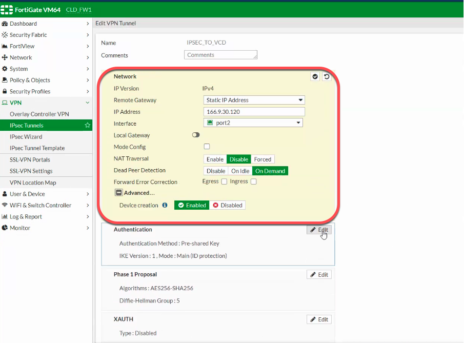
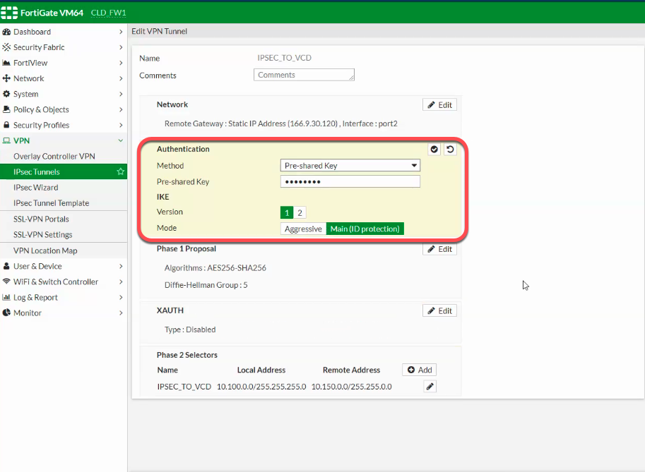
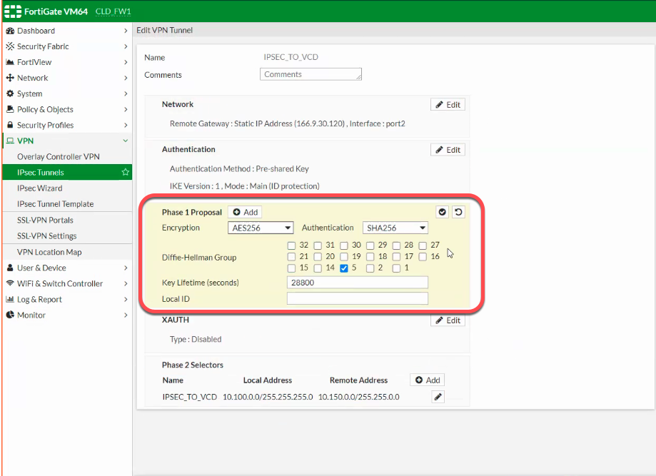
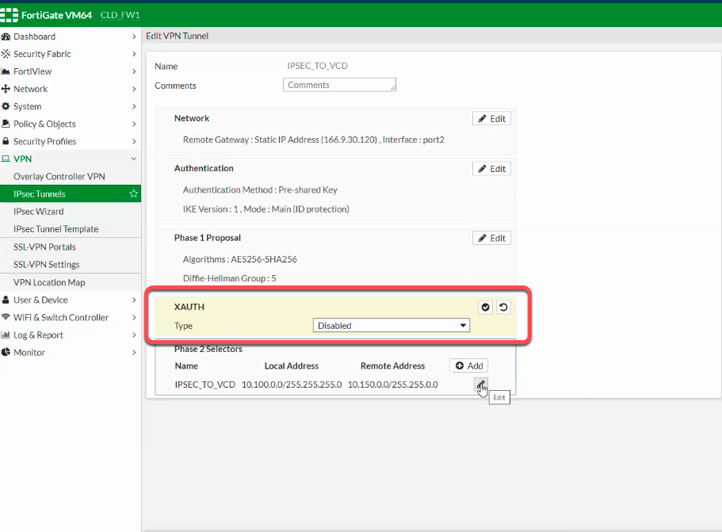
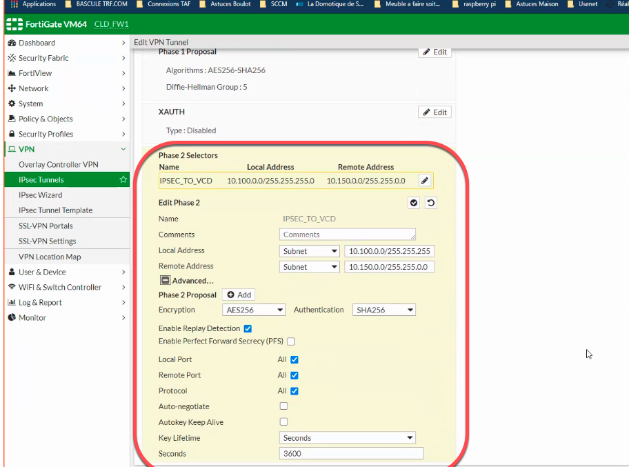
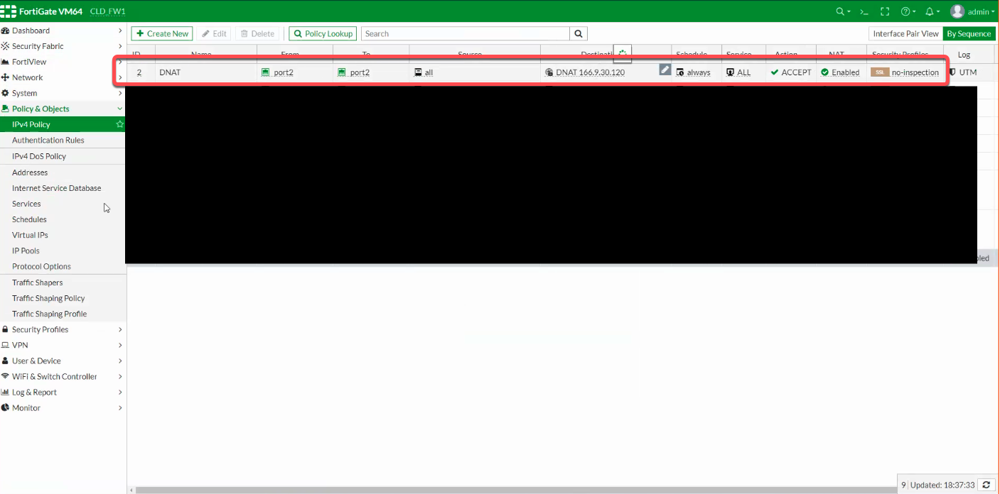
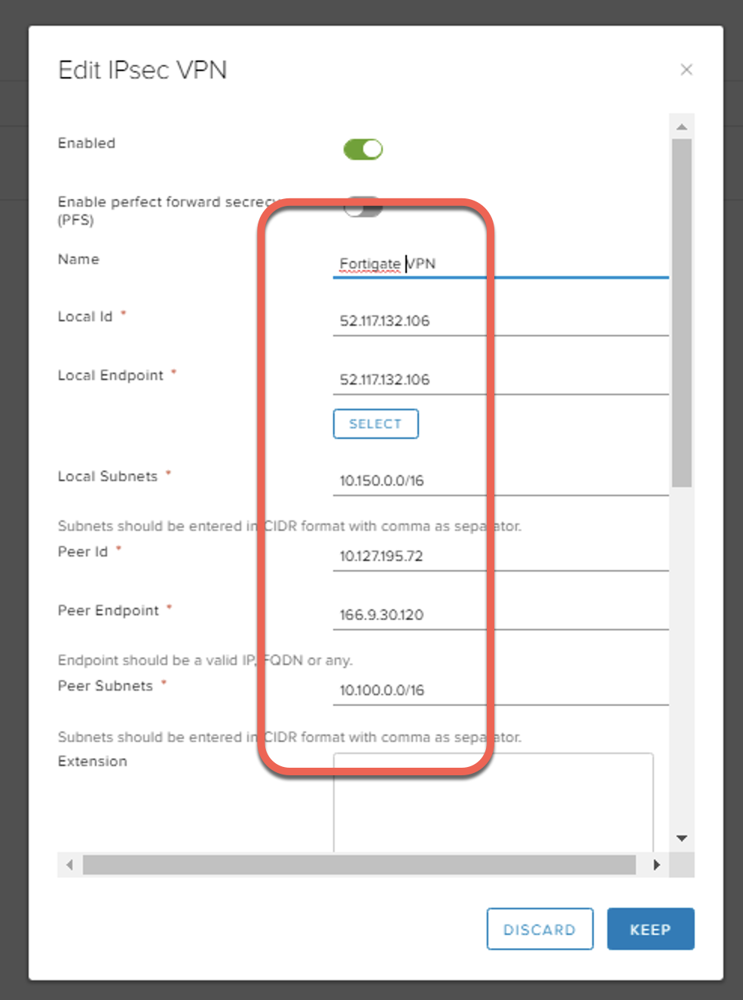
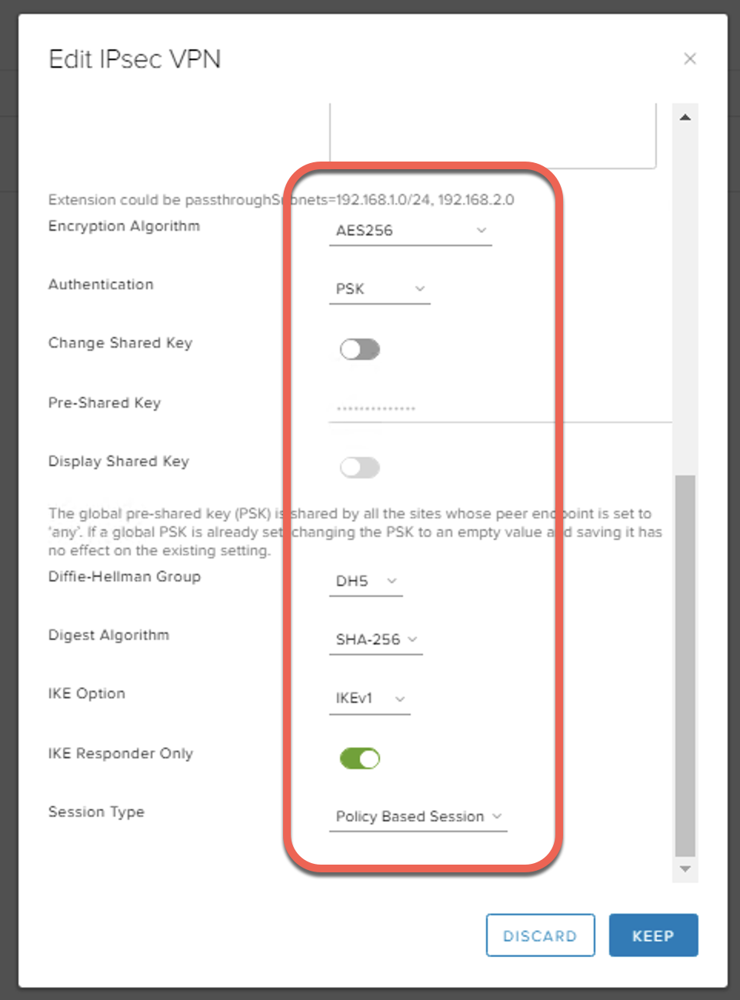

## vCD - IPSec Tunnel over IBM Private Network Endpoint (PNE) using Fortigate

Updated: 2020-12-17

In order to use a PNE for your IPSec tunnel between your IBM account to your IBM VMWare Solutions Shared virtual datacenter (vDC), you must first have a PNE ordered in your vDC.  See how to [Order IBM Private Network Endpoint (PNE)](https://mlwiles.github.io/vmwaresolutions/vcd/order-pne/).  

Additionally there is a detailed example of connecting two separate virtual datacenters using NSX-to-NSX Edge configuration - [IPSec Tunnel over IBM PNE](https://mlwiles.github.io/vmwaresolutions/vcd/ipsec-pne/)  

This example will demonstrate how to connect a vCloud Director vDC to another device, Fortigate (NSX-to-Fortigate) in different IBM Cloud account.  This allows bi-directional communication from virtual machines in the virtual datacenter to IBM Cloud accound fronted by the Vyatta device using the IBM Cloud backbone.  

Details of the Fortigate are listed below.

### Fortigate Rules

IPSec Tunnel:  Network

IPSec Tunnel:  Authentication

IPSec Tunnel:  Phase 1 Proposal

IPSec Tunnel:  XAUTH

IPSec Tunnel:  Phase 2 Authentication

Firewall:  Allow the DNAT to the PNE ordered

### NSX Configuration 

_Note the information described in this example are guidelines.  There are multiple ways to configure the various parts of the example.  Please adjust accordingly for your needs._

[VMWare vCloud Director](https://mlwiles.github.io/vmwaresolutions/vcd/) 
[Main Page](https://mlwiles.github.io/vmwaresolutions)
