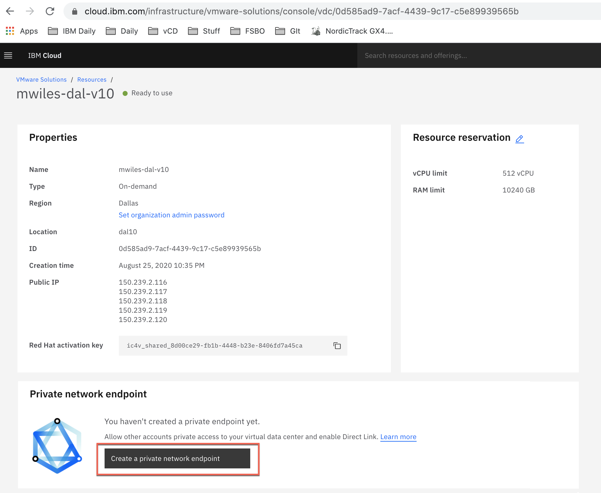
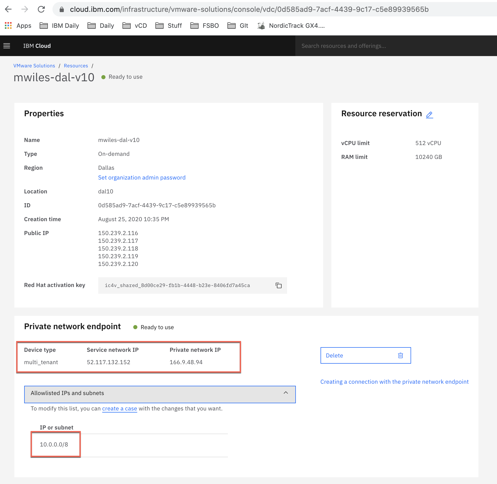

## Configuring an IPSec tunnel between two vDCs using Private Network Endpoint

There is a relatively new offering from IBM that allows communication between two IBM Cloud accounts taking advantage of the IBM Cloud backbone.  This provides a super fast connection between the accounts as well as avoids any 

 
