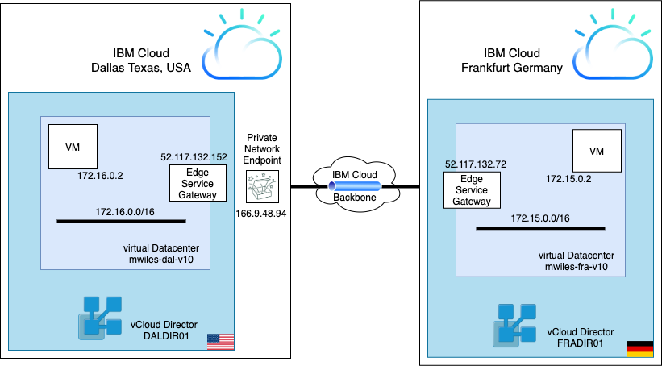
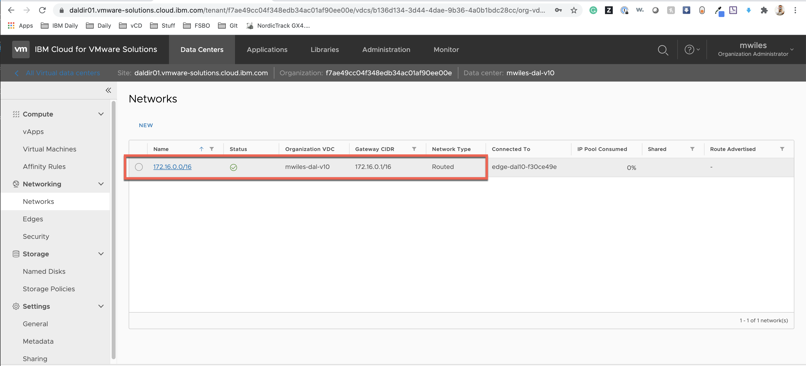
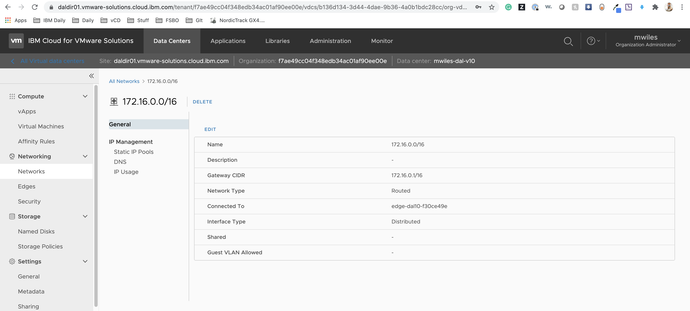
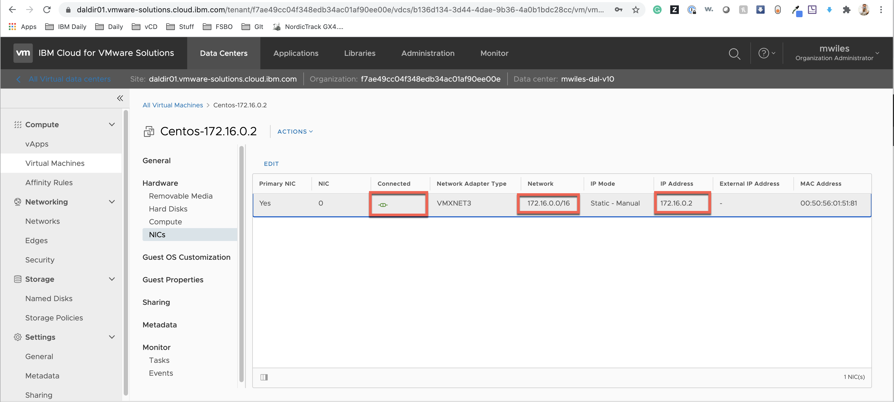
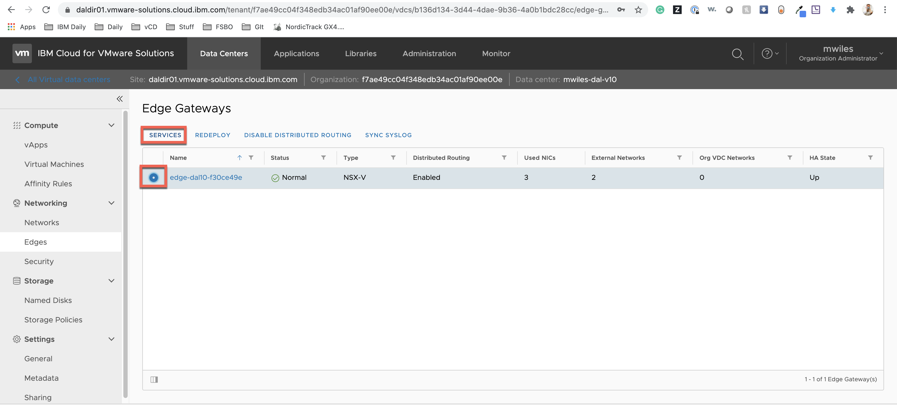
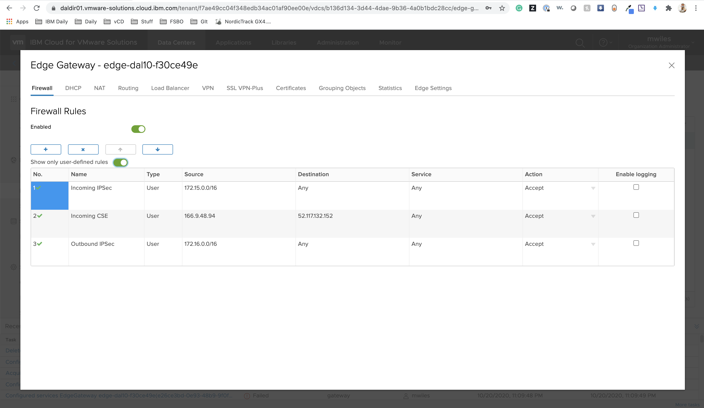
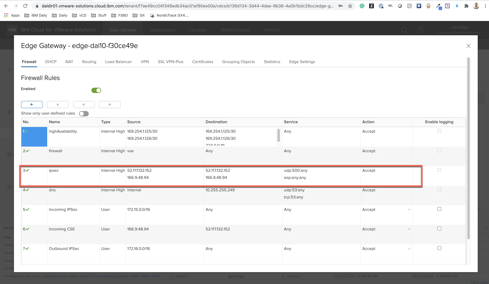
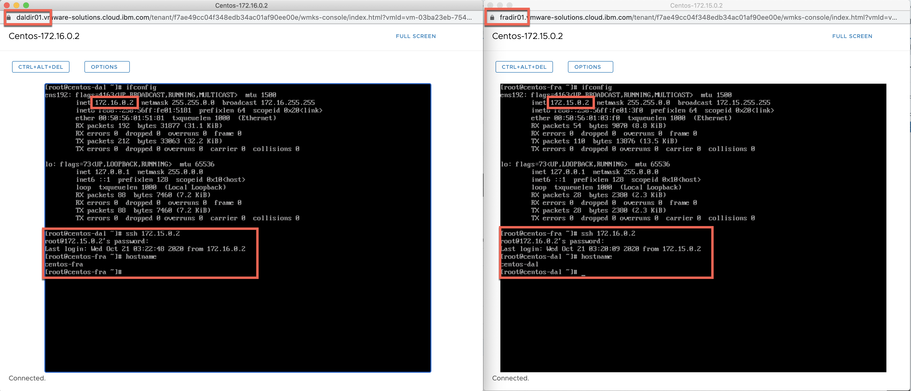

## IPSec Tunnel over IBM Private Network Endpoint (PNE) 

In order to use a PNE for your IPSec tunnel between your IBM account to your IBM VMWare Solutions Shared virtual datacenter (vDC), you must first have a PNE ordered in your vDC.  See how to [Order IBM Private Network Endpoint (PNE)](../order-pne/index.md).  Only one side requires a PNE.  

_If you are connecting a your IBM account to your vDC, you only need the PNE deployed in one of your vDCs (you can share the network linked in your tunnel across multiple vDCs)._

This example will demonstrate how to connect two vCloud Director vDCs located in two different physical datacenters to each other using an IPSec tunnel and one PNE.  This allows bi-directional communication from virtual machines in both virtual datacenters using the IBM Cloud backbone.

The diagram below describes the flow of the connection between the two datacenters

### The Datacenter information on the left:
- Physical datacenter: Dallas, TX, USA
- vCloud Director virtual datacenter: mwiles-dal-v10
- Edge Service Gateway address: 52.117.132.152
- VM network: 172.16.0.0/16
- VM (centos-dal): 172.16.0.2
- PNE address: 166.9.48.94

### The Datacenter information on the right:
- Physical datacenter: Frankfurt, Germany
- vCloud Director virtual datacenter: mwiles-fra-v10
- Edge Service Gateway address: 52.117.132.72
- VM network: 172.15.0.0/16
- VM (centos-dal): 172.14.0.2

## Configuring the Dallas vDC.

### Create a network.

Create a 172.16.0.0 Network
- Name: 172.16.0.0/16
- Gateway CIDR: 172.16.0.1/16
- Network Type: Routed
- Interface Type: Distributed

Deploy at least 1 VM to test your tunnel.  172.16.0.2 will be our Dallas-side example.  Attach it to your network and ensure the network interface is configured properly.

### Configure the Dallas Edge Service Gateway (ESG) services.

### Firewall rules:
- CSE Inbound: This rule will allow all traffic from your PNE with destination of the ESG Service Address.  This information can be found on your IBM Cloud vDC information page.
  - Source: 166.9.48.94
  - Destination: 52.117.132.152
- Incoming IPSec: This rule allows the network from the Frankfurt side (yet to be created) access to this ESG network.
  - Source: 172.15.0.0/16
  - Destination: Any (this can be more restrictive if required)
- Outbound IPSec: This rule allows the Dallas ESG network outbound access.
  - Source: 172.16.0.0/16
  - Destination: Any (this can be more restrictive if required)

### Network Address Translation SourceNAT rule:
- This rule will allow all traffic from the Dallas ESG network to route to translate to the ESG Address.
  - Original: 172.16.0.0/16
  - Translated: 52.117.132.152

### IPSec VPN:
To enabled the service, toggle the status switch to show green.

### Create the IPSec VPN Site:
- Enabled: True
- Name: ipsec-dal
- Local Id: ipsec-dal
- Local Endpoint: 52.117.132.152
- Local Subnets: 172.16.0.0/16
- Peer Id: ipsec-fra
- Peer Endpoint: 166.9.48.94
- Peer Subnets: 172.15.0.0/16
- Pre-Shared Key: _keycode used on both sides_
- IKE Responder Only: Enabled (**this is on the PNE Side ONLY**)

_In our example we did not change the Encryption Algorithm, Authentication, Diffie-Hellman Group, Digest Algorithm, IKE Option, Session Type_

NOTE: Some additional items will be created from this IPSec VPN Site:
- Routes:

- Firewall Rules:

## Configuring the Frankfurt vDC.

### Create a network.

Create a 172.15.0.0 Network
- Name: 172.15.0.0/16
- Gateway CIDR: 172.15.0.1/16
- Network Type: Routed
- Interface Type: Distributed

Deploy at least 1 VM to test your tunnel.  172.15.0.2 will be our Frankfurt-side example.  Attach it to your network and ensure the network interface is configured properly.

### Configure the Frankfurt Edge Service Gateway (ESG) services.

### Firewall rules:
- Incoming IPSec: This rule allows the network from the Dallas side access to this ESG network.
  - Source: 172.16.0.0/16
  - Destination: Any (this can be more restrictive if required)
- Outbound IPSec: This rule allows the Frankfurt ESG network outbound access.
  - Source: 172.15.0.0/16
  - Destination: Any (this can be more restrictive if required)

### Network Address Translation SourceNAT rule:
- This rule will allow all traffic from the Frankfurt ESG network to route to translate to the ESG Address.
  - Original: 172.15.0.0/16
  - Translated: 52.117.132.72

### IPSec VPN:
To enabled the service, toggle the status switch to show green.

### Create the IPSec VPN Site:
- Enabled: True
- Name: ipsec-fra
- Local Id: ipsec-fra
- Local Endpoint: 52.117.132.72
- Local Subnets: 172.15.0.0/16
- Peer Id: ipsec-dal
- Peer Endpoint: 166.9.48.94
- Peer Subnets: 172.16.0.0/16
- Pre-Shared Key: _keycode used on both sides_
- IKE Responder Only: **Leave Disabled**

## Test the tunnel

From the web-console, we log into the VMs in each side.  Then ensure we can ssh into the other VM as shown in the screenshot.

