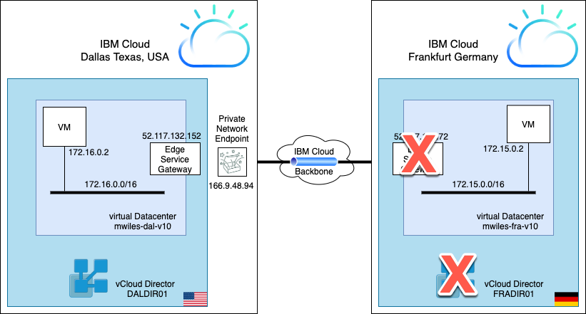
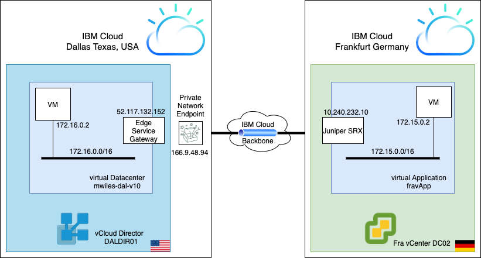
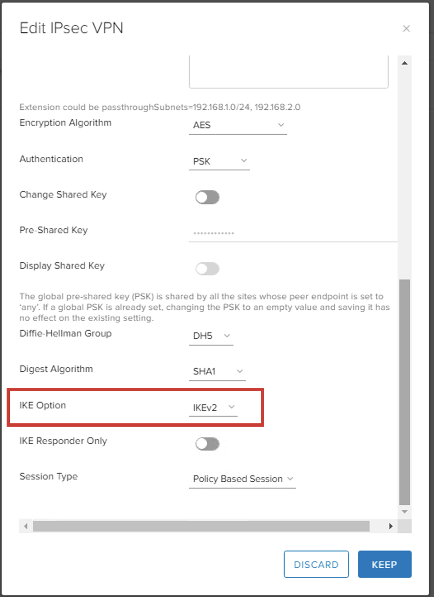
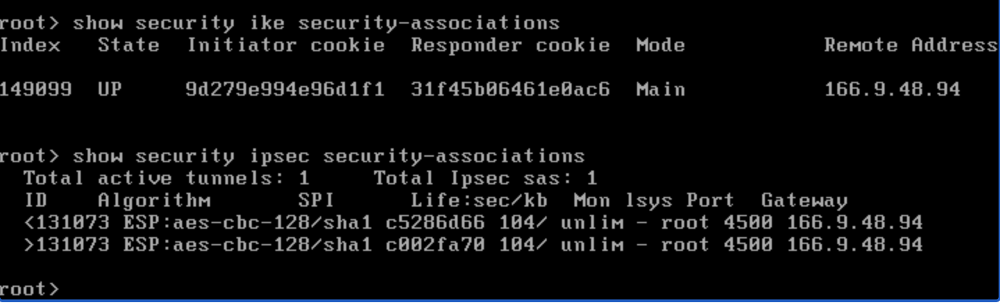
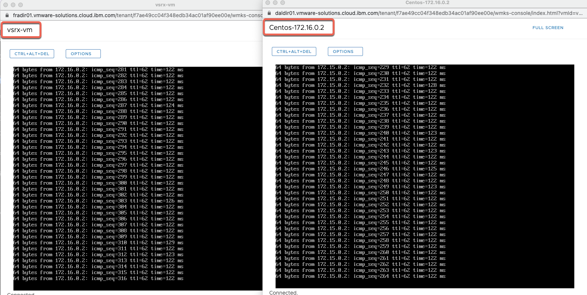

## vCD - IPSec Tunnel over IBM Private Network Endpoint (PNE) using SRX

Updated: 2021-02-09

**NOTE:  _As of 2021-03-01 the vSRX over private PNE to VCD has a known issue where the tunnel fails for 2 minutes every 24 hrs.  Over public works fine and actually has less latency between the SRX and ESG.  There are open work items with Juniper and VMWare to determine where the tunnel config is failing to keep the tunnel active.  Stay tuned for updates_**

Based on the initial example of an [IPSec Tunnel over IBM PNE - ESG](https://mlwiles.github.io/vmwaresolutions/vcd/ipsec-esg-pne/), this modification of the example will change the 'external' or 'inbound' side of the IPSec tunnel which was using ESG and to now use an SRX.

Replace the vCloud Directory using an ESG in Frankfurt ...


with a vCenter and a Juniper SRX.


To do so, we have deployed an SRX appliance in the vCenter in FRA (Juniper appliance image - vsrx_20.4r1.12_scsi)

### The Datacenter information on the left:
- Physical datacenter: Dallas, TX, USA
- vCloud Director virtual datacenter: mwiles-dal-v10
- Edge Service Gateway address: 52.117.132.152
- VM network: 172.16.0.0/16
- VM (centos-dal): 172.16.0.2
- PNE address: 166.9.48.94

### The Datacenter information on the right:
- Physical datacenter: Frankfurt, Germany
- vCenter instance with VM: vsrx
- IBM Cloud IP of the vsrx: 10.240.232.10
- VM network: 172.15.0.0/16
- VM (centos-fra): 172.15.0.2

## Configuring the Dallas vDC.

Same config in Dallas vDC from the referenced example, [IPSec Tunnel over IBM PNE - ESG](https://mlwiles.github.io/vmwaresolutions/vcd/ipsec-esg-pne/)<br>
The change required for IBM VMWare Shared side of the tunnel is to change the IKE version to v2:
- IKE Option: IKEv2



## Configuring the Frankfurt vCenter instance (SRX)

The configuration below provides the FRA side of the tunnel.  This descibes the interfaces and the routes for the example.

```
interfaces {
    ge-0/0/0 {
        unit 0 {
            family inet {
                address 10.240.232.10/24;
            }
        }
    }
    ge-0/0/1 {
        unit 0 {
            family inet {
                address 172.15.0.3/16;
            }
        }
    }
    st0 {
        unit 1 {
            family inet {
                inactive: filter {
                    input PCAP-VPN;
                    output PCAP-VPN;
                }
            }
        }
    }
}
routing-options {
    static {
        route 166.8.0.0/14 next-hop <SOFTLAYER PRIVATE NETWORK GATEWAY>;
        route 172.16.0.0/16 next-hop st0.1;
    }
}
```

Next we will define the IPsec configuration per our example.

```
security {
    ike {
        proposal cse-test-proposal {
            authentication-method pre-shared-keys;
            dh-group group5;
            authentication-algorithm sha1;
            encryption-algorithm aes-128-cbc;
            lifetime-seconds 28800;
        }
        policy cse-test-policy {
            mode main;
            proposals cse-test-proposal;
            pre-shared-key ascii-text "REDACTED"; ## SECRET-DATA
        }
        gateway cse-test-gateway {
            ike-policy cse-test-policy;
            address 166.9.48.94;
            local-identity hostname ipsec-fra-SRX;
            remote-identity hostname ipsec-dal;
            external-interface ge-0/0/1.0;
            version v2-only;
        }
    }
    ipsec {
        proposal cse-test-proposal {
            protocol esp;
            authentication-algorithm hmac-sha1-96;
            encryption-algorithm aes-128-cbc;
            lifetime-seconds 300;
        }
        policy cse-test-policy {
            proposals cse-test-proposal;
        }
        vpn cse-test-vpn {
            bind-interface st0.1;
            ike {
                gateway cse-test-gateway;
                proxy-identity {
                    local 172.15.0.0/16;
                    remote 172.16.0.0/16;
                    service any;
                }
                ipsec-policy cse-test-policy;
            }
            establish-tunnels immediately;
        }
    }
}
```

Finally we will define the security zones and policies per our example.

```
security {
    policies {
        from-zone trust to-zone trust {
            policy VPN-IN {
                match {
                    source-address NET-172.16.0.0/16;
                    destination-address NET-172.15.0.0/16;
                    application any;
                }
                then {
                    permit;
                }
            }
            policy VPN-OUT {
                match {
                    source-address NET-172.15.0.0/16;
                    destination-address NET-172.16.0.0/16;
                    application any;
                }
                then {
                    permit;
                }
            }
        }
    }
    zones {
        security-zone trust {
            address-book {
                address NET-172.15.0.0/16 172.15.0.0/16;
                address NET-172.16.0.0/16 172.16.0.0/16;
            }
            host-inbound-traffic {
                system-services {
                    all;
                }
            }
            interfaces {
                ge-0/0/0.0;
                st0.1;
            }
        }
    }
}

```
Check the status of the IPsec tunnel on the SRX device by reviewing the ike and ipsec security associations. Typically you should expect to see one `ike SA`, and one *pair* of `ipsec SAs` for each remote-subnet/local-subnet combination.
```
show security ike security-associations
show security ipsec security-associations
```


## Test the tunnel

From the web-console, we log into the VMs in each side.  Then ensure we can ping the other VM as shown in the screenshot.



_Note the information described in this example are guidelines.  There are multiple ways to configure the various parts of the example.  Please adjust accordingly for your needs._

_Additional note this SRX is not secured/locked down as would be recommended in real life. So bear that in mind when using as an example_

Credit:  [Nigel Vander Houwen](https://www.linkedin.com/in/nigel-vander-houwen-1a0a1626/) for his Network expertise!

[VMWare vCloud Director](https://mlwiles.github.io/vmwaresolutions/vcd/)<br/>
[Main Page](https://mlwiles.github.io/vmwaresolutions)