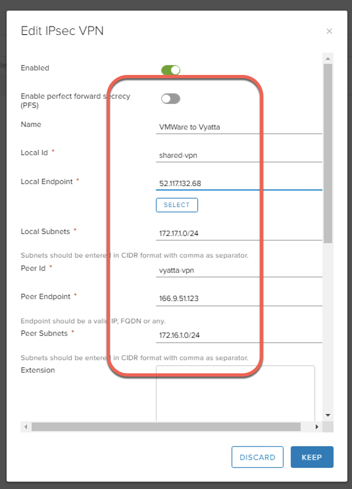
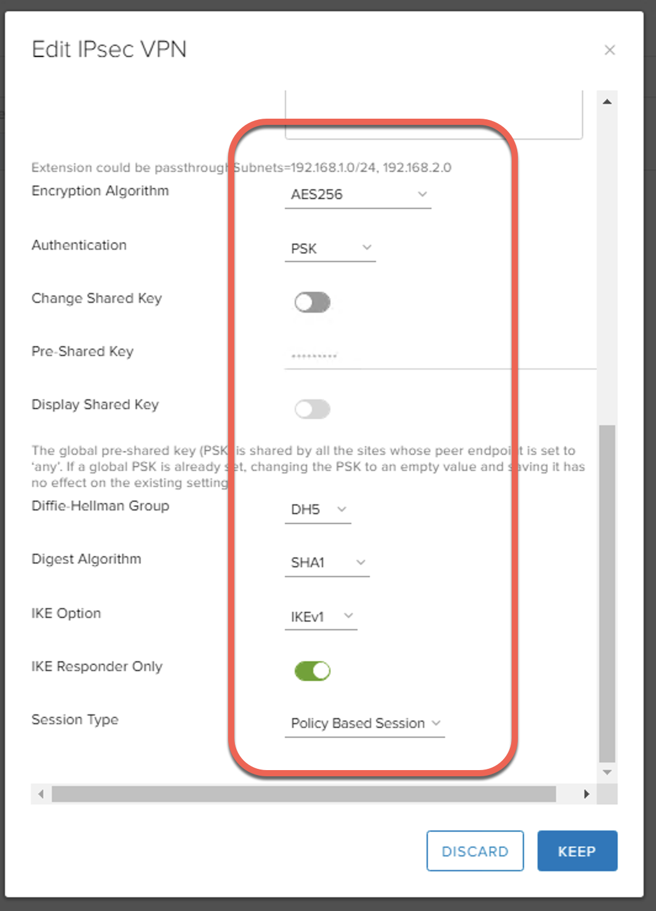

## vCD - IPSec Tunnel over IBM Private Network Endpoint (PNE) using Vyatta 

Updated: 2020-12-17

In order to use a PNE for your IPSec tunnel between your IBM account to your IBM VMWare Solutions Shared virtual datacenter (vDC), you must first have a PNE ordered in your vDC.  See how to [Order IBM Private Network Endpoint (PNE)](https://mlwiles.github.io/vmwaresolutions/vcd/order-pne/).  

Additionally there is a detailed example of connecting two separate virtual datacenters using NSX-to-NSX Edge configuration - [IPSec Tunnel over IBM PNE](https://mlwiles.github.io/vmwaresolutions/vcd/ipsec-pne/)  

This example will demonstrate how to connect a vCloud Director vDC to another device, Vyatta (NSX-to-Vyatta) in different IBM Cloud account.  This allows bi-directional communication for virtual machines in the virtual datacenter to virtual machines in a different IBM Cloud account fronted by the Vyatta device using the IBM Cloud backbone.  

Details of the Vyatta are listed below.

### Vyatta Rules

```
set security vpn ipsec esp-group ESP01 mode ‘tunnel’
set security vpn ipsec esp-group ESP01 pfs ‘disable’
set security vpn ipsec esp-group ESP01 proposal 1 encryption ‘aes256’
set security vpn ipsec esp-group ESP01 proposal 1 hash ‘sha1’
set security vpn ipsec ike-group IKE01 proposal 1 dh-group ‘5’
set security vpn ipsec ike-group IKE01 proposal 1 encryption ‘aes256’
set security vpn ipsec ike-group IKE01 proposal 1 hash ‘sha1’
set security vpn ipsec nat-networks allowed-network ‘0.0.0.0/0’
set security vpn ipsec nat-traversal ‘disable’
set security vpn ipsec site-to-site peer 166.9.51.123 authentication id ‘vyatta-vpn’
set security vpn ipsec site-to-site peer 166.9.51.123 authentication mode ‘pre-shared-secret’
set security vpn ipsec site-to-site peer 166.9.51.123 authentication pre-shared-secret ‘********’
set security vpn ipsec site-to-site peer 166.9.51.123 authentication remote-id ‘shared-vpn’
set security vpn ipsec site-to-site peer 166.9.51.123 connection-type ‘initiate’
set security vpn ipsec site-to-site peer 166.9.51.123 default-esp-group ‘ESP01’
set security vpn ipsec site-to-site peer 166.9.51.123 description ‘Vyatta to VMWare’
set security vpn ipsec site-to-site peer 166.9.51.123 ike-group ‘IKE01’
set security vpn ipsec site-to-site peer 166.9.51.123 local-address ‘10.184.55.70’
set security vpn ipsec site-to-site peer 166.9.51.123 tunnel 1 local prefix ‘172.16.1.0/24’
set security vpn ipsec site-to-site peer 166.9.51.123 tunnel 1 remote prefix ‘172.17.1.0/24’
```

### NSX Configuration 






_Note the information described in this example are guidelines.  There are multiple ways to configure the various parts of the example.  Please adjust accordingly for your needs._

[VMWare vCloud Director](https://mlwiles.github.io/vmwaresolutions/vcd/)<br/>
[Main Page](https://mlwiles.github.io/vmwaresolutions)
