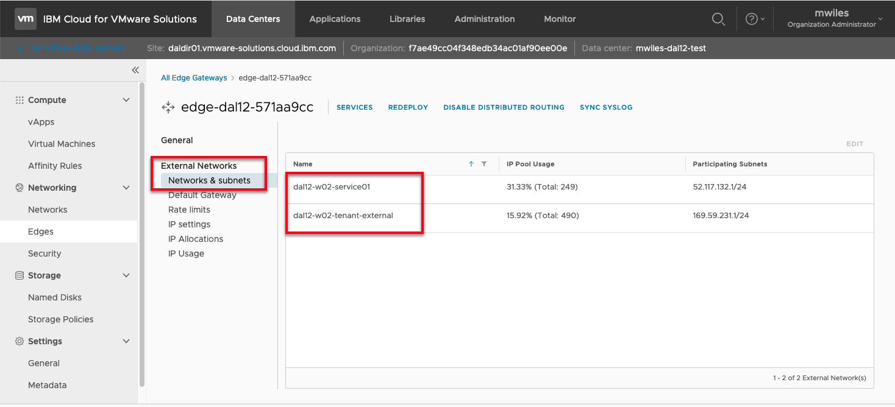
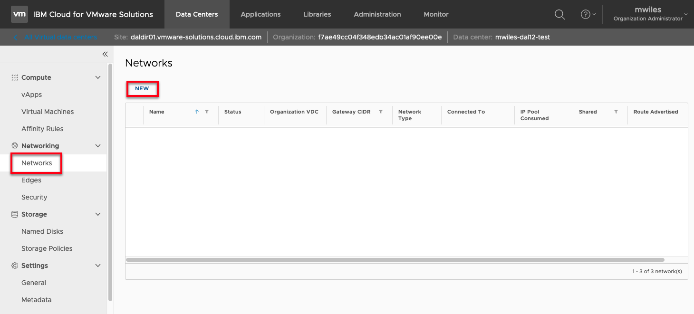
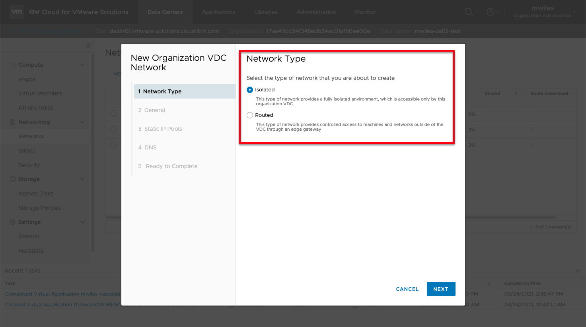
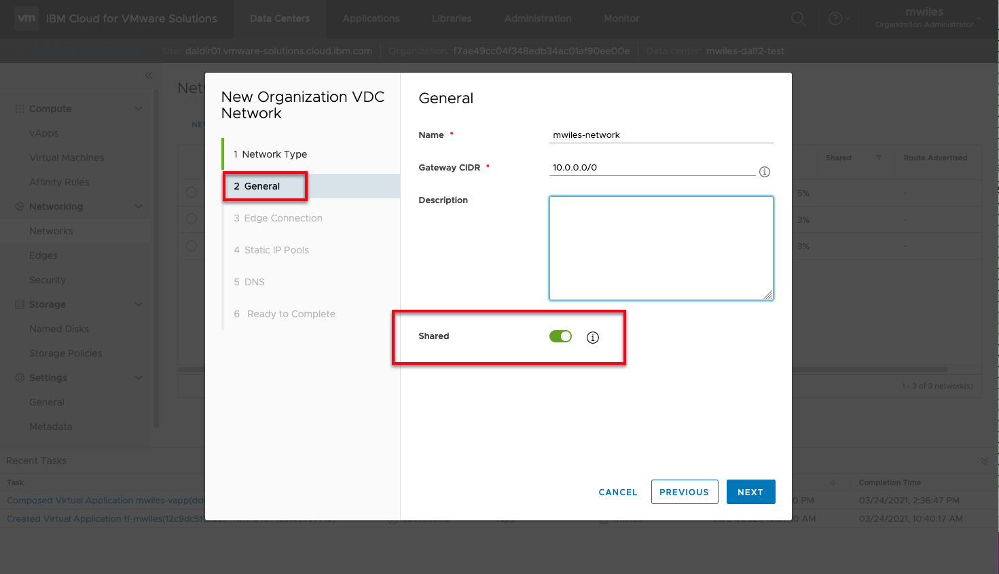
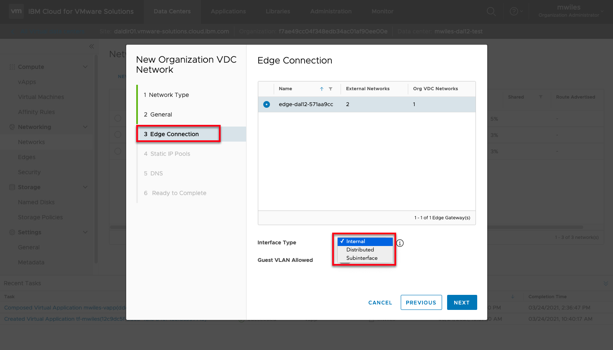
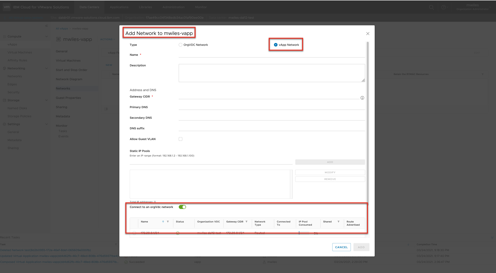

## vCD - Networking made easy 

Updated: 2021-03-24

### vCD Network Types

- **[External](https://docs.vmware.com/en/VMware-Cloud-Director/10.2/VMware-Cloud-Director-Service-Provider-Admin-Portal-Guide/GUID-B460BB86-C302-484E-A0C0-C754D83A5BDD.html)** networks are backed by vSphere networks therefore created by a system administrator.  These networks provide uplinks to networks outside of vCD.  In the current implementation of [VMWare Solutions on IBM Cloud](https://cloud.ibm.com/infrastructure/vmware-solutions/console) there are two networks visible to vDC users: 
  - Service network (e.g. _dal12-w02-service01_) - this network is used to allow virtual datacenter VMs to access IBM Cloud internal services.
  - Tenant External (e.g. _dal12-w02-tenant-external_) - this network is used to allow virtual datacenter VMs to access the public internet.

  From the datacenter view 
    Edges > edge-YOUREDGE > External Networks > Networks & subnets
   

   
 

- **[Organization](https://docs.vmware.com/en/VMware-Cloud-Director/10.2/VMware-Cloud-Director-Tenant-Portal-Guide/GUID-B208CDD2-5D46-4841-8F3C-BED9E4F27F07.html?hWord=N4IghgNiBcIPYCcDmYB2BLAXmALuuqABKgKY4DuiA1iAL5A)** networks are backed by NSX Data Center for vSphere which can be created by an vDC organization administrator or higher priviledged user.  These networks provide various access levels within the vDC organization.  These types are:
  - Direct - direct layer 2 external network connectivity to virtual machines outside of the organization vDC (_currently not available for [VMWare Solutions on IBM Cloud](https://cloud.ibm.com/infrastructure/vmware-solutions/console)_).
  - Isolated (Internal) - a private network that only organization virtual machines and vApps can connect to.
  - Routed - a network that provides controlled access to external networks by use of network address translation (NAT), firewall, and VPN settings.
  - Imported - logical network segments that are created in NSX-T Data Center and use an existing NSX-T Data Center logical switch (_currently not available for [VMWare Solutions on IBM Cloud](https://cloud.ibm.com/infrastructure/vmware-solutions/console)_).

  From the datacenter view 
    Networking > Networks > New
   

   

  For Isolated and Routed networks there are some additional options to consider.  If the Shared option is enabled for the network this means that it can be accessible from any vDC with the organization.

  

  For Routed networks there are some additional Interface Types that are important to understand:

  - Internal - Connects to one of the Edge gateway's internal interfaces.  The maximum number of networks that are allowed is 9.
  - Distributed - Creates the network on a distributed logical router connected to this edge gateway.  The maximum number of networks that are allowed is 400.
  - Subinterface - Extends an organization VDC network. VMware Cloud Director identifies the network to use to extend through L2 VPN.  vCD, with the help of NSX network virtualization, creates a trunk interface type for this network. The maximum number of networks that are allowed is 200.

  

 

- **[vApp](https://docs.vmware.com/en/VMware-Cloud-Director/10.2/VMware-Cloud-Director-Tenant-Portal-Guide/GUID-B95FB8AF-C428-4FCB-88DA-5DCA35B19B5A.html)** networks are created as part of the vApp by an user with vApp Author rights or a higher priviledged user.  

  VApp networks can also be connected to Organization networks.  The connections can be direct or fenced. Fencing allows identical virtual machines in different vApps to be powered on without conflict by isolating the MAC and IP addresses of the virtual machines.

  When fencing is enabled and the vApp is powered on, an isolated network is created from the organization virtual data center network pool. An edge gateway is created and attached to the isolated network and the organization virtual data center network. Traffic going to and from the virtual machines pass through the edge gateway, which translates the IP address using NAT and proxy-AR. This allows a router to pass traffic between two networks by using the same IP space.

  

_Note the information described in this example are guidelines.  There are multiple ways to configure the various parts of the example.  Please adjust accordingly for your needs._

[VMWare vCloud Director](https://mlwiles.github.io/vmwaresolutions/vcd/) 
[Main Page](https://mlwiles.github.io/vmwaresolutions)