## vCD - Network High Availability via Data Center Groups
 
Updated: 2021-06-22

### Table of Contents:
 - Data Center Group
   - [Create New Group](#vcddcgnew)
   - [Add EGress](#vcddcgegress)
   - [Create Stretch Network](#vcddcgstretch)

_NOTE:  There are some noticeable differences between vCD v10.1.3 vs v10.2.2.  We will focus on 10.1.3 (current deployed version) and update this document for 10.2.2 as soon as the environment is updated._

A [data center group](https://docs.vmware.com/en/VMware-Cloud-Director/10.2/VMware-Cloud-Director-Tenant-Portal-Guide/GUID-086DD0B6-C01C-43EB-BFDE-DED999980B2A.html)
 acts as a virtual data center group router that provides centralized networking administration, configuration for multiple egress points in multiple virtual data centers, and east-west traffic between all networks within the group. A data center group can contain between one and 16 virtual data centers that are configured to share multiple egress points.

Big picture:  The end result will be to create a network that is owned by an NSX Distributed Logical Router (DLR) creating an iBGP session with two NSX Edge Service Gateways (ESG) therefore allowing VMs that are connected to that network uninterrupted network access if one of the ESG's becomes unavailable.  Ideally this configuration is using ESG's that are in two different physical datacenters.  We will describe how to setup the Cross VDC network in the diagram below:

- 172.16.0.0/24 (Cross VDC network owned by DLR)
- iBGP Session created via the vCD Datacenter Group

<kbd>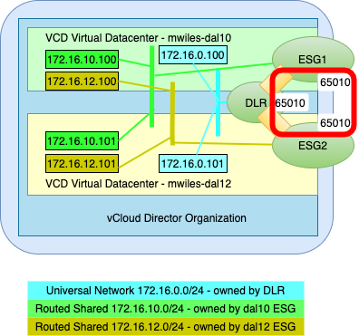</kbd>

## Create New Group
v10.1.3 DCG's are located at `Data Centers` > `Data Center Groups` 
v10.2.2 DCG's are located at `Networking` > `Data Center Groups` 

To create a Data Center Groups, switch to tenant view and `Data Centers` > `Data Center Groups` and click on `New Data Center Group`
<kbd>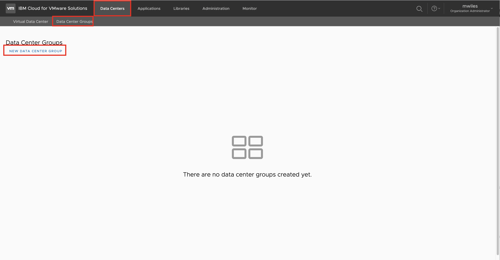</kbd>

1-Name:  Enter Name for the DCG, Select `Create Local Group`
<kbd>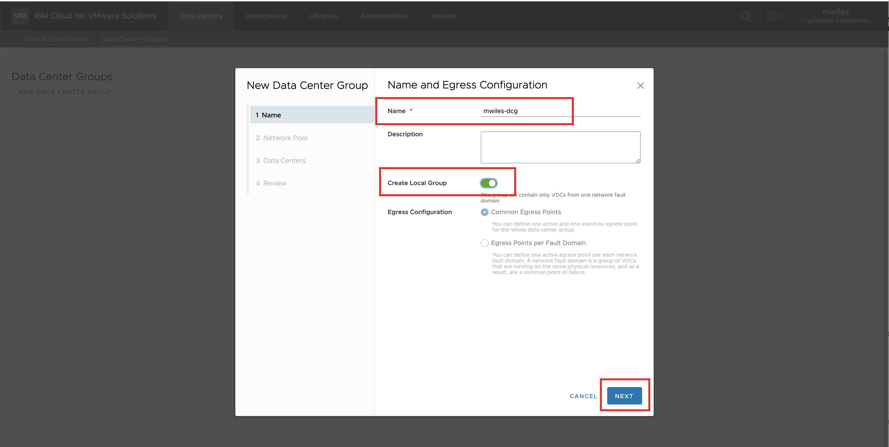</kbd>

2-Network Pool: Select the correct Network Pool (there should only be 1)
<kbd>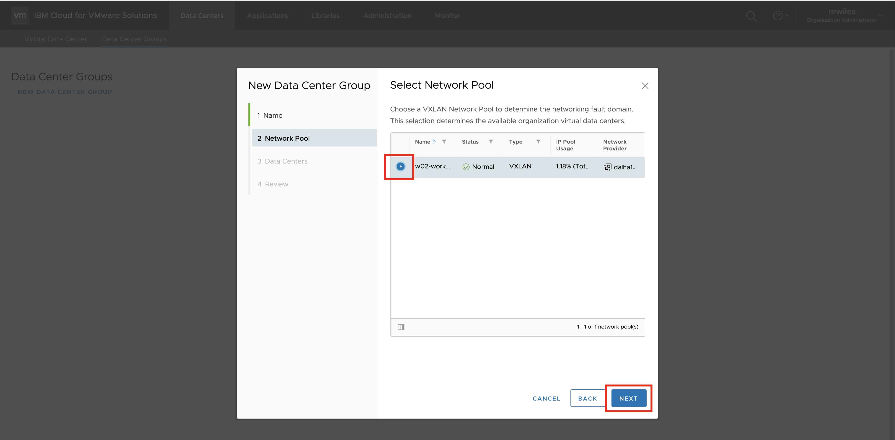</kbd>

3-Data Centers: Select the vDC's to participate in the DGC
<kbd>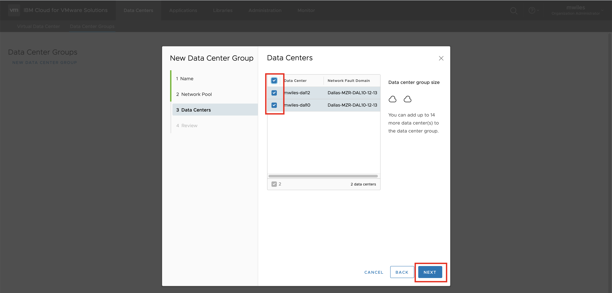</kbd>

4-Review: Check before `Finish`
<kbd>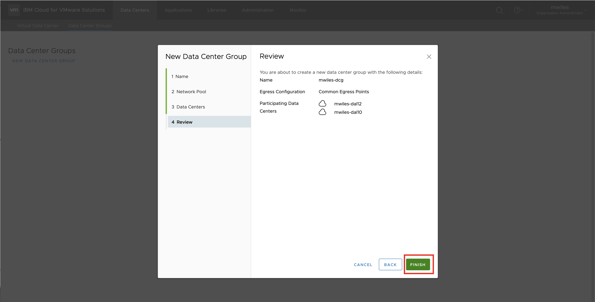</kbd>

At this point the Data Center group is created and there is a DLR associated to the group.

Back to: [Menu](#toc)

## DCG EGress

Select the `Details` of the DCG
<kbd>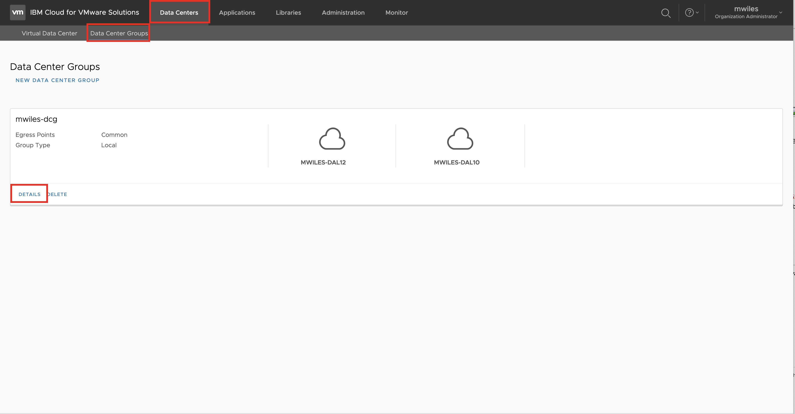</kbd>

`Network Topology` > `Add EGress Point`
<kbd>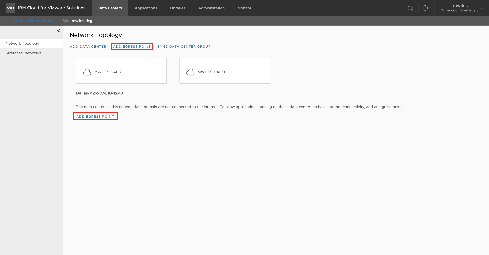</kbd>

Select one of the ESGs from the vDCs that were added.  This will be the current Active EGress point.
<kbd>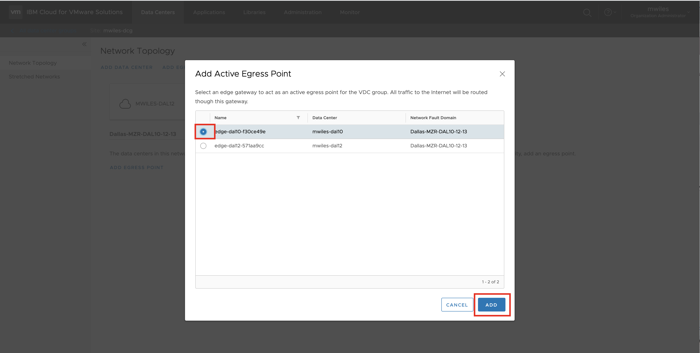</kbd>

Notice the Active EGress point is now created.  Next create the Stand-By EGress point by `Network Topology` > `Add Stand By EGress Point` (this requires more that 1 vDC in the DCG)
<kbd>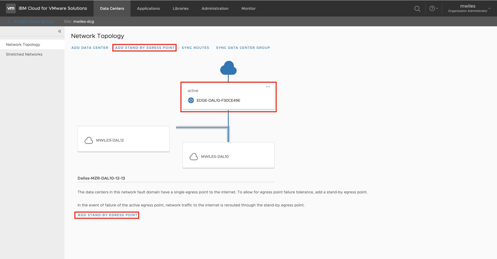</kbd>

Select one of the ESGs from the vDCs that were added.  This will be the current Stand By EGress point.
<kbd>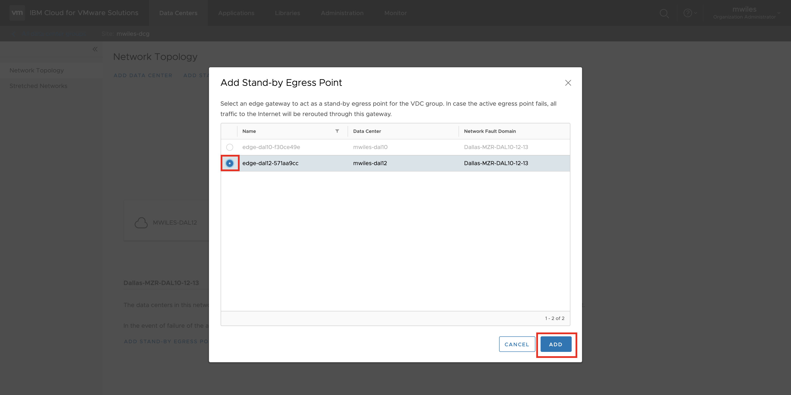</kbd>

Notice the Standby EGress point.  Additionally, if the EGress points need to change roles, a Swap action can be manually initiated via `Swap EGress Points`
<kbd>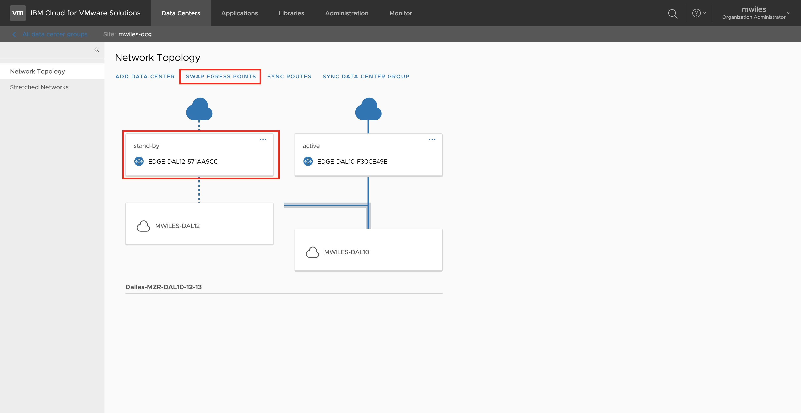</kbd>

In the ESG settings for the Active and Stand by EGress Points, in the `Routing` > `BGP` section, notice the BGP Configurations have been modified:
- Enable BGP
- Enable Graceful Restart
- Enable Default Originate

A new Neighbor will be created and managed.  If the `Local AS` was previously set to a value other than `65010` it will be overwritten.  The new Neighbor is the Group created via the DLR interfaces to each ESG.  This will be a network `192.168.253.0/30` _This currently CANNOT be changed or the DCG feature will not work as described._  The Active ESG will have a weight of `60` and the Stand-by will have a weight of `30`.
<kbd>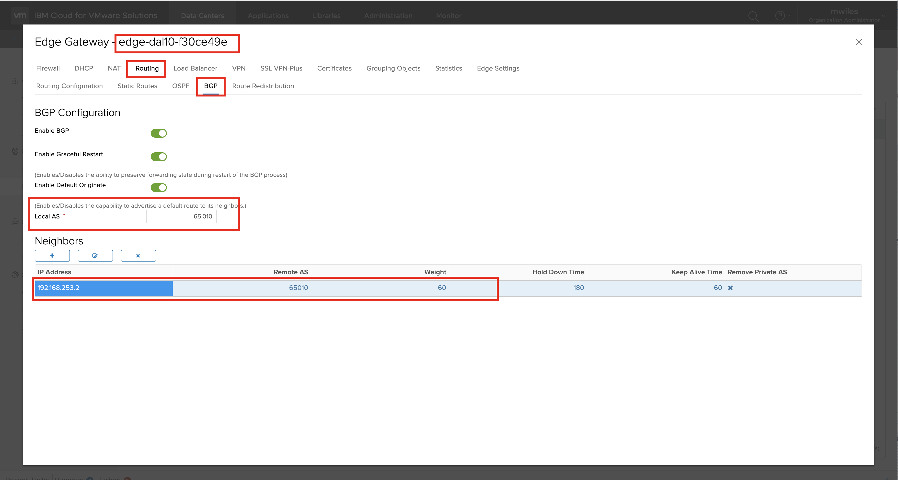</kbd>

Back to: [Menu](#toc)

## DCG Stretch Network
Lastly, to take advantage of the Cross vDC Networking, create a stretch network.

`Stretched Networks` > `Add`
<kbd>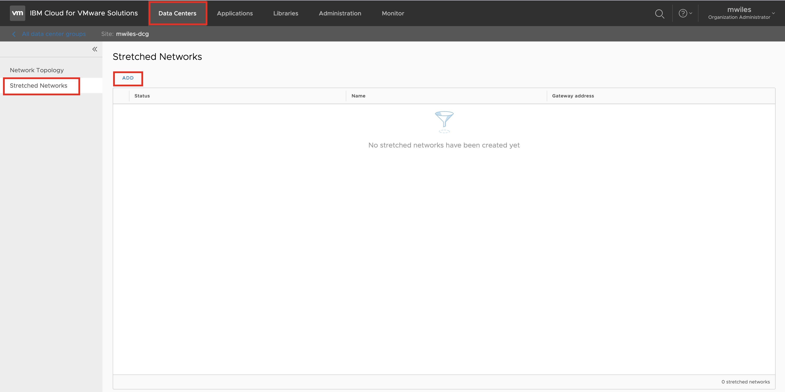</kbd>

Provide `Name` and `CIDR`
<kbd>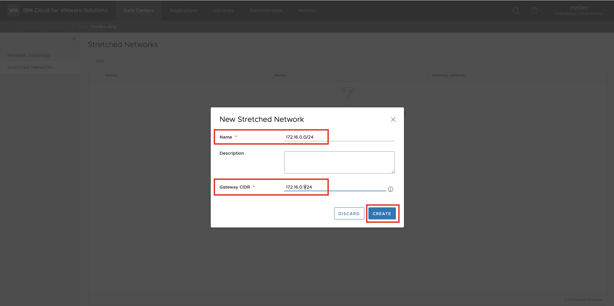</kbd>

New network is now available for BGP across the vDCs of the DCG.
<kbd>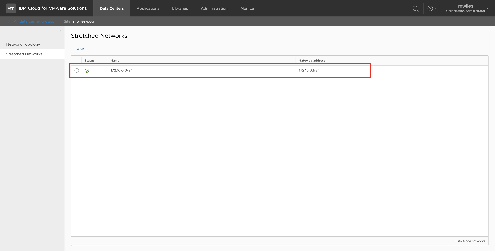</kbd>

Next would be to put VMs on the Cross-VDC network and build out your use case.
<kbd>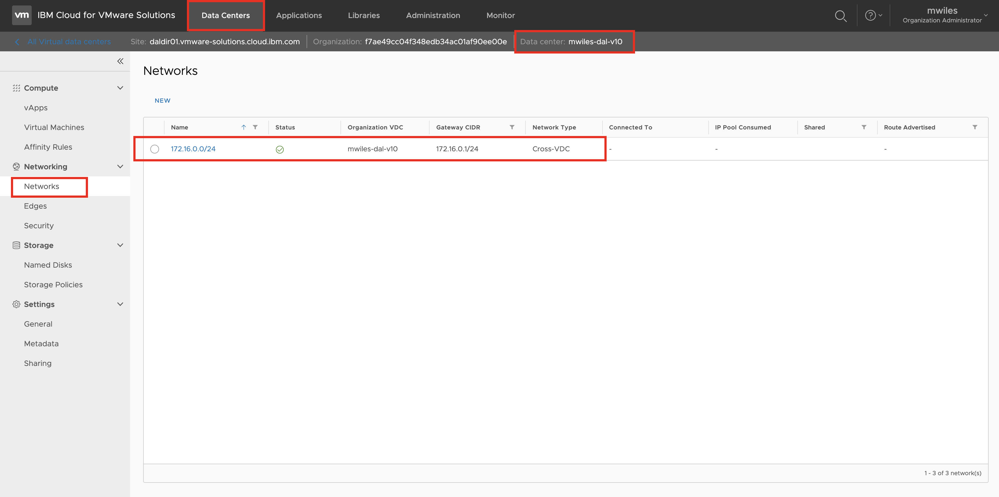</kbd>

Back to: [Menu](#toc)

_Note the information described in this example are guidelines.  There are multiple ways to configure the various parts of the example.  Please adjust accordingly for your needs._

[VMWare vCloud Director](https://mlwiles.github.io/vmwaresolutions/vcd/) 
[Main Page](https://mlwiles.github.io/vmwaresolutions)

