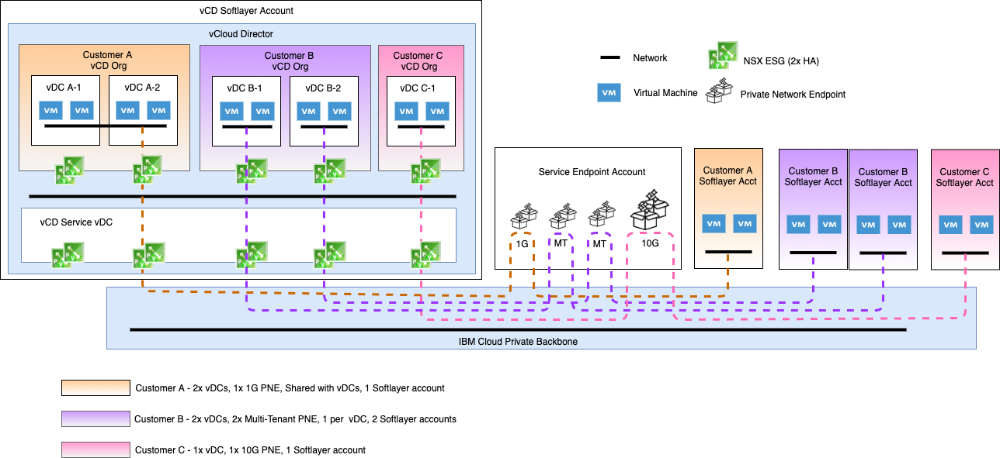
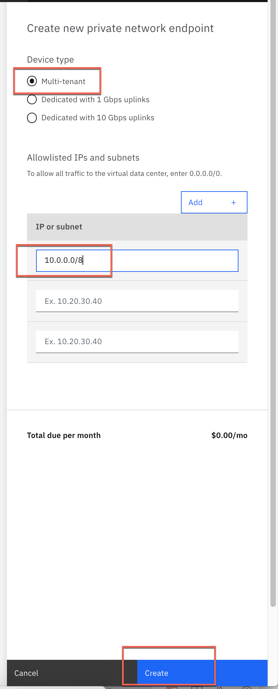
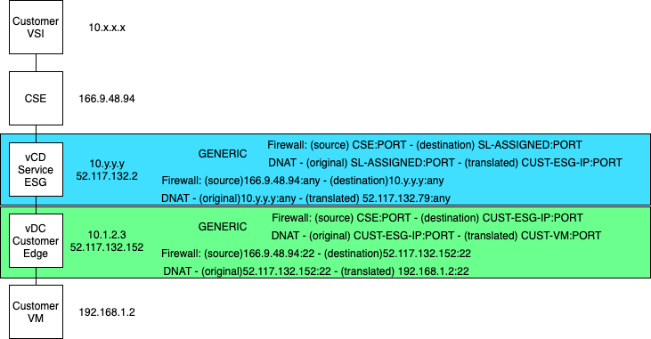

## Order a Private Network Endpoint (PNE) to connect your IBM account to your IBM VMWare Solutions Shared virtual datacenter (vDC)

Updated: 2020-10-02 

There is an offering from IBM VMWare Solutions that allows communication between an IBM Cloud account and IBM VMWare Solutions Shared taking advantage of the IBM Cloud backbone.  This provides a fast connection between the accounts as well as avoids any ingress/egress charges.  

The examples below show some of the common use cases that can be fullfilled by using a PNE to connect into a vDC.

- Customer A using a dedicated 1G PNE to access thier vDC via an organization shared network.
- Customer B using multiple shared PNE's to access two differnet vDCs.
- Customer C using a dedicated 10G PNE to access their vDC.

### Request a PNE from the IBM VMWare Solutions Shared virtual data center

Select 'Create a private network endpoint' as seen in the screenshot below.

### Options
For the free version, select Multi-tenant.  This option runs on shared hardware and the throughput is not guaranteed.  
For faster and guaranteed throughput, check out the Dedicated options (1 Gig or 10 Gig).

### Ordering
In order to allow the IBM account to have access, you will need to identify which IP(s) or subnet(s) can have access.  

Ordering a PNE does not automatically allow all of IBM Cloud to have access to your vDC, this just allows the whitelisted IP ranges to pass through the PNE.  The default firewall rules on your edge gateway prevents all inbound traffic (this is completely under control of your organization admin). 

In this example we allow all of IBM Cloud private (10.0.0.0/8) but will later show how to use the firewall rules to allow only endpoints we desire.

### Details
Once created, the PNE will show the information that is required for firewall rules.  

Note:
- the 52. ip address is the internal address that is used by IBM VMWare Solutions Shared.  This is NOT a public IP.  
- the 166.9 IP will be your PNE address will be important for your firewall rules.  
- the IP/subnet that you whitelisted at order time.  

We do not allow changes via the IBM Cloud UI; requests will be ticket based at this time.

Once ordered and configured you will be able to take advantage of the unlimited access from your whitelisted accounts into the virtual datacenter. 

### Configuration Example
Below is an example of a customer configuring their edge gateway to allow forwarding of SSH to a VM deployed in their vDC.

- Customer VM 192.168.1.2
- Firewall rule (in green) allowing all traffic from the PNE with destination to the customer edge gateway ip.
- DNAT rule (in green) redirecting SSH traffic on port 22 to the target customer VM.

[Main Page](https://mlwiles.github.io/vmwaresolutions)