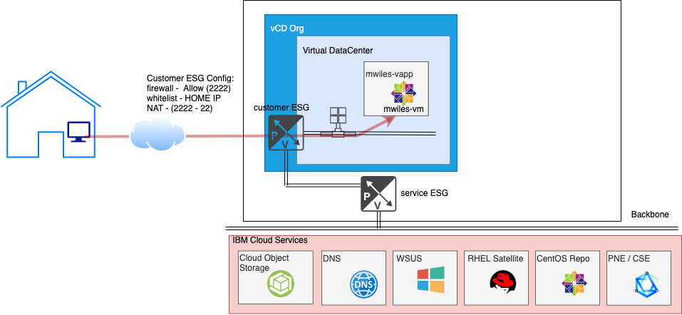
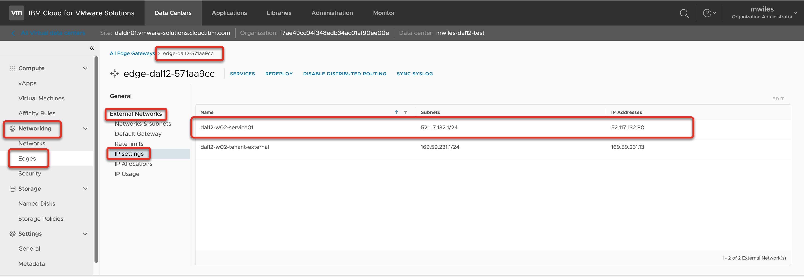
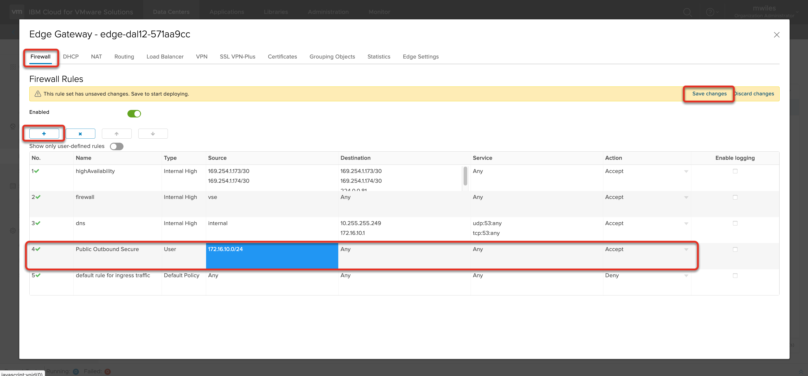
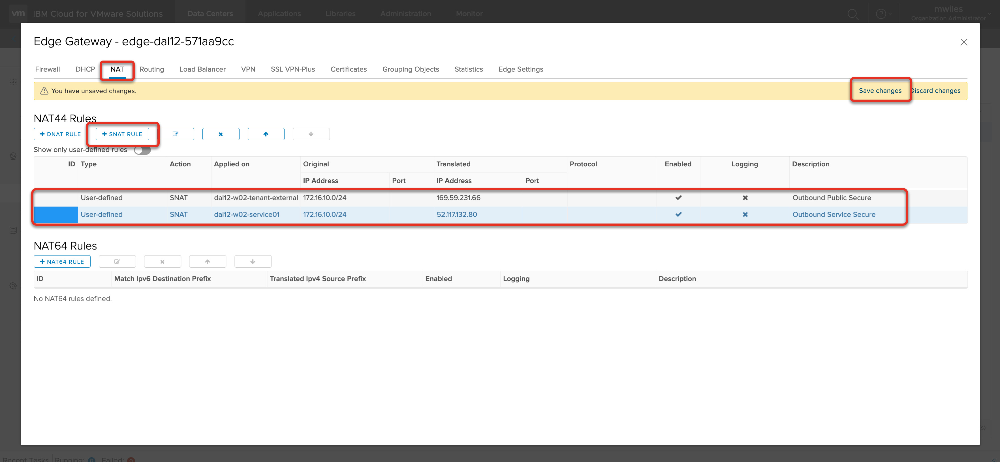
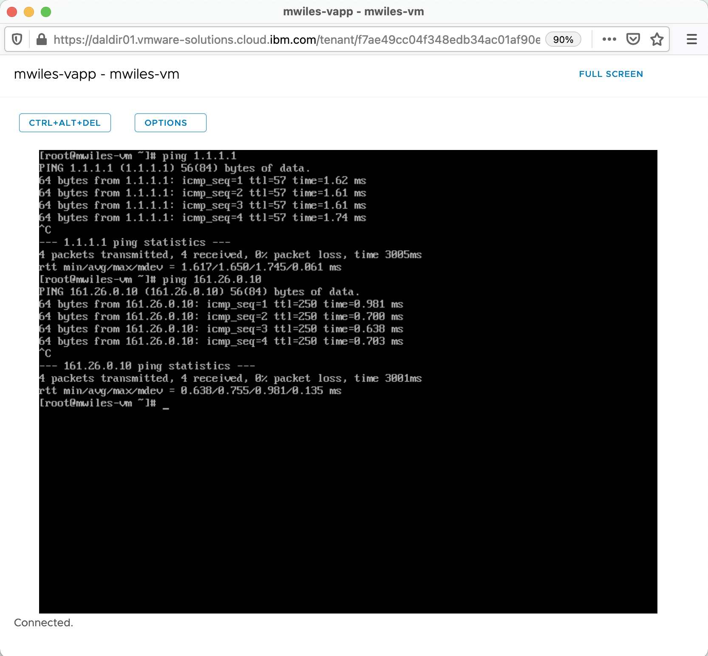

## vCD - Internet and IBM Cloud services access

Updated: 2021-05-01 

### Table of Contents:
  - [Overview](#overview)
  - [Finished Picture](#finished)
  - [Data Collection](#data)
  - [Public IP](#publicip)
  - [Service IP](#serviceip)
  - [vDC Network](#vdcnetwork)
  - [Virtual Machine IP](#vmip)
  - [Allow Access outbound](#allow)
  - [Test the rule](#test)

###  Overview

If you have requirements for your Virtual Machines to access either the Internet or IBM Cloud services, then you can configure SECURE outbound access for your VM.  This is great way to utilize the large portfolio of IBM Services as well as accessing your critical data that might be outside of IBM Cloud.

For more details on allowing external access to your VMs see [Secure inbound access](https://mlwiles.github.io/vmwaresolutions/vcd/inbound).

Back to: [Menu](#toc)

### Finished Picture

The end goal is to open your Edge Service Gateway (ESG) to securely enable your VMs to access specific or all services that are available from IBM Cloud or from the public internet.

Below is a use case where we will configure outbound access to both the IBM Cloud services as well as the public Internet for our VM in our vDC.   

Back to: [Menu](#toc)

This will demonstrate unrestricted access to all services external to the vDC.  You should identify requirements for your vDC VMs and restrict as needed either by more restrictive ESG Firewall rules or some other means.

### Data Collection 

For this example, we need the following information:
- Public IP address for my ESG (see below): `169.59.231.66`
- Service IP address for my ESG (see below): `52.117.132.80`
- vDC Network CIDR: (see below): `172.16.10.0/24`

Back to: [Menu](#toc)

### Public IP address range can be found on your ESG

Networking > Edges > EDGENAME > External Networks > IP Allocations 
There will be 5 IP addresses assigned to your ESG at creation time.  Any of these will work for this purpose.  Select one of the IPs to use as public outbound IP:  169.59.231.66

Back to: [Menu](#toc)

### Service IP address range can be found on your ESG

Networking > Edges > EDGENAME > External Networks > IP Settings 
There will be 1 IP address assigned to your ESG at creation time to access the service network (IBM Cloud services).  For this ESG the service outbound IP:  52.117.132.80

Back to: [Menu](#toc)

### vDC Network

You must create a network if one does not already exist that will be used to route the inbound traffic.

For this example, I created a network with the following criteria:
- Gateway CIDR: `172.16.10.1/24`
- Type: `Routed`
- Connection Type: `Subinterface`
- Static IP Pool: `172.16.10.10-172.16.10.20`

Review [vCD -   Networks made easy](https://mlwiles.github.io/vmwaresolutions/vcd/network101/) for additional information on how to create a network.

If using vApps, the network must be attached to the vApp.  

Compute > vApps > Networks > New

OrgVDC Network > 172.16.10.0/24 (in the case of this example)

Back to: [Menu](#toc)

### Virtual Machine IP

Make sure you have a VM attached to the Network and assign an IP

Compute > vApps > Virtual Machine > MACHINE > Hardware > NICs > Edit

Select the NIC
- Primary NIC
- Connected
- Network (`172.16.10.0/24` in the case of this example)
- IP Mode (`Static - Manual` for this example)
- IP (`172.16.10.22` in the case of this example)

Once set, Force Customization on the VM to have VMWare Tools setup the networking.

Back to: [Menu](#toc)

### Allow Access outbound

Create the ESG Firewall rule to allow the outbound traffic.  In this case we are going to allow ALL traffic from the network that was created above: `172.16.10.0/24` 

Networking > Edges > EDGENAME > Services 

From the Firewall tab, select the `+` to add a new rule.  Edit the contents of the rule:
- Name: `Public Outbound Secure`
- Source: Network, Interface, or IP (for this example `172.16.10.0/24`)
- Destination: Where to allow traffic (for this example `Any`)
- Service: What service to allow (for this example `Any`)

Don't forget to `Save changes`

Create the ESG SNAT rules to allow the internal network traffic to access the public internet, select `+ SNAT` button to add a new SNAT rule:
- Applied on: `tenant external network`
- Original IP Address: vDC Network CIDR: `172.16.10.0/24`
- Translated IP Address: Public IP address for my ESG: `169.59.231.66`

Create a second ESG SNAT rules to allow the internal network traffic to access the IBM Cloud services, select `+ SNAT` button to add a new SNAT rule:
- Applied on: `service network`
- Original IP Address: vDC Network CIDR: `172.16.10.0/24`
- Translated IP Address: Service IP address for my ESG: `52.117.132.80`

Don't forget to `Save changes`

Back to: [Menu](#toc)

### Test the rule

To test the rule, I will open a web console to the VM we deployed and try simple ping tests: 
`ping 1.1.1.1` (Public internet -- Cloudflare WARP) 
`ping 161.26.0.10` (Services network -- IBM Cloud DNS server)

Compute > Virtual Machine > MACHINE > Actions > Launch Web Console

For more details on deploying VMs see [vCD - Simple Deploy of a VM](https://mlwiles.github.io/vmwaresolutions/vcd/vm101/).

Back to: [Menu](#toc)

_Note the information described in this example are guidelines.  There are multiple ways to configure the various parts of the example.  Please adjust accordingly for your needs._ 

[VMWare vCloud Director](https://mlwiles.github.io/vmwaresolutions/vcd/) 
[Main Page](https://mlwiles.github.io/vmwaresolutions)

