## vCD - Password Management and MOTD Splash Screens

Updated: 2021-05-07

### Table of Contents:
  - [Overview](#overview)
  - [Password from vCD](#pwd)
  - [Linux Login Screen (MOTD)](#linux)
  - [Windows Login Screen (Legal Notice)](#windows)

###  Overview

I will try to address some common questions around password management of the VMs that you have deployed as well as how to present the user with some meaningful messages at login time or simply removing what is already part of the template. 

There are some assumptions I make in this article: 
- the templates used are from the vCD instance `Public Catalog`
- the OS image information I share can be generalized for the various versions of OS (e.g. Windows 2016 vs Windows 2019 there might be subtle differences)
- for password management, the VMWare tools software is installed and up to date on the VM.  For more details on [VMWare Tools](https://mlwiles.github.io/vmwaresolutions/vcd/vmwaretools/).

For more details on deploying VMs see [Simple Deploy of a VM](https://mlwiles.github.io/vmwaresolutions/vcd/vm101/).

Back to: [Menu](#toc)

### Password from vCD

This example I have two VMs deployed:
- Windows (vm-windows)
- Linux (vm-linux)

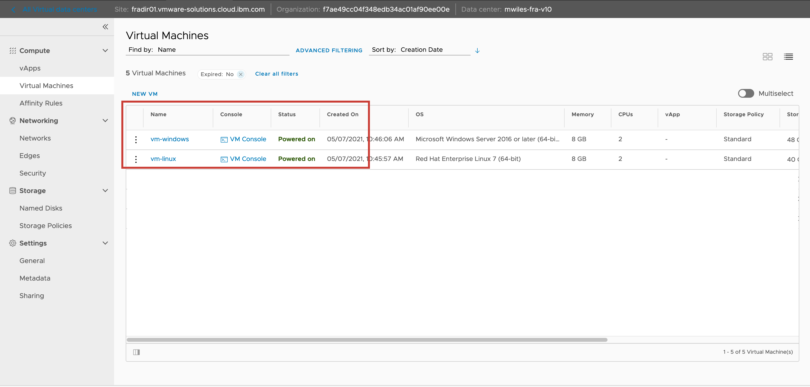

A common question is how to set the VM password.  If you are using a VM provided from the environment, you can use the `OS Customizations` portion of the VM.

Compute > Virtual Machines > MACHINE-NAME > Guest OS-Customization > EDIT

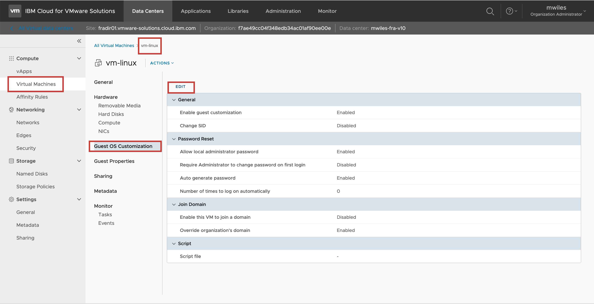

If the `Auto generate password` is selected and already enabled, the password will be displayed in the text field.  This should be the default.  The password might be challenging to type in and you cannot copy and paste in the Web Console. 

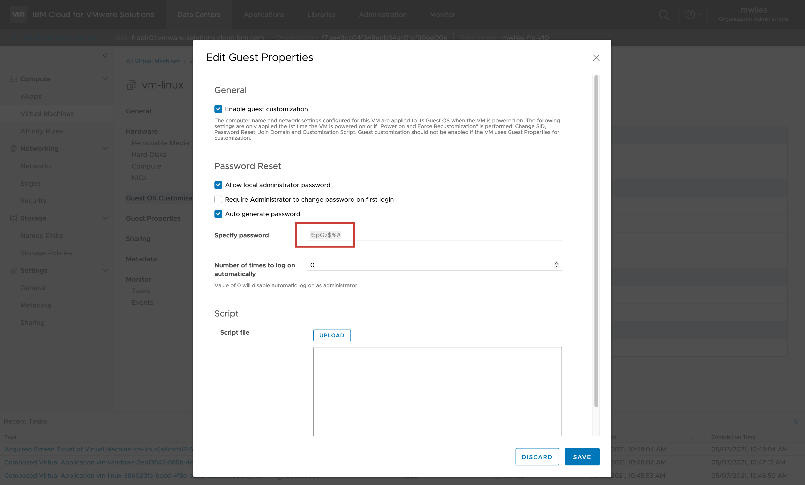

If you wish to override the password settings, you can enter your own.  Un-check the `Auto generate password` will enable the `Specify password` field where you can enter your specific password.  This will not take effect until you Force Recustomizations.

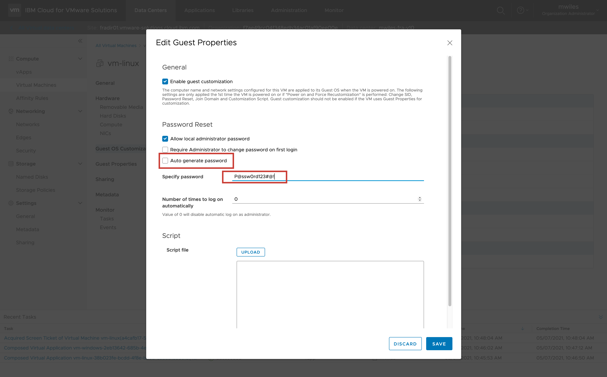

To Force Recustomization you have to first `Power Off` the VM.

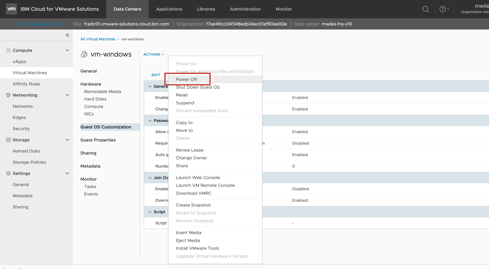

To Force Recustomization changes you select `Power-on and Force Recustomization` on the  VM.

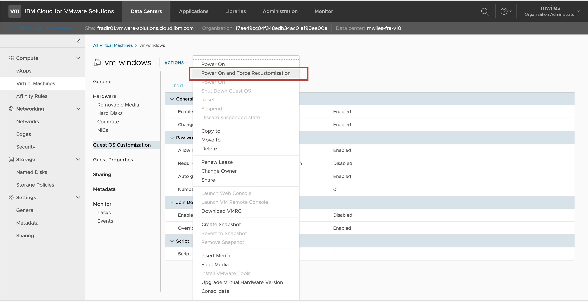

You can launch the Web Console to attempt login to the VM from the Actions menu.  Again NOTE: there is no copy / paste via this method.  

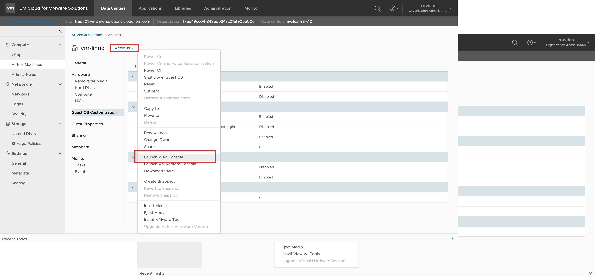

To enable access to the VMs with full desktop access see - [Secure inbound access](https://mlwiles.github.io/vmwaresolutions/vcd/inbound/).

Back to: [Menu](#toc)

### Linux Login Screen (MOTD)

The Red Hat Enterprise Linux (RHEL) images provided from the VMWare Shared environment have a MOTD (Message of the Day) that is intended to assist the user to enable the RHEL image to subscribe to the Red Hat satellite server.  Once the RHEL image is configured, the message can be removed, but we do not have a way to do that for the user.  For RHEL and the CentOS images provided, there is a simple way that the user can update the MOTD. 
_(CentOS images provided from the VMWare Shared environment DO NOT have the MOTD set in the default templates)_.

Use an editor to modify the `/etc/motd` file. 

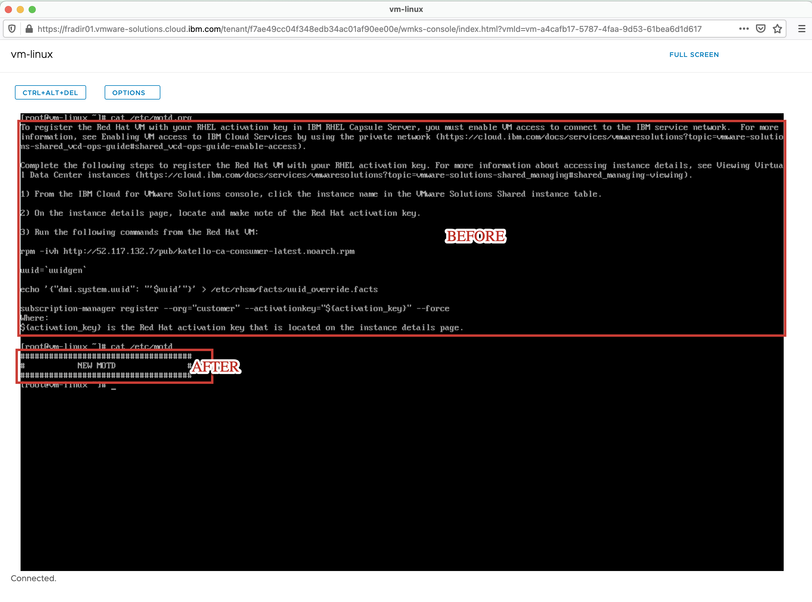

Once the content of the `/etc/motd` has been updated, log out as the current user and log back in to observe the new MOTD.

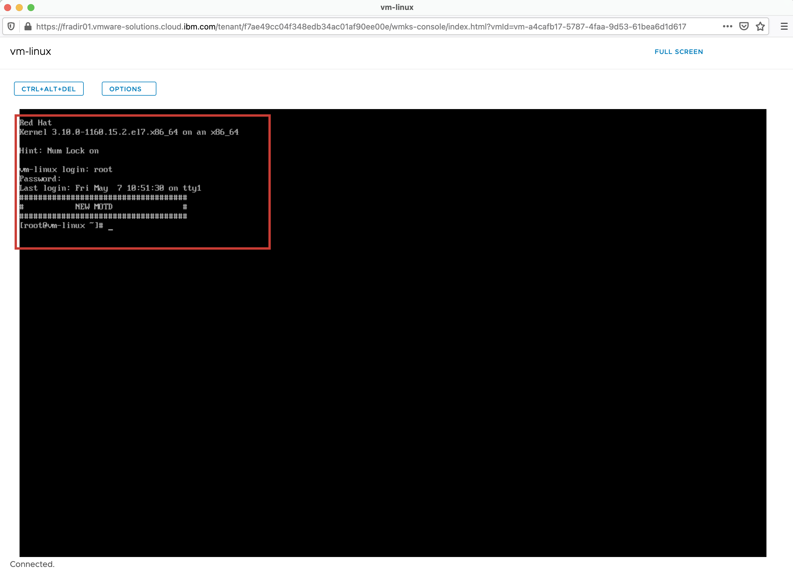

Back to: [Menu](#toc)

### Windows Login Screen (Legal Notice)

Similar to Linux, Windows provides the ability to have a MOTD (Message of the Day) which Windows refers to as the `Legal Notice`.  This can be changed for Windows using the Registry Editor (regedit.exe). 
_(The Windows images provided from the VMWare Shared environment DO NOT have the MOTD set in the default templates)_. 

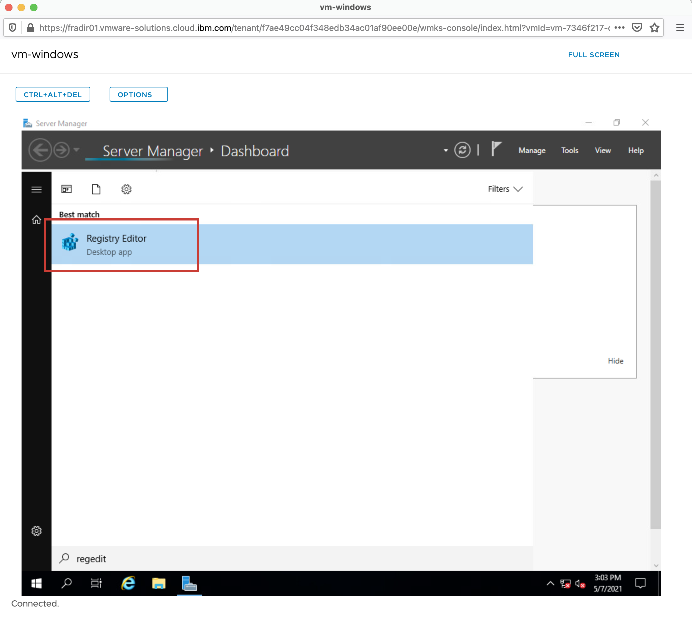

To update this message, navigate in the Registry Editor to `HKEY_LOCAL_MACHINE/SOFTWARE/Microsoft/Windows NT/CurrentVersion/Winlogon`
- `LegalNoticeCaption` - enter the text to be in the title bar
- `LegalNoticeText` - enter the text for the main message

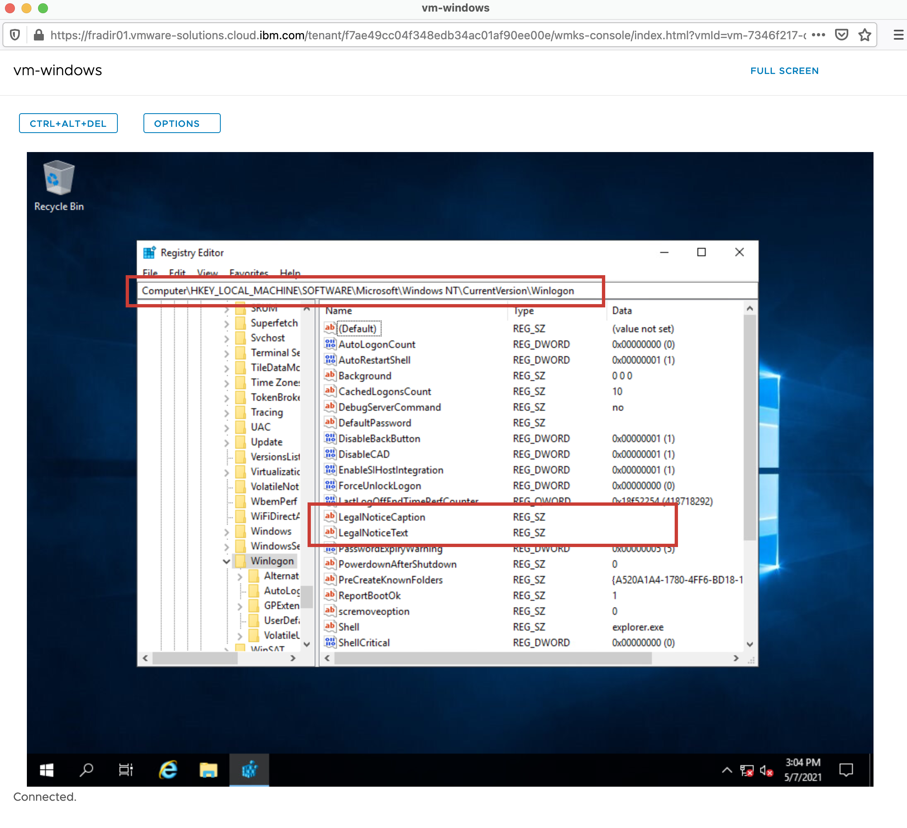

Added some test strings for demonstration.

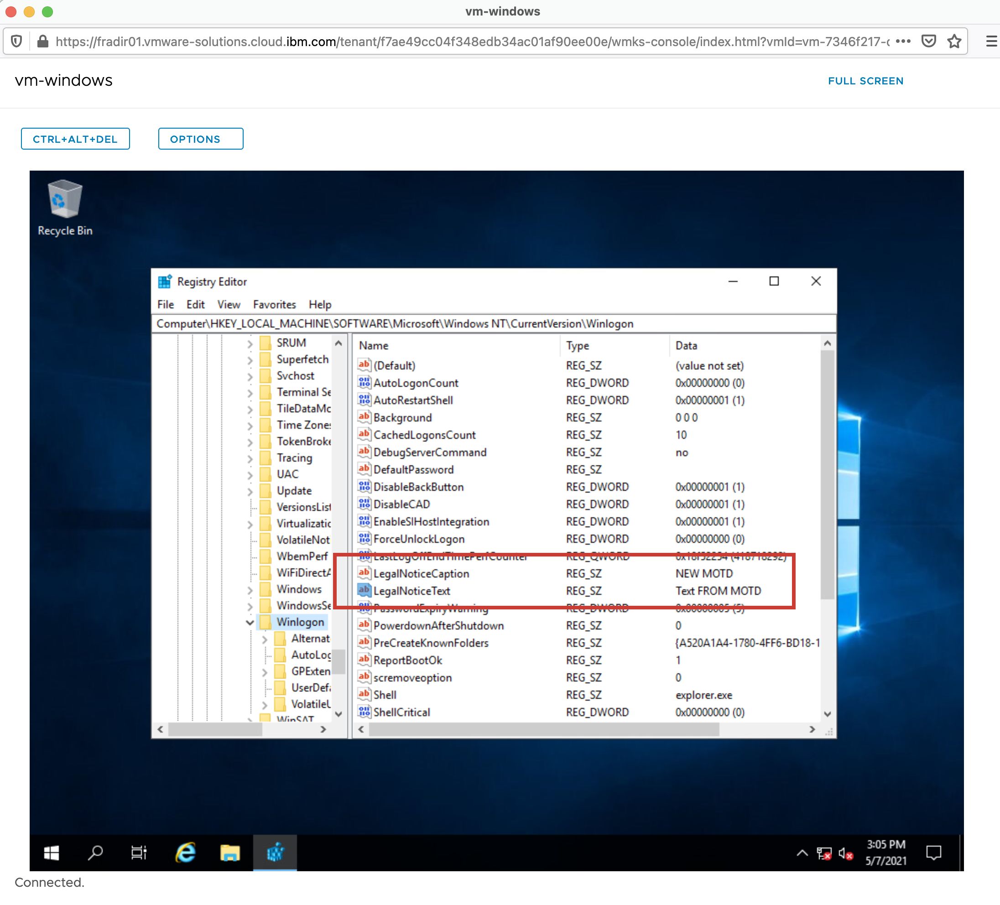

Once the content of the registry has been updated, log out as the current user and log back in to observe the new `Legal Notice`.

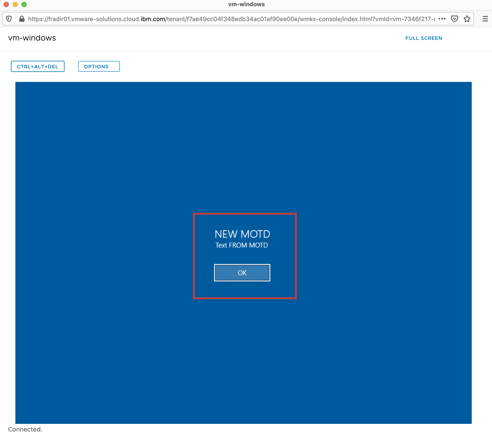

Back to: [Menu](#toc)

_Note the information described in this example are guidelines.  There are multiple ways to configure the various parts of the example.  Please adjust accordingly for your needs._

[VMWare vCloud Director](https://mlwiles.github.io/vmwaresolutions/vcd/) 
[Main Page](https://mlwiles.github.io/vmwaresolutions)
