## vCD - Terraform deploying all OS templates

Updated: 2021-02-27

Several of our customers have been using Terraform to deploy their content.  They often asked questions and to better support them, we took a swag a some simple Terraform so we could speak similar a language...

## Terraform 101

Terraform is a tool for building, changing, and versioning infrastructure safely, efficiently, consistently. It uses state maintained locally to determine what actions need to be taken against the desired target.  This is NOT intended to be a tutorial for Terraform but will very briefly discuss some of the basics.  For our purposes we have installed Terraform and use the vCD Provider (basically a plugin) to interact with our managed service.

We do not show how to [install Terraform](https://learn.hashicorp.com/tutorials/terraform/install-cli)<br>
We do not show how to install the [vCD Provider](https://github.com/vmware/terraform-provider-vcd)<br>

### Terraform Commands 

Some very basics for Terraform:
- _terraform plan_ – Shows you what is going to be executed via config vs. the state without executing the changes
- _terraform apply_ – actual execution of config vs. the state
- _terraform destroy_ – reversal or tear down of config vs. the state

### Terraform Files 
- [variables.tf](https://github.com/mlwiles/stuff/blob/master/scripts/terraform/vcd/prep-templates/variables.tf) – File where you define variables – types, defaults, etc
- [terraform.tfvars](https://github.com/mlwiles/stuff/blob/master/scripts/terraform/vcd/prep-templates/terraform.tfvars) – File where you assign variables, override defaults set in the definitions
- [main.tf](https://github.com/mlwiles/stuff/blob/master/scripts/terraform/vcd/prep-templates/main.tf) – Playbook for the script to execute

## VMWare Shared Usecase

[VMWare Solutions on IBM Cloud](https://cloud.ibm.com/infrastructure/vmware-solutions/console) provides several OS templates that customers can use to build up their vDC.  These templates are available for all customers via the Global Public Catalog.


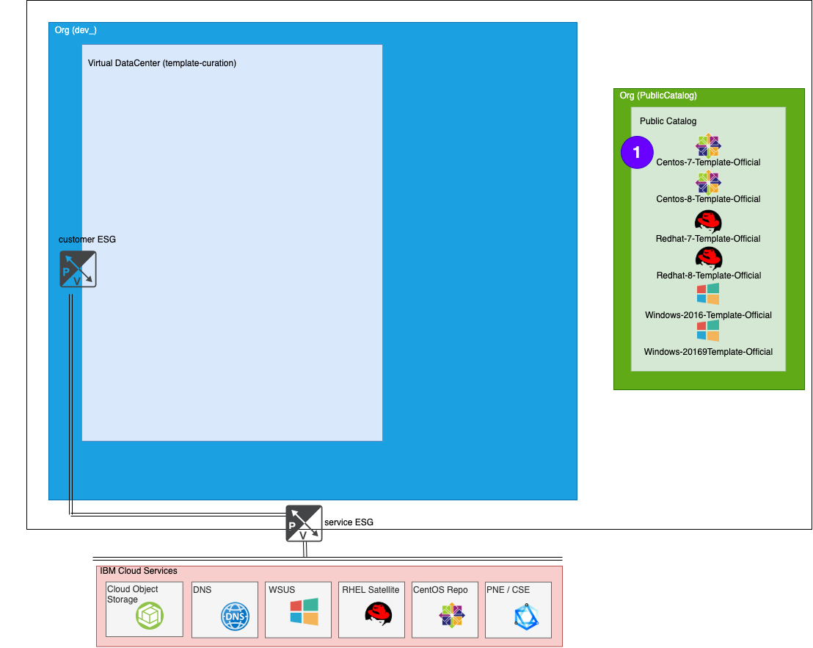

One effort that VMWare Solutions tries to fulfill is to keep these OS templates images up to date with the latest OS provided patches as well as update the installed version of VMWare tools to work with OS Customizations of vCD.  This is a very repetitive task and updates are pushed out monthly, if not more frequently, so it’s a perfect fit to use terraform.

## The Update Process
The process to update requires:
- (**Terraform**) Create new VMs from existing templates
  - this will create vApps, VMs, Network, ESG, OS Customizations
- Update the VMs
  - Update VMs (Apply all patches/other required security updates)
  - Use Powershell / Bash scripts generated from initscripts
     - initscripts will be created within the VMs
- (**Terraform**) Prep VMs to create new templates
  - The templates do not have Network associations
  - alter the OS Customizations
  - Power off the VMs and vApps
- Create new templates from the VMs
  - Add to local Catalog 
- (**Terraform**) Test the new templates
  - Validate new templates can create new VMs
  - Similar process as before - create vApps, VMs, Network, ESG, OS Customizations
- Replace current templates with new templates
  - Publish new templates

### Process part 1 - Create VMs

```
cp main.tf.1prep main.tf
terraform apply --auto-approve
```
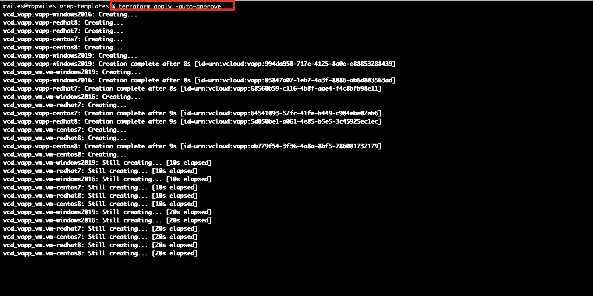

What the Terraform creates ... 
- 6 vapps (vApps are needed to create vCD templates)
  - CentOS 7/8, RHEL 7/8, Windows 2016/2019
- 6 vms (one per existing template)
  - CentOS 7/8, RHEL 7/8, Windows 2016/2019
  - from provided templates
  - os customizations
    - passwords
    - networking (IPs)
```
# vAPP/VM for each OS ... (CENTOS7 Example)
####################### VAPPS #######################
# https://www.terraform.io/docs/providers/vcd/r/vapp.html
resource "vcd_vapp" "vapp-centos7" {
...
####################### VIRTUAL MACHINES #######################
# https://www.terraform.io/docs/providers/vcd/r/vapp_vm.html
####################### CENTOS7 #######################
resource "vcd_vapp_vm" "vm-centos7" {
```
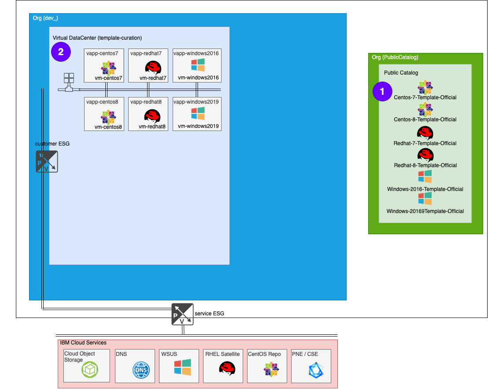

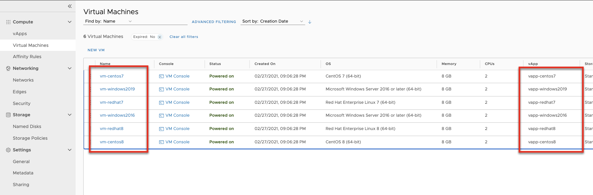

### Process part 2 - Put VMs on the Network
What the Terraform creates ... 
- 1 vdc org network
  - allow access from vapps 
```
# VAPP network access for each OS ... (CENTOS7 Example)
####################### VAPP NETWORKS #######################
resource "vcd_vapp_org_network" "vapp-net-centos7" {
```
  - attach the vms
```
####################### NETWORKS #######################
# https://registry.terraform.io/providers/vmware/vcd/latest/docs/data-sources/network_routed
resource "vcd_network_routed" "template-network" {

```
- 2 snat rules
  - outbound all VMs to the internet
  - outbound all VMs to the IBM service network
```
####################### FIREWALL and DNAT RULES #######################
# https://www.terraform.io/docs/providers/vcd/r/nsxv_firewall_rule.html
# https://www.terraform.io/docs/providers/vcd/r/nsxv_dnat.html
####################### ALL VMs #######################
...
resource "vcd_nsxv_snat" "outbound-edge-snat-service" {
...
resource "vcd_nsxv_snat" "outbound-edge-snat-tenant-external" {
```
- 6 dnat rules
  - redirect single ip using different ports per service
    - 22220 port is redirected to 22 on CentOS 7
    - 22221 port is redirected to 22 on CentOS 8
    - 22222 port is redirected to 22 on RHEL 7
    - 22223 port is redirected to 22 on RHEL 8
    - 33890 port is redirected to 3389 on Windows 2016
    - 33891 port is redirected to 3389 on Windows 2019
  - All DNAT rules are also Whitelisted to restrict access
```
# DNAT for each OS ... (CENTOS7 Example)
####################### CENTOS7 #######################
resource "vcd_nsxv_dnat" "vm-centos7-edge-dnat-ssh" {
```
- 7 firewall rules
  - 6 whitelisted inbound for DNAT rules
  - 1 outbound any/any for the vcd org network
```
# Firewall file for each OS ... (CENTOS7 Example)
####################### CENTOS7 #######################
resource "vcd_nsxv_firewall_rule" "vm-centos7-edge-firewall-inbound-ssh" {
...
resource "vcd_nsxv_dnat" "vm-centos7-edge-dnat-ssh" {
...
####################### FIREWALL and DNAT RULES #######################
# https://www.terraform.io/docs/providers/vcd/r/nsxv_firewall_rule.html
# https://www.terraform.io/docs/providers/vcd/r/nsxv_dnat.html
####################### ALL VMs #######################
resource "vcd_nsxv_firewall_rule" "outbound-edge-firewall" {
```

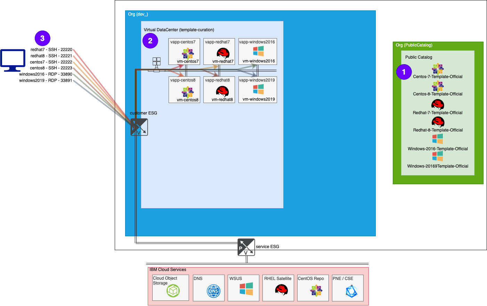

Network
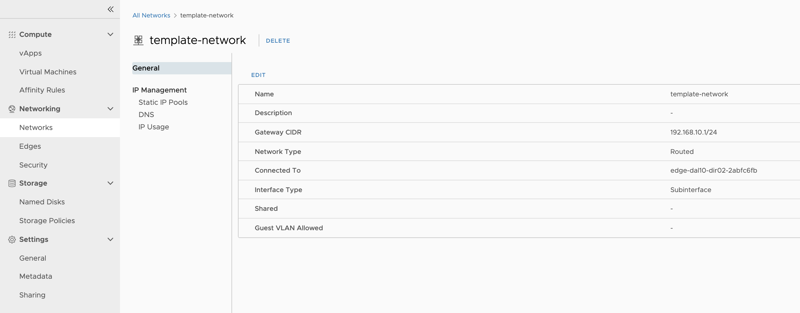

Firewall Rules
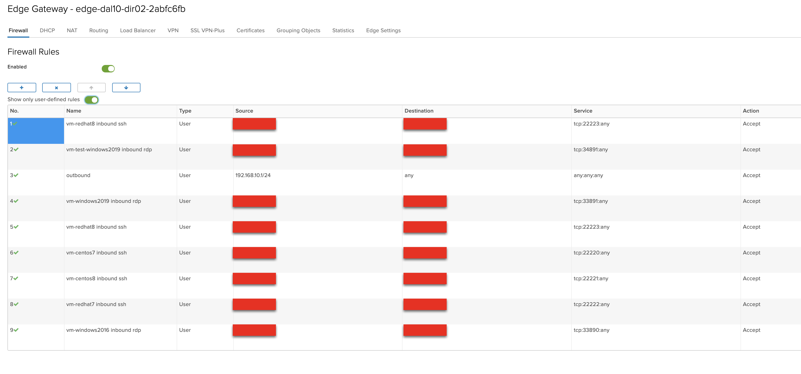

NAT Rules
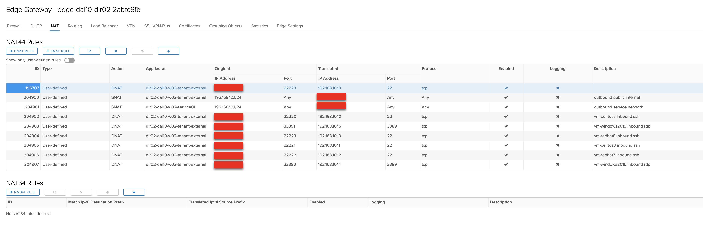

### Update the VMS
Update templates – There are some scripts that are generated from the *Optimization* section of the *main.tf* file 

```
####################### OPTIMIZATION FILES #######################
data "template_file" "centos_init" {
  template = "${file("${path.cwd}/centos_init.sh")}"
}
data "template_file" "redhat_init" {
  template = "${file("${path.cwd}/redhat_init.sh")}"
  vars = {
    activation_key   = var.vm_customization_redhat_activation_key
  }
}
data "template_file" "windows_init" {
  template = "${file("${path.cwd}/windows_init.bat")}"
}
```

What the Terraform creates ... 

Update templates
- Powershell (_C:\template_updates.ps1_)
  - Windows updates
- Bash scripts (_/tmp/template_updates.sh_)
  - CentOS - Yum updates
  - RHEL Satellite register / update

Clean templates
- Powershell (_C:\template_cleanup.ps1_)
   - Clear Event Viewer
   - Delete contents of %TEMP%
   - Run sDelete
   - Run Clean Disk
- Bash scripts (_/tmp/template_cleanup.sh_)
   - Cleanup History
   - Purge Yum cache
   - RHEL Satellite unregister

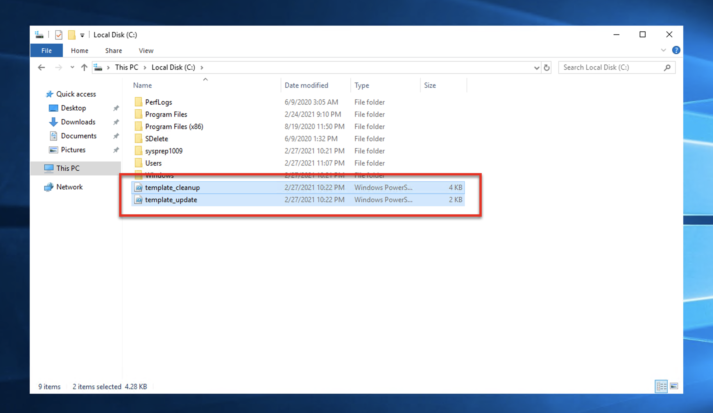

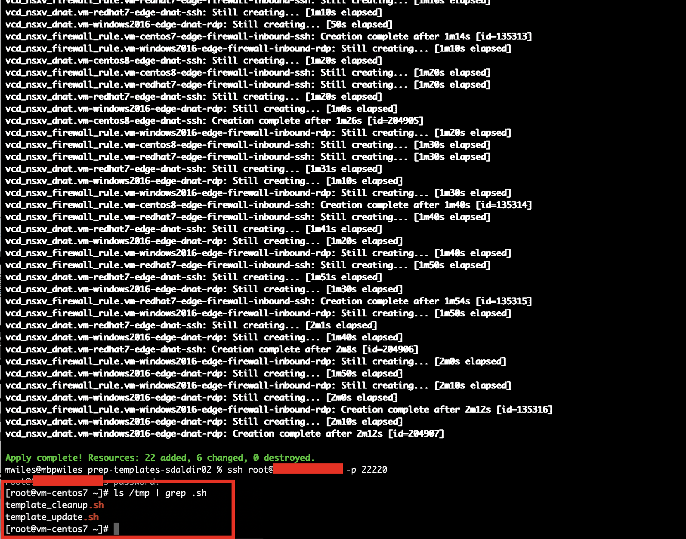

Once those files have completed, the VM is ready to be prepped for "templatization"

### Process part 3 - Prep VMs for Templates
The prep of the VMs to create new templates includes:
- remove the network information
- change OS customizations (remove password and autogenerate)
- power off VM/vApp

```
cp main.tf.2cleanup main.tf
terraform apply --auto-approve
```
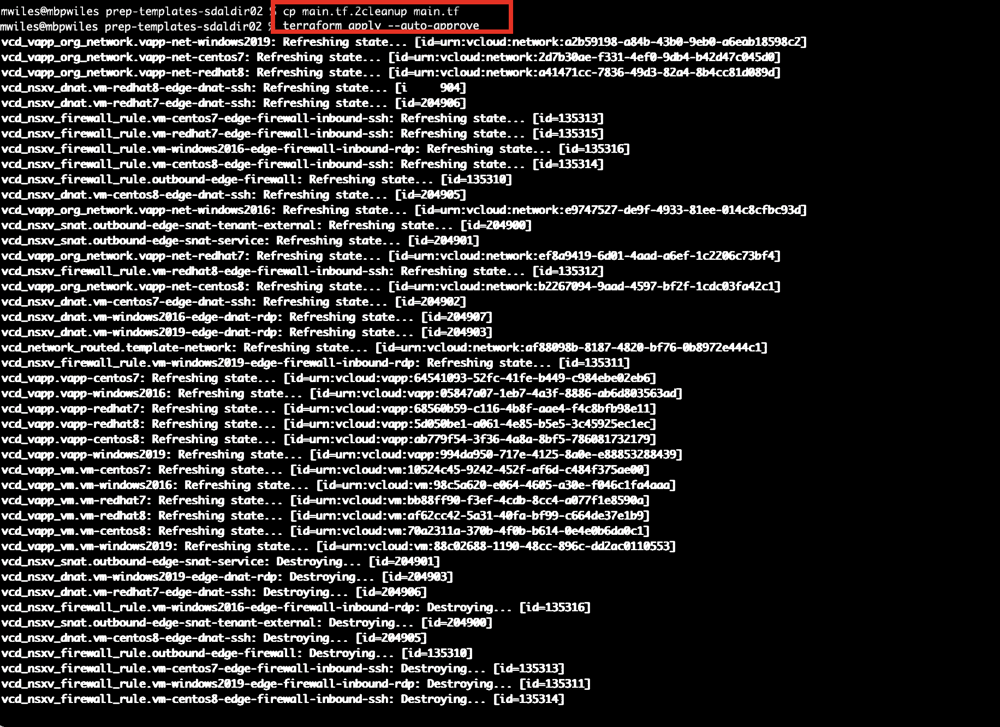

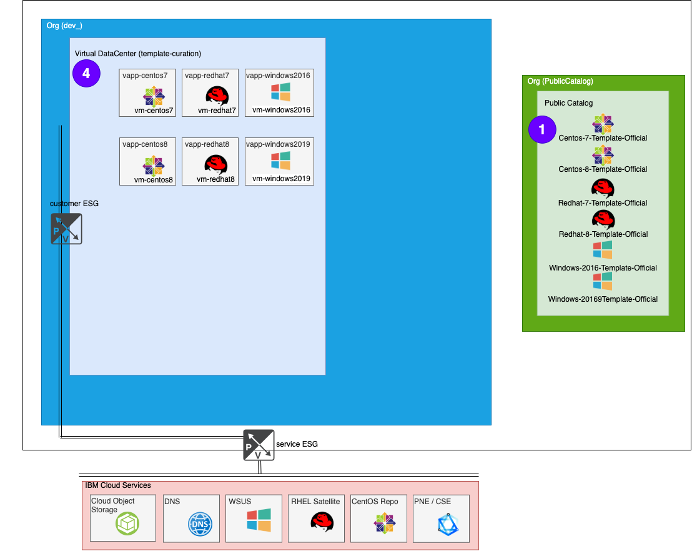

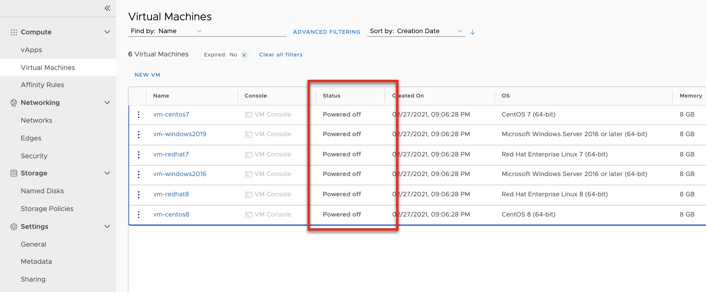

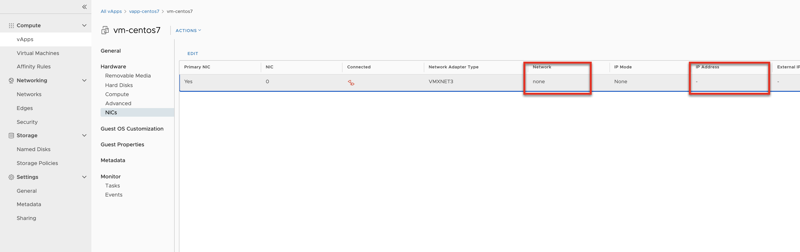

### Process part 4 - Create new templates
Create new templates.  This is not using Terraform at this time.  

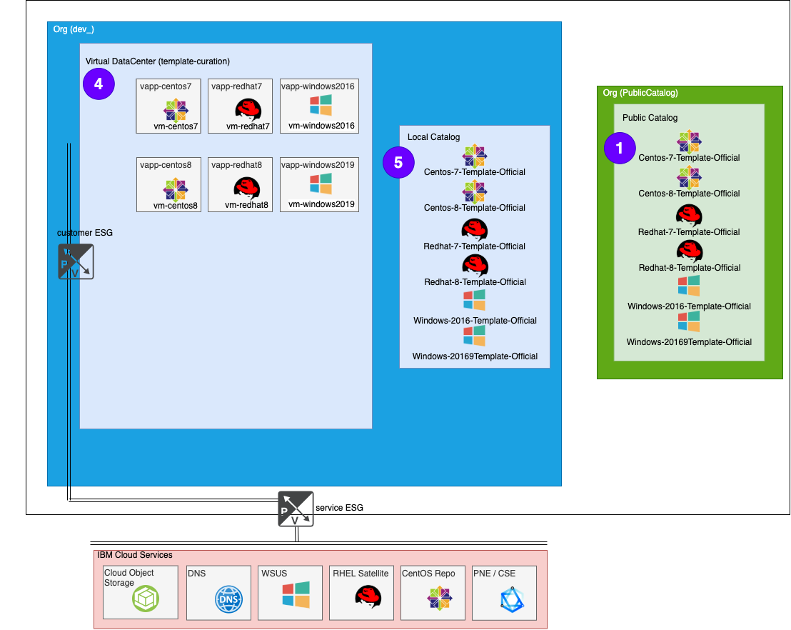

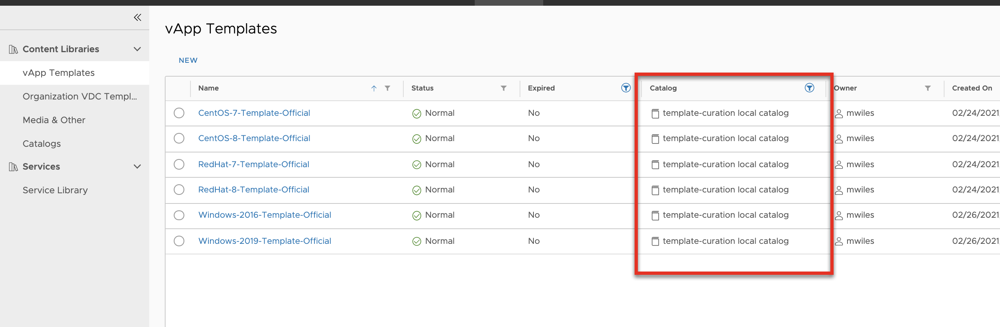

### Process part 5 - Create test VMs
Test the templates.  To validate the newly created templates, we need to create new VMs from newly created templates.  This will involve a similar process as the _Process part 1 - Create VMs_ but with different networking and naming convention.

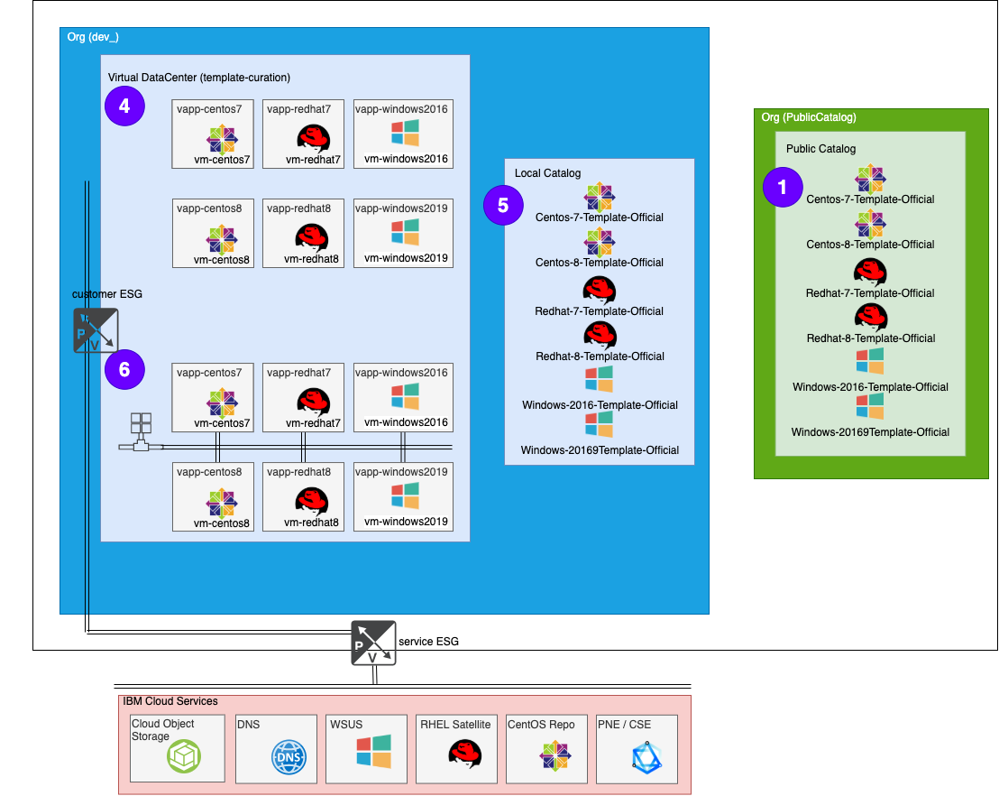

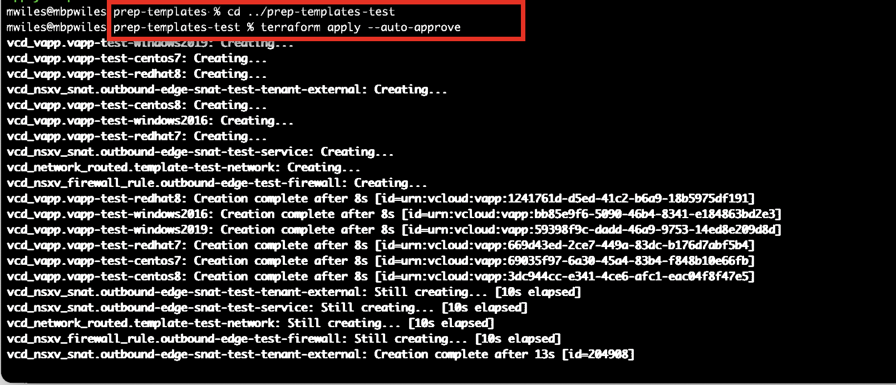

### Process part 6 - Put test VMs on the Network
Similar process as with _Process part 2 - Put VMs on the Network_ 


### Process part 7 - Update the Catalog
Replace in public catalog - This is not using Terraform at this time.  

While this is not a very detailed post, it gives some high level use cases as well as some sample files for the said use cases.  Please let me know if there are parts that you would like me to elaborate on. 

Reference Links
[Terraform Docs](https://www.terraform.io/docs/cli/commands/apply.html)<br/>
[Terraform Download](https://www.terraform.io/downloads.html) <br/>
Providers<br/>
[Terraform]https://registry.terraform.io/browse/providers)<br/>
vCD - https://github.com/vmware/terraform-provider-vcd)<br/>

My Source Terraform<br/>
[Create / Prep Images](https://github.com/mlwiles/stuff/tree/master/scripts/terraform/vcd/prep-templates)<br/>
[Test Local Images](https://github.com/mlwiles/stuff/tree/master/scripts/terraform/vcd/prep-templates-test)<br/>

[VMWare vCloud Director](https://mlwiles.github.io/vmwaresolutions/vcd/)<br/>
[Main Page](https://mlwiles.github.io/vmwaresolutions)

