## Simple Deploy of a VM 

Updated: 2020-11-26
 
### To vApp or Not to vApp?

The first choice when deploying a VM in vCD is to consider using a Virtual Application (referred to a vApp) or create a 'standalone' VM.  There are more advantages for using vApps then not.  They are a relatively lightweight 'container' of VMs, networks, and some policies.
- **Logical collections of VMs** - add upto [128 VMs in a single vApp](https://configmax.vmware.com/guest?vmwareproduct=vCloud%20Director%20For%20Service%20Providers&release=VMware%20Cloud%20Director%2010.2&categories=35-0).
- **Start and stop order of VMs** - control which VMs start before others as well as which vms shutdown before others.
- **Network diagrams** - visualization of all networks and VMs in use by the vApp.
- **vApp fencing** - allowing identical VMs in different vApps without conflicts.
- **Access to multiple networks** - add orginization networks or keep the network isolated to the vApp.
- **Span multiple networks** - more granular control of network access.
- **Sharing ACL within the organization** - control who can do what to the vApp.
- **Create vApp from a template** - Expedite the creation of similar vApps by using templates.
- **Save vApp as a template** - Create the template from existing vApp configuation.
- **Move / Copy to other vDCs** - organization capabilities to clone or relocate.

It all comes down to the requirements that are needed.  Something quick and dirty might not require a vApp.  And at the end of the day, if you do not create a vApp when you create your VM, you can always create a vApp later and move your vms to it!

For this example, we will create a simple vApp.  For more information about vCD vApps visit [Working with vApps](https://docs.vmware.com/en/VMware-Cloud-Director/10.1/VMware-Cloud-Director-Tenant-Portal-Guide/GUID-AC48FB5E-4ADC-4835-AACE-B949B297A147.html).

Compute > vApps > New > New vApp

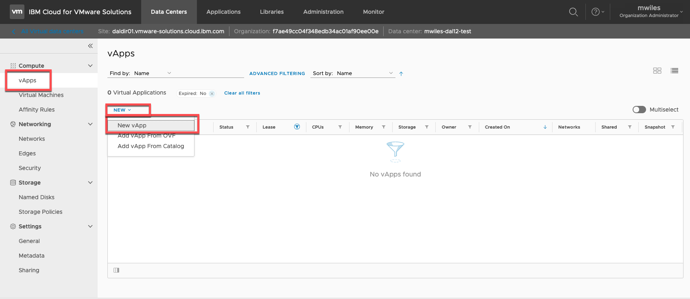

Only a name is required, but its good practice to add a descrition for others.

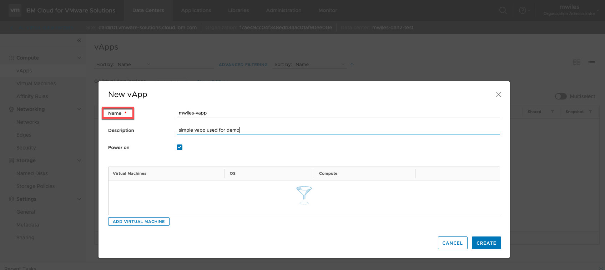

### Creating a new VM

There are a few ways to create a VM:

- From the vApp view
  - during vApp create  
    Compute > vApps > New > New vApp > Add Virtual Machine
    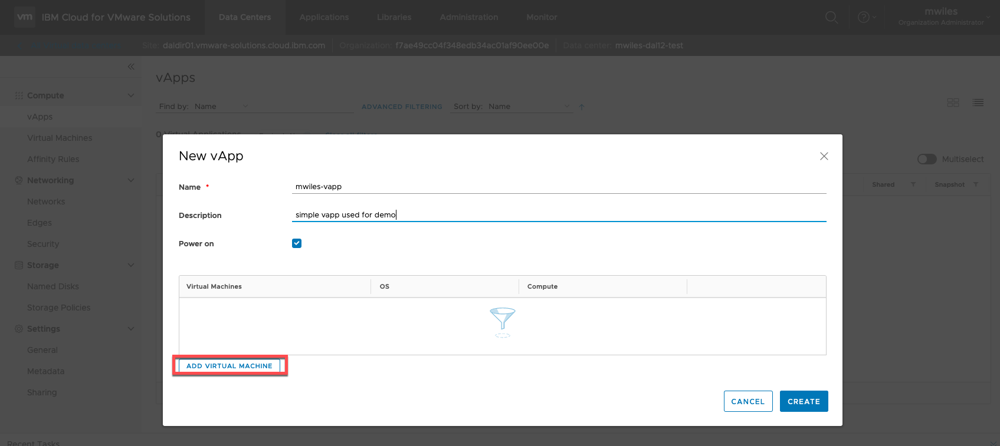
  - after vApp created  
    Compute > vApps > *vApp menu* > Add VM
    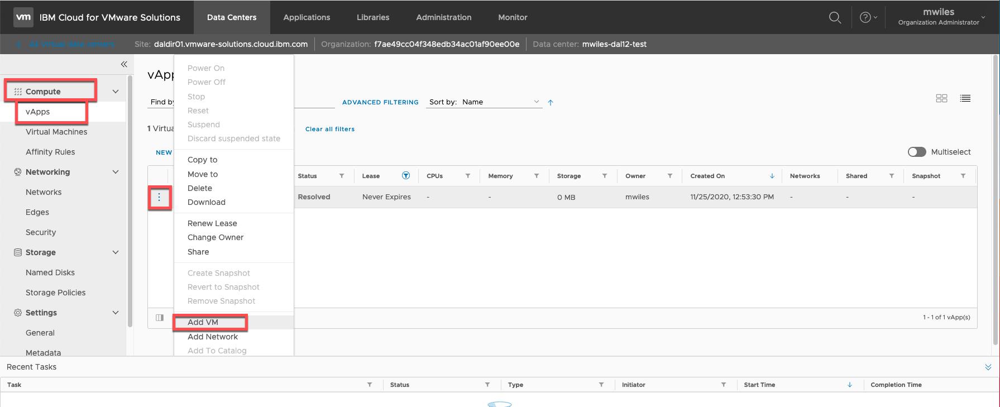
    Compute > vApps > *select vApp* > Virtual Machines > Actions > Add VM
    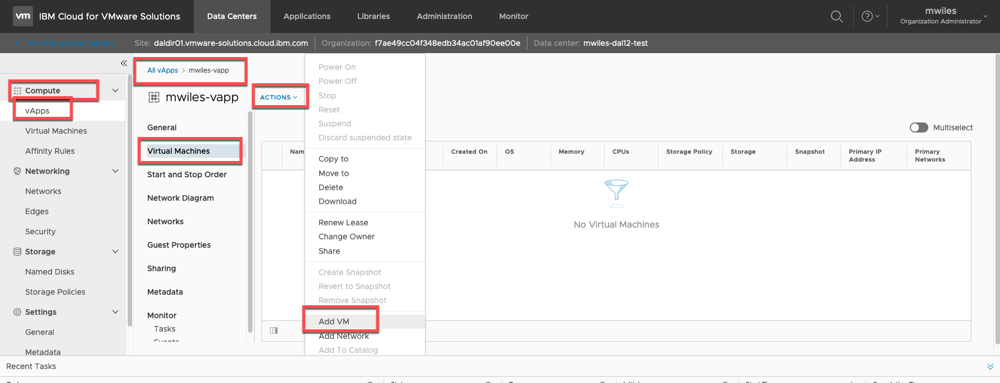
- From the VM View
  - anytime - with or without vApps  
  Compute > Virtual Machines > New VM
  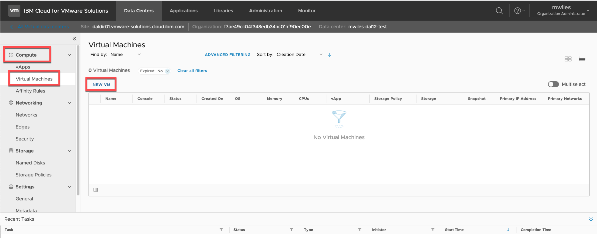

So we will create the VM *not in* a vApp and show you how to add it later...

In the New VM wizard, lets discuss some of the options:
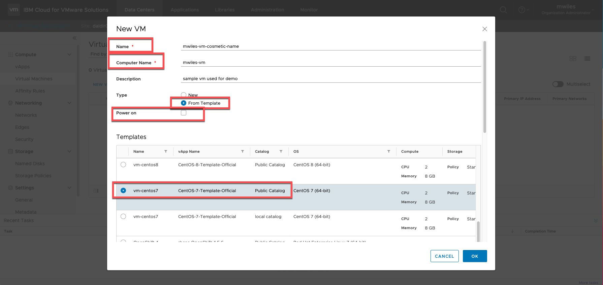
- **Name** - cosmetic name from your vDC (NOTE while chaning this it will automatically change the computer name)
- **Computer Name** - this is what the VM will actually be named.  There are numerous rules to follow here that are controlled by the OS itself.  Some are listed at [Length Limits on Names and Descriptions](https://docs.vmware.com/en/VMware-Cloud-Director/10.2/VMware-Cloud-Director-Service-Provider-Admin-Portal-Guide/GUID-023D4FBC-3016-4757-B52B-4A97984ABD7F.html) but a simple guide I follow is keep the computer name 15 characters or less and DO NOT use any special characters other than maybe a hyphen ( - ).
- **Description** - as with vApps, this is not required but its good practice to add a descrition for others.
- **Power on** - this will power on the VM once its deployed.  I tend to NOT allow power on at create time so I can do some modifications prior to powering it on.
- **Type** - **New** will create a *blank* VM that you can later use an ISO image to boot from and install yourself.  This will be demonstrated in [Customized VMs](custom-vms/index.md).  In our case we are also going to select the type as **From Template**.  VMWare Solutions on IBM Cloud provides some basic OS templates that can be used and configured to meet your requirements.  They can be *activated* in the context of Windows and Red Hat.  They all have access to IBM Cloud provided update servers (Windows WSUS and RHEL/CentOS Yum repositories) that the machines are configured to access once they are on the network (Will show this later in the [Networking made easy](network101/index.md) section).  I will move forward with CentOS 7 template.
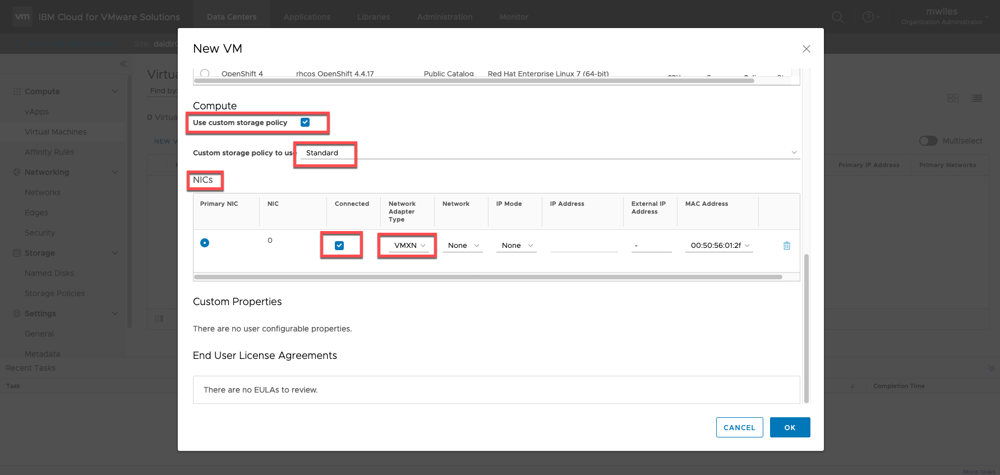
- **Use custom storage policy** - this allows you to determine which storage policy that the VM will use.  VMs can be split across multiple storage policies which will be demonstrated in [Customized VMs](custom-vms/index.md).  For information about the different storage policies visit [Storage overview](https://cloud.ibm.com/docs/vmwaresolutions?topic=vmwaresolutions-shared_overview#shared_overview-specs-storage).   The default policy for VMs is currently set to *Standard* and that is what we will select in this demo.
- **NICs ** - If the Template selected contains a NIC card, this can be altered at deploy time.  NICs can also be modified when the VM is powered off once deployed.  One tip I have found is to make sure the *Network Adapter Type* is set to *VMXNET3* for best results.  If a network already exists for the vDC, it can be configured here as well, we will create and configure our network in [Networking made easy](network101/index.md) section.
For more information about for VM properties visit [Edit Virtual Machine Properties](https://docs.vmware.com/en/VMware-Cloud-Director/10.1/VMware-Cloud-Director-Tenant-Portal-Guide/GUID-FA8C101E-241E-41A5-A3C3-83BDBB4467F1.html).

Once initial configuration options are selected, Click **OK** to begin deployment.  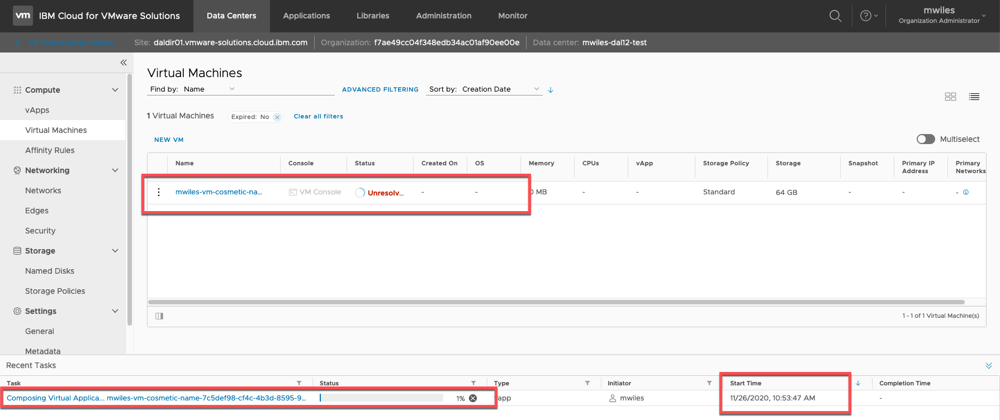
This can take several minutes to complete.  The underlying infrastructure is creating a clone from the Template in the Public Catalog so depending on which physical datacenter the vDC is located and the template selected ... this can increase the deployment time.  Typically this is less than 10 minutes.
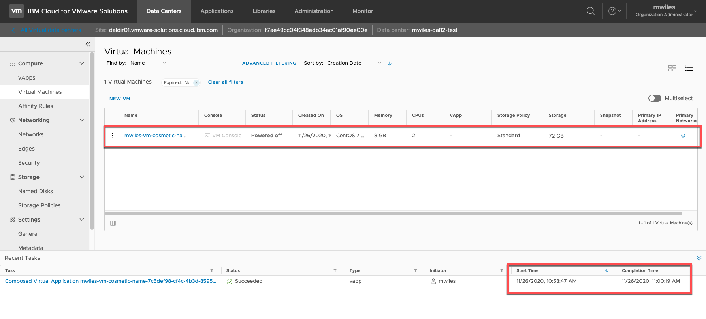

### VM Details

Once the VM is deployed, there are a few things I like to change before powering it up.

Compute > Virtual Machines > *select VM*

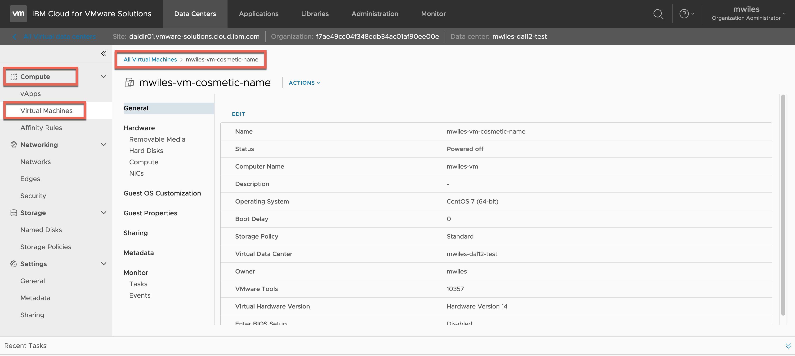

Until we have some networking available, we will only prep a few items but for completeness we can discuss the VM options:
- **General** - Some items displayed here are informational only and cannot be modified via vCD.  For those items that can be modified, Select *Edit* and view.
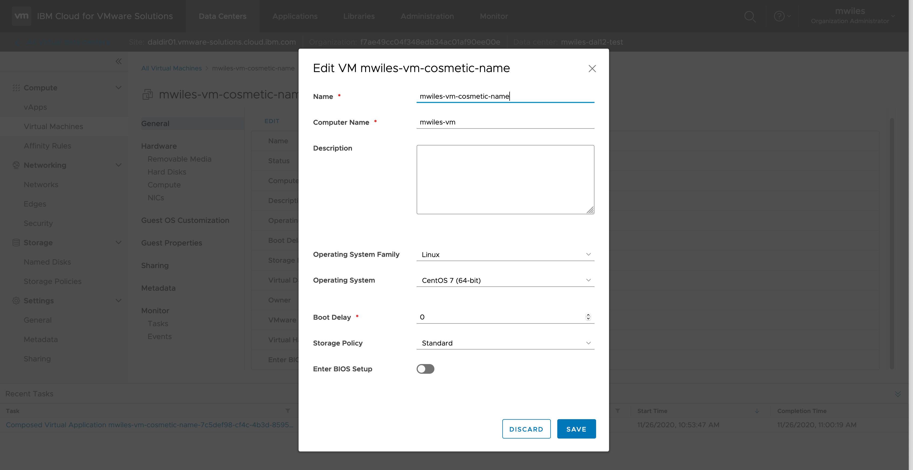
  - Name, Computer Name, Description - these properties were all discussed at VM create time.
  - Operating System Family - in the case of this VM, Linux was set as part of the template.  When creating a *New* VM (not from template) you are able to select which family. I read that vCenter Server (underlying infrastructure for vCD) chooses configuration defaults based on the guest type. Changing the guest operating system type after the virtual machine is created does not retroactively change those settings. It affects the recommendations and setting ranges offered after the change.  From what I understand you might only change these if you are upgrading the guest operating system installed in the virtual machine.
  - Operating System - See *Operating System Family* ^^ for similar details
  - Boot Delay - I believe the main purpose for this is to increase the amount of time before initiating the boot up of the VM so you can have sufficient time to request a VM console and make changes to the Boot options of the VM.
  - Storage Policy - this will change the storage location of ONLY the VM configuration and supporting files (e.g. .vmx, .log, .nvram, etc).  This does NOT change the location of the virtual harddrives.  That will be accessible from the *Hard Disks* section of the VM.
  - Enter BIOS Setup - toggle to enable/disable the BIOS prompts for the VM.
- **Hardware**
  - **Removable Media** - provides a CD/DVD & Floppy drive
  - **Hard Disks** - Properties of the Hard disk can be modified in this view.  Most notably the Storage Policy can be changed.  This will cause the virtual harddisk (.vmdk file) to be migrated to the new storage policy datastore and will take some time based on a number of variables (size of the harddrive, current storage policy, target storage policy, etc) .. please be patient when changing this property.
  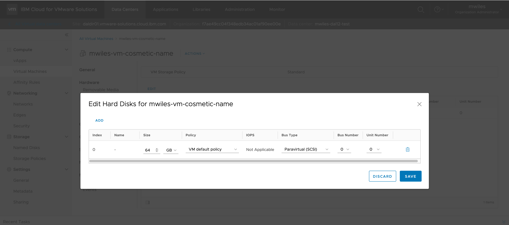
  - **Compute** - CPU and Memory allocations can be changed here.  These are common VM attributes that can impact the performance of the VM.
  - **NICs** - NIC creation, deletion, and modification can take place in this view.  We will revisit this when we assign network details.
- **Guest OS Customization** - in this section, you can edit guest customizations.  Guest customizations are described in detail from VMWare documentation - [Understanding Guest Customizations](https://docs.vmware.com/en/VMware-Cloud-Director/9.5/com.vmware.vcloud.user.doc/GUID-BB682E4D-DCD7-4936-A665-0B0FBD6F0EB5.html) however for our purposes we are going to edit the machine access or set local administrator password.  
To set a password, go to  
Compute > Virtual Machines > *select VM* > Guest OS Customization > EDIT
Either use the *auto generate* option or *specify password*.
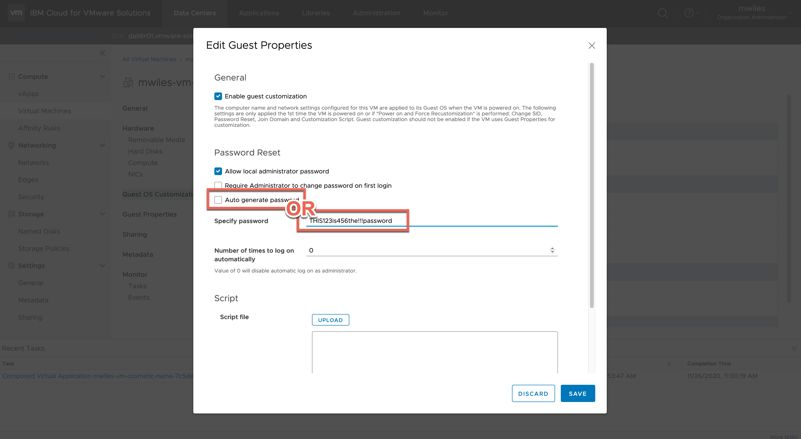
- **Guest Properties** - in the current deployment of vCD, there are no user configurable properties.
- **Sharing** - allows control over what organization users and groups have access to the VM.
- **Metadata** - allows creation, deletion, modification of metadata attributes of the VM.
- **Monitor**
  - **Tasks** - View history of tasks related to the VM.
  - **Events** - View history of events related to the VM.

Now we are ready to apply the guest OS customizations and power on the VM. 
Compute > Virtual Machines > *VM Menu* > Power On and Force Recustomization
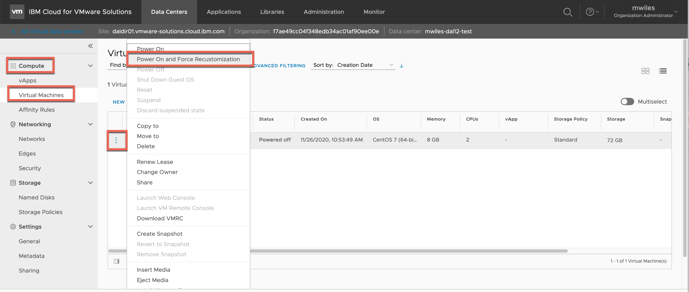

Once the VM is powered on, from the same menu acquire a web console. 
Compute > Virtual Machines > *VM Menu* > Launch Web Console
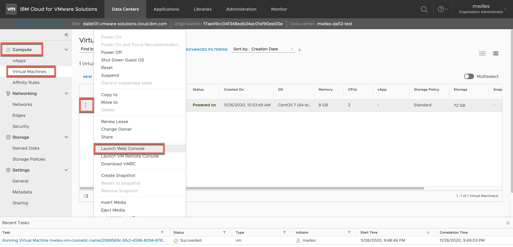

After the we console is launched and the VM it ready, login with the Admin (root / Administrator) user and password that was set in the OS Customization.
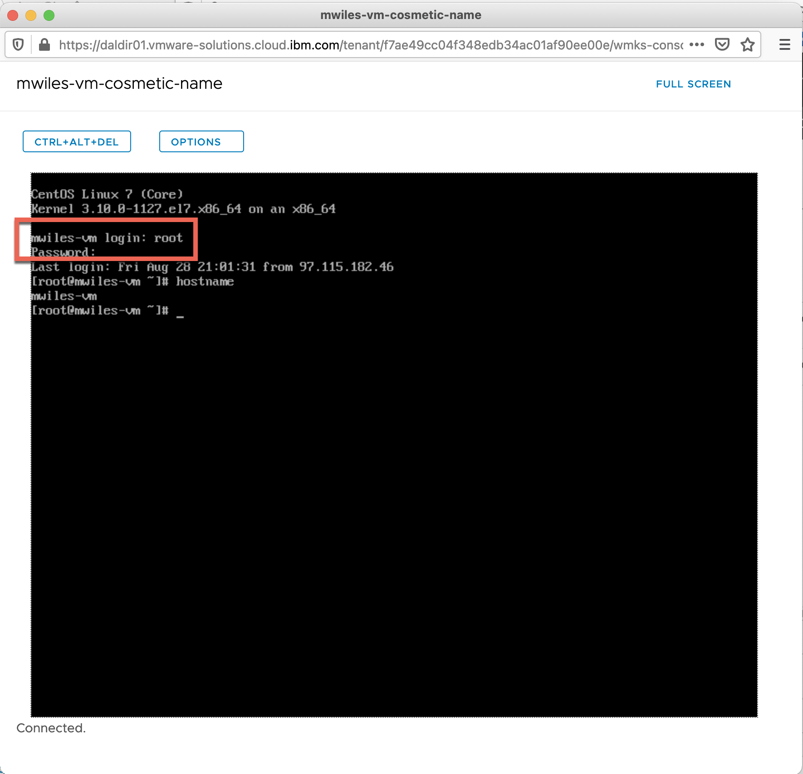

After you login, there is not really much that can be done with this VM without networking.  That’s all for now, good luck deploying and modifying VMs.  Other sections will continue on and add additional configurations to the vDC.

Oh wait ... I forgot that I said I would show you how to add the VM to the vApp.  Showing that the VM we created is NOT part of a vApp. 
Compute > vApps > *select vApp* > Virtual Machines 
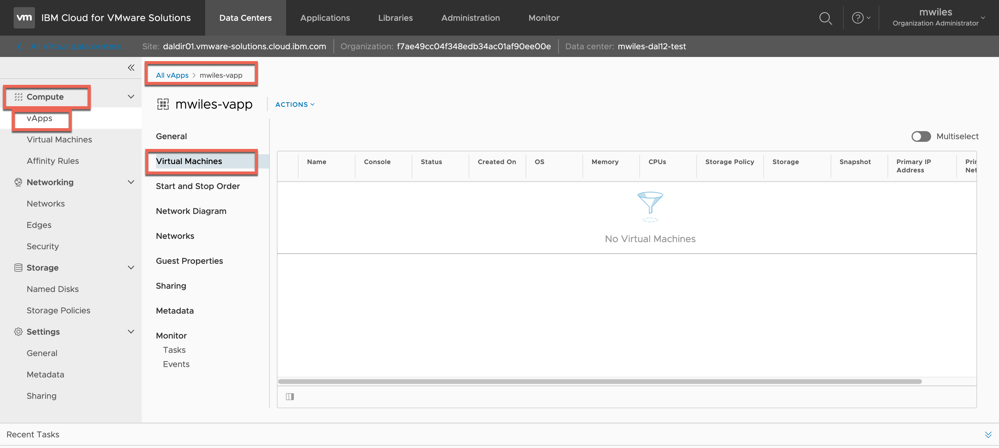
Nagivate back to the list of VM's, identify the VM to take action on and select *Move To* option and select the vApp as a target. 
Compute > Virtual Machines > *VM Menu* > Move To
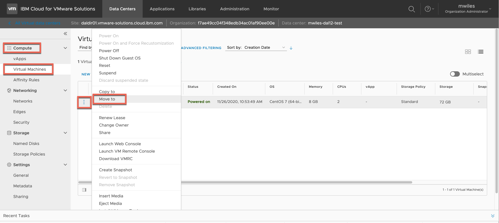
Select the target vApp...
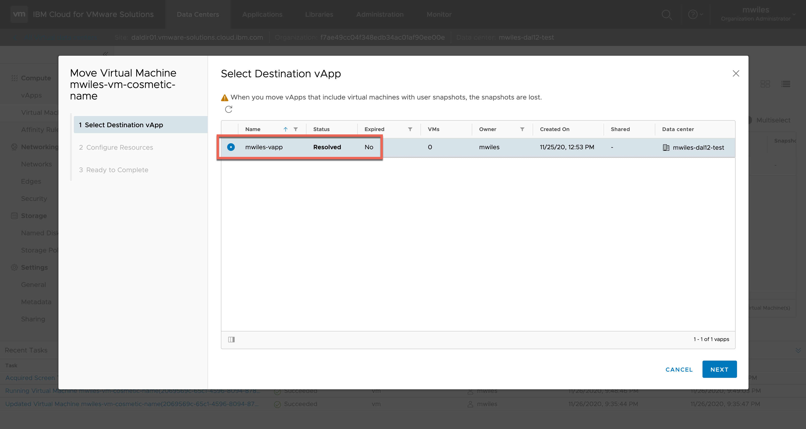
Select the required properties.  In this case you will need to select Storage Policy as it defaults to none selected, but this also give you an opportunity to change some other attributes of the VM prior to moving it.
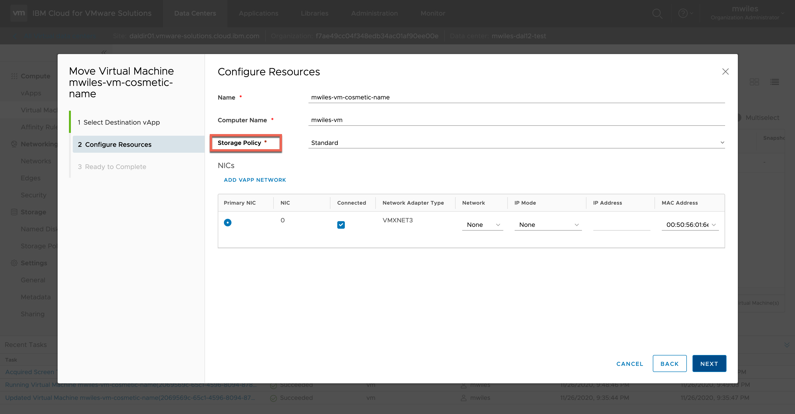
Finally once the task is completed, navigate back to the list of VMs in the vApp and you will see the VM is now in the vApp. 
Compute > vApps > *select vApp* > Virtual Machines 

For Pricing details on the VM components visit [
VMware Solutions Shared pricing](https://cloud.ibm.com/docs/vmwaresolutions?topic=vmwaresolutions-shared_pricing)

_Note the information described in this example are guidelines.  There are multiple ways to configure the various parts of the example.  Please adjust accordingly for your needs._

[Main Page](https://mlwiles.github.io/vmwaresolutions)

