## vCD - VMWare Tools

Updated: 2021-05-09

### <a name="toc"></a>Table of Contents:
  - [Overview](#overview)
  - [Install Preparation](#install)
    - [Install VMWare Tools on Linux](#linux)
    - [Install VMWare Tools on Windows](#windows)
  - [Upgrade](#upgrade)
  - [References](#references)

###  <a name="overview"></a>Overview

For Virtual Machines to integrate their best with the [VMWare Solutions on IBM Cloud](https://cloud.ibm.com/infrastructure/vmware-solutions/console) offering, it is recommended that VMWare Tools be installed and kept up to date with the versioning of the infrastructure.  We will go through installation of VMWare Tools on Linux and Windows and discuss how to run the upgrades as future versions become available.

This requires for VMs to be installed.  VMs can be created from your own media or installed from the templates provided in the environment.  

For more details on deploying VMs see [Simple Deploy of a VM](https://mlwiles.github.io/vmwaresolutions/vcd/vm101/).

Back to: [Menu](#toc)

###  <a name="install"></a>Install Preparation

From the Virtual Machines View of the vDC, you can check to see what versions of VMWare Tools are installed on the VMs as well as to determine if VMWare Tools is installed at all.  

To change the properties that are viewed for the VMs:
- Select the `List View` to change from Tile View (this is default)
- Select the `Column Data` to display (check `VMWare Tools Version`)
- _Optionally you can filter by the name of the VM_

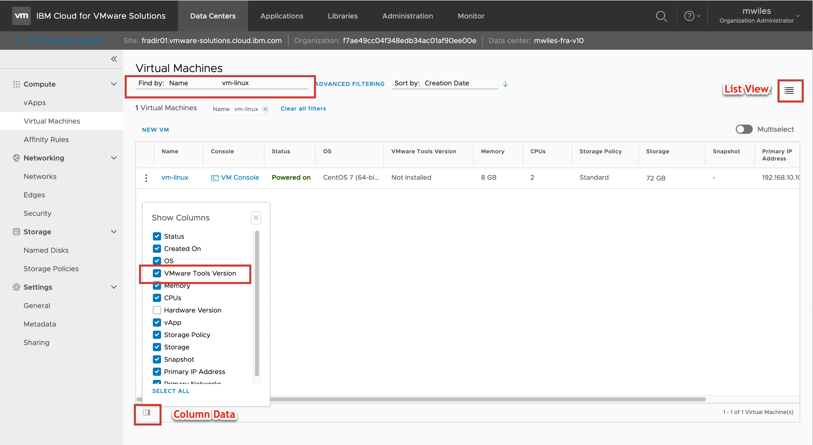

Note the version of VMWare Tools or determine that VMWare Tools is not installed.

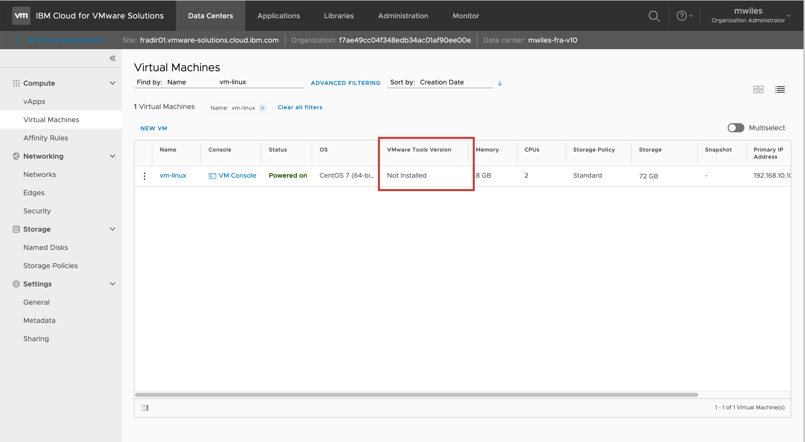

To install / upgrade VMWare Tools from the environment, select the VM and from the Action Menu select `Install VMWare Tools`

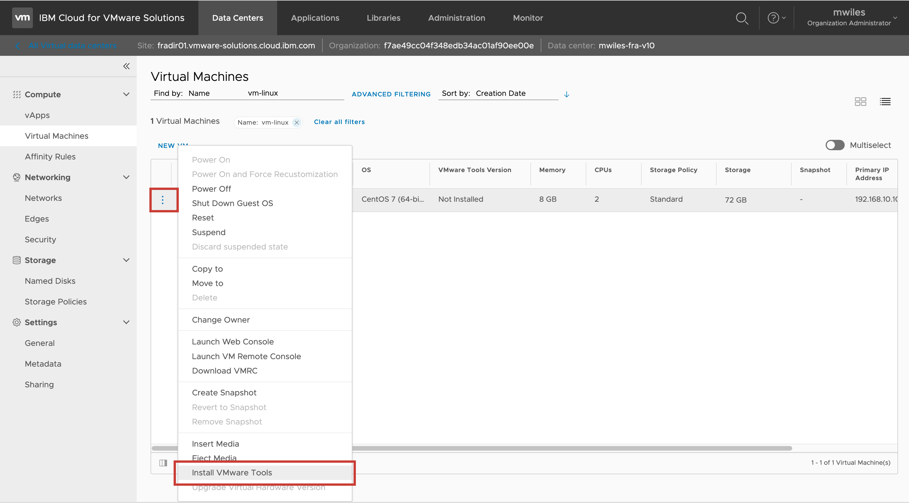

Note the task completed `Installed VMWare Tools on Virtual Machine`.  This DOES NOT actually imply that the Tools were installed, this only tells you that the virtual CDROM/Media is available from the VM.


###  <a name="linux"></a>Install VMWare Tools on Linux

The following will walk through installing VMWare Tools on a Linux VM.

Once the Media is made available in the [Install Preparation](#install) section, we need to prepare the VM to mount the Media.  The following commands will mount and copy the install media to the VM.

```
mkdir /mnt/cdrom
mount /dev/cdrom /mnt/cdrom
cd /mnt/cdrom
cp VMWareTools-VERSION.tar.gz /tmp
cd /tmp
tar zxvf VMWareTools-VERSION.tar.gz
cd vmware-tools-distrib
```

Now begin the installation of the VMWare Tools (this can change with every version, but should follow similar pattern of questioning).  _When answering the questions from the install script, default values are recommended_

```
./vmware-install.sh
```
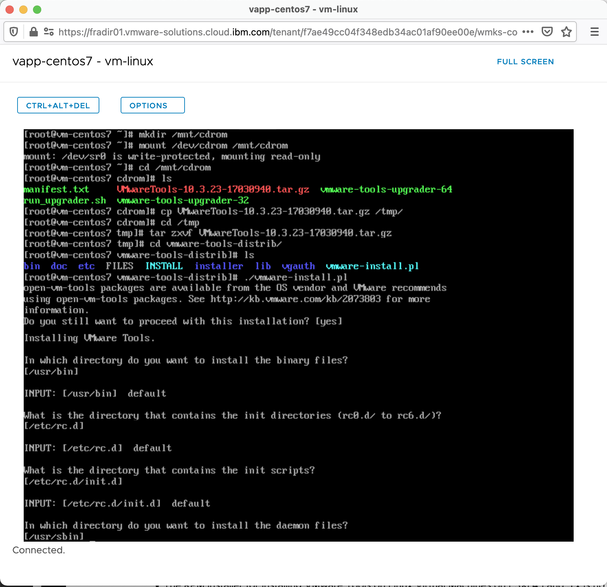

more VMWare Tools install questions ... 

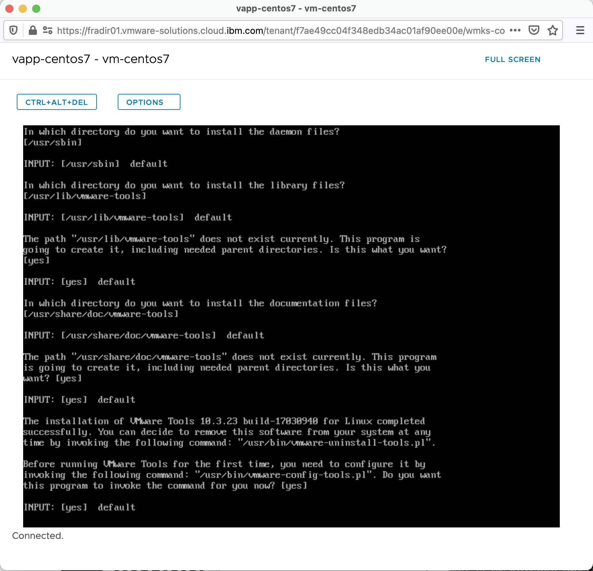

more VMWare Tools install questions ... 

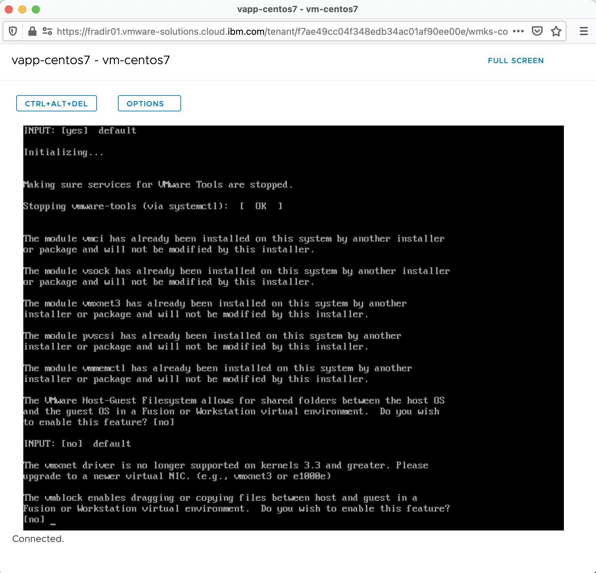

more VMWare Tools install questions ... Once the VMWare Tools have been installed, it is _**STRONGLY**_ recommended to restart your VM to have the Kernel to cleanly restart as well as the VMWare Tools media to be unmounted from the VM.

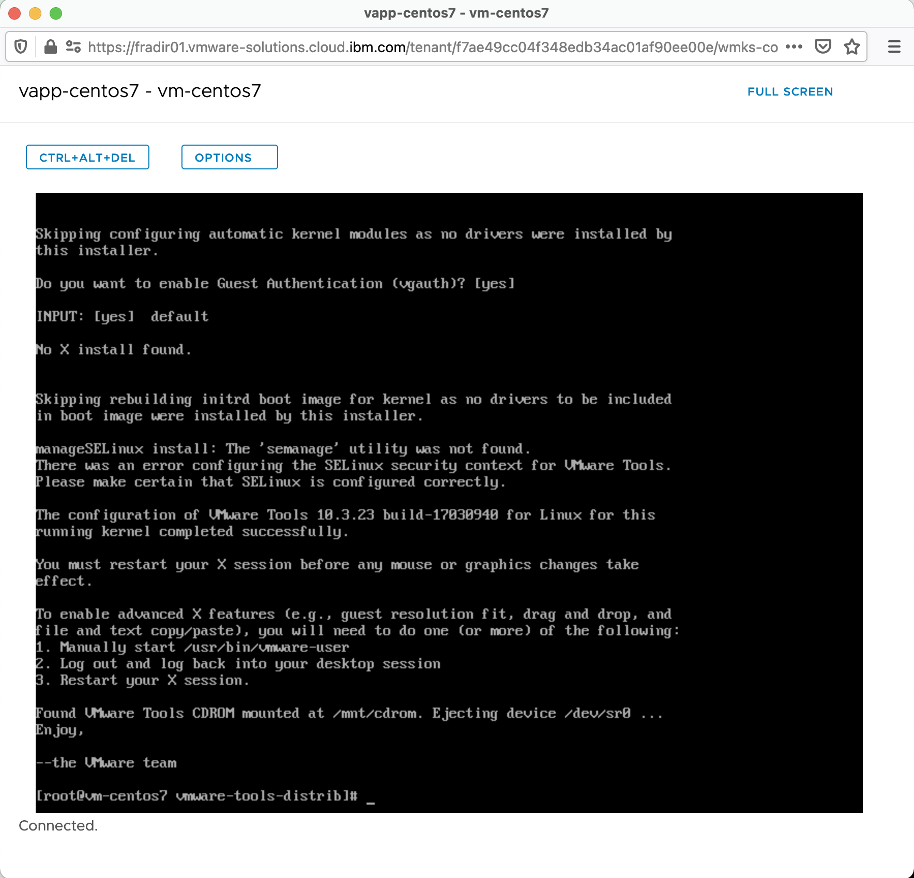

Back to: [Menu](#toc)

###  <a name="windows"></a>Install VMWare Tools on Windows

The following will walk through installing VMWare Tools on a Windows VM.

Once the Media is made available in the [Install Preparation](#install) section, you can validate by starting `Windows Explorer` to view the latest Drives and note that the VMWare Tools shows as a CDROM.  Double click to being installation.

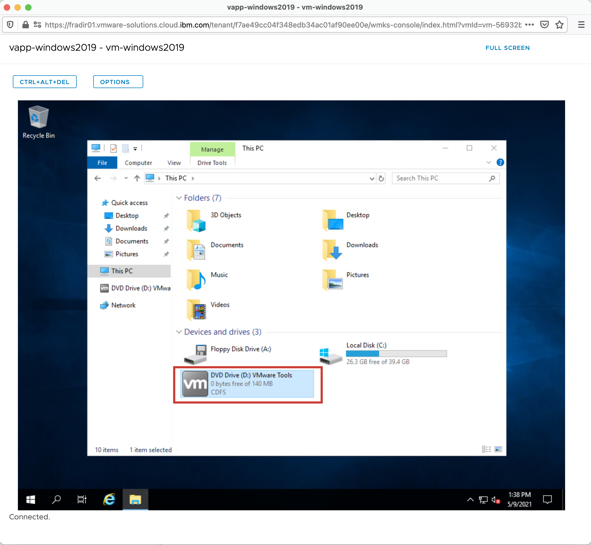

Install Welcome ... 


Install Type ... 

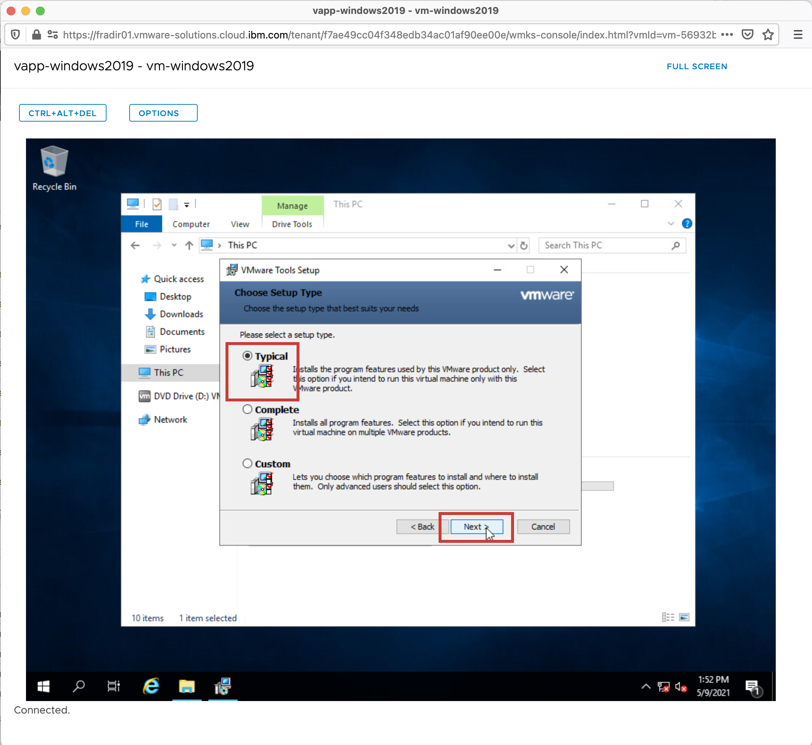

Begin Install ... 

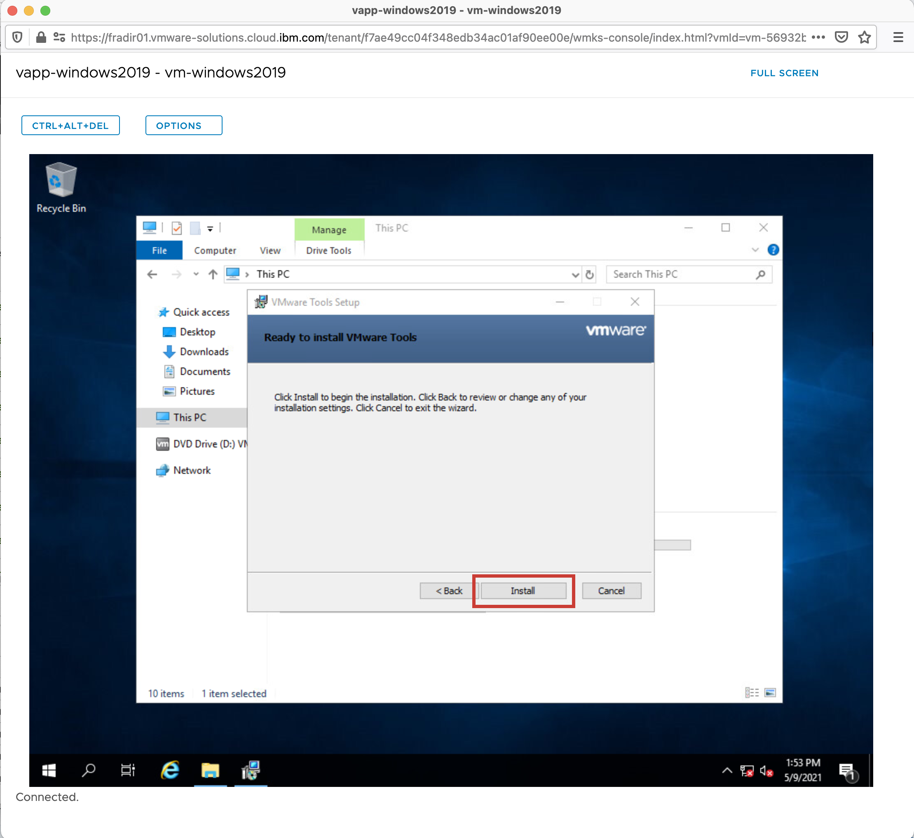

installation progress ... 

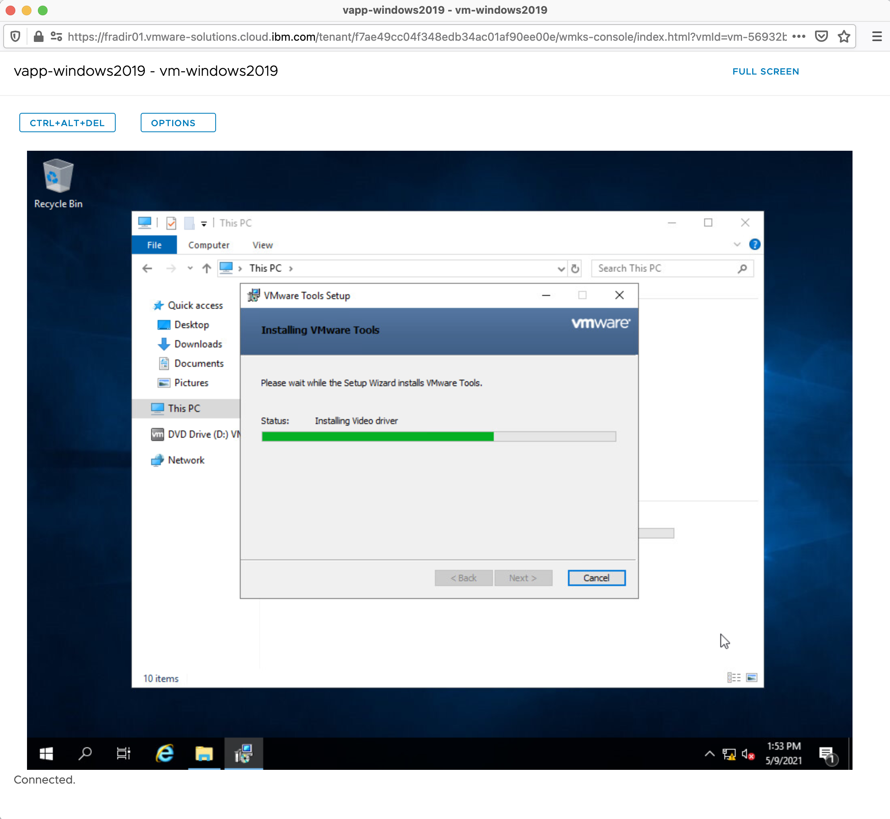

Finish Install ... 

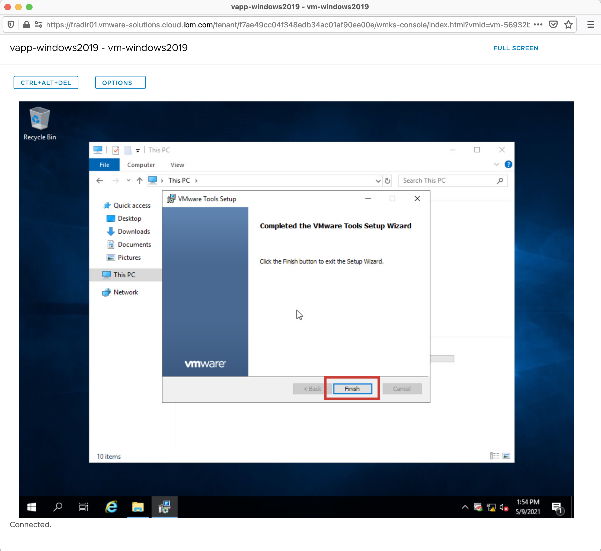

Once the VMWare Tools have been installed, it is _**STRONGLY**_ recommended to restart your VM to have Windows cleanly restart as well as the VMWare Tools media to be ejected from the VM.


Back to: [Menu](#toc)

###  <a name="upgrade"></a>Upgrade

The infrastructure supporting [VMWare Solutions on IBM Cloud](https://cloud.ibm.com/infrastructure/vmware-solutions/console) will be updated when required for patches, features, and security updates.  When the backing VMWare ESXi servers are updated, a newer version of the VMWare Tools will be available for upgrade.  You may see a message in the VM details such as `VMware Tools is installed, supported, but a newer version is available` when a newer version is available.

To Upgrade, follow the steps outlined in the [Install](#install) steps for the respective Operating System.  VMWare will try to uninstall the current version or identify that the versions are identical, and you should answer accordingly.

Back to: [Menu](#toc)

###  <a name="references"></a>References

- [Install VMware Tools in a Virtual Machine](https://docs.vmware.com/en/VMware-Cloud-Director/10.2/VMware-Cloud-Director-Tenant-Portal-Guide/GUID-2D21BDFA-FADB-445A-8CB5-3628255773AC.html)
- [How to install VMware Tools (1014294)](https://kb.vmware.com/s/article/1014294)
- [Uninstalling and manually installing VMware Tools](https://kb.vmware.com/s/article/1014522)

Back to: [Menu](#toc)

_Note the information described in this example are guidelines.  There are multiple ways to configure the various parts of the example.  Please adjust accordingly for your needs._

[VMWare vCloud Director](https://mlwiles.github.io/vmwaresolutions/vcd/)<br/>
[Main Page](https://mlwiles.github.io/vmwaresolutions)
